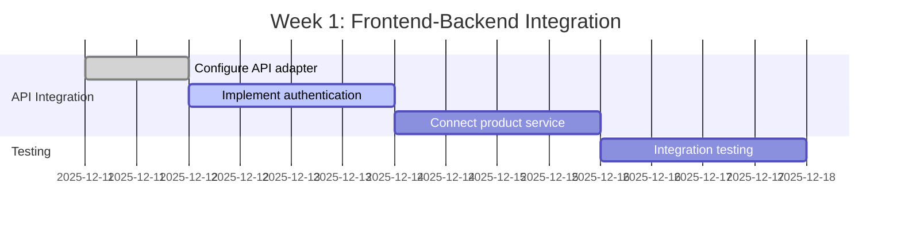
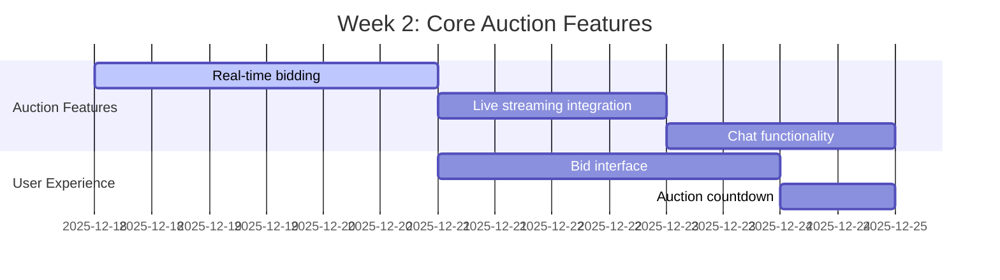

# 🚀 BLYTZ LIVE AUCTION MVP - STRATEGIC PLAN FOR NEXT PHASE

**Date:** December 11, 2025  
**Focus:** Soft Launch with Beta Testers (50-100 users) before Public Launch  
**Timeline:** 30-60 days  
**Priority:** Market Launch Readiness

---

## 📊 **CURRENT PLATFORM STATUS ANALYSIS**

### **✅ STRENGTHS - WHAT'S WORKING**

#### **Backend Services (90% Production Ready)**
- **10 Complete Microservices**: Auth, Product, Auction, Order, Payment, Chat, Logistics, Gateway, LiveKit, Notification
- **Database Layer**: PostgreSQL 15 with complete migrations and relationships
- **Authentication**: Production-ready JWT with bcrypt and RBAC
- **Service Integration**: End-to-end testing framework in place
- **Docker Configuration**: Complete docker-compose setup with health checks

#### **Frontend (Next.js) - 80% Ready**
- **Modern Architecture**: Next.js 14 with App Router, TypeScript, Tailwind CSS
- **Component Library**: shadcn/ui components with consistent design system
- **Mobile-First Design**: Responsive layout optimized for touch interactions
- **Testing Framework**: Jest + Playwright for comprehensive testing
- **API Adapter**: Switchable between mock and real API modes

#### **Mobile App (React Native) - 70% Ready**
- **Expo Framework**: Modern React Native setup with Expo
- **Stripe Integration**: Payment processing capabilities
- **Navigation**: React Navigation with proper stack navigation
- **Core Screens**: Login, API testing, payment screens implemented

---

## 🎯 **IMMEDIATE PRIORITIES FOR SOFT LAUNCH**

### **🔥 Priority 1: Frontend-Backend Integration (Week 1-2)**
**Current State**: Frontend has mock data, backend is production-ready  
**Blocking Issue**: No real API integration between frontend and backend  
**Impact**: Cannot test end-to-end user journeys

### **🔥 Priority 2: Real-time Features Implementation (Week 2-3)**
**Current State**: WebSocket infrastructure exists but not fully implemented  
**Blocking Issue**: Live bidding, chat, and notifications not working end-to-end  
**Impact**: Core auction functionality incomplete

### **🔥 Priority 3: Mobile App Backend Integration (Week 3-4)**
**Current State**: Mobile app has Stripe integration but limited backend connectivity  
**Blocking Issue**: Mobile app cannot authenticate or interact with backend services  
**Impact**: Mobile users cannot participate in auctions

---

## 📅 **30-60 DAY STRATEGIC ROADMAP**

### **PHASE 1: FOUNDATION COMPLETION (WEEKS 1-2)**

#### **Week 1: Frontend-Backend Integration**


**Deliverables:**
- Frontend connected to real backend APIs
- User authentication flow working end-to-end
- Product catalog displaying real data
- Basic auction listing functionality

#### **Week 2: Core Auction Features**


**Deliverables:**
- Real-time bidding system operational
- Live video streaming for auctions
- Chat functionality during auctions
- User-friendly bidding interface

### **PHASE 2: MOBILE INTEGRATION (WEEKS 3-4)**

#### **Week 3: Mobile App Backend Connection**
**Focus Areas:**
- Authentication flow between mobile app and backend
- API client implementation for all services
- Push notification setup for auction alerts
- Mobile-optimized bidding interface

#### **Week 4: Cross-Platform Testing**
**Focus Areas:**
- End-to-end testing across web and mobile
- Payment testing with Stripe integration
- Performance testing with simulated load
- Beta tester onboarding preparation

### **PHASE 3: BETA LAUNCH PREPARATION (WEEKS 5-6)**

#### **Week 5: Beta Testing Setup**
**Focus Areas:**
- Create beta tester onboarding flow
- Implement feedback collection system
- Set up monitoring and analytics
- Prepare launch announcement materials

#### **Week 6: Soft Launch**
**Focus Areas:**
- Onboard 50-100 beta testers
- Monitor system performance and user behavior
- Collect and prioritize feedback
- Fix critical issues identified by testers

### **PHASE 4: PUBLIC LAUNCH PREPARATION (WEEKS 7-8)**

#### **Week 7: Performance Optimization**
**Focus Areas:**
- Optimize database queries based on beta usage
- Implement caching strategies
- Scale infrastructure based on load testing
- Refine user experience based on feedback

#### **Week 8: Production Launch**
**Focus Areas:**
- Final security audit and penetration testing
- Deploy to production environment
- Execute marketing launch plan
- Monitor and respond to launch issues

---

## 🚨 **POTENTIAL BOTTLENECKS & MITIGATION STRATEGIES**

### **🔴 Critical Bottlenecks**

#### **1. Real-time Features Complexity**
**Risk**: WebSocket implementation for live bidding and chat  
**Impact**: Core auction functionality may not work smoothly  
**Mitigation**:
- Use existing LiveKit integration for video streaming
- Implement simple polling for bidding as fallback
- Prioritize core bidding over advanced chat features

#### **2. Payment Integration Testing**
**Risk**: Stripe payment flow may have edge cases  
**Impact**: Users cannot complete transactions  
**Mitigation**:
- Test payment flow extensively with small beta group
- Implement comprehensive error handling
- Have manual payment processing as backup

#### **3. Mobile App Store Approval**
**Risk**: App store review delays could launch timeline  
**Impact**: Mobile users cannot access platform  
**Mitigation**:
- Submit app for review 2 weeks before planned launch
- Prepare web app as mobile-friendly alternative
- Use TestFlight for iOS beta testing

### **🟡 Medium-Risk Bottlenecks**

#### **4. Database Performance Under Load**
**Risk**: Auction bidding may cause database contention  
**Impact**: Slow response times during peak activity  
**Mitigation**:
- Implement Redis caching for auction data
- Use database connection pooling
- Optimize queries with proper indexing

#### **5. Video Streaming Costs**
**Risk**: LiveKit usage costs may exceed budget  
**Impact**: Unexpected operational expenses  
**Mitigation**:
- Implement streaming quality controls
- Set usage limits and alerts
- Optimize streaming for mobile bandwidth

---

## 🚀 **DEPLOYMENT STRATEGIES**

### **Frontend Deployment Strategy**

#### **Staging Environment (Week 2)**
```yaml
# Deployment Configuration
Environment: Staging
Provider: Vercel/Netlify
Domain: staging.blytz.app
Features:
  - Connected to staging backend
  - Real API integration
  - Basic analytics
  - Error monitoring
```

#### **Production Environment (Week 6)**
```yaml
# Production Configuration
Environment: Production
Provider: AWS CloudFront + S3
Domain: blytz.app
Features:
  - CDN distribution
  - SSL certificates
  - Performance monitoring
  - Advanced analytics
```

### **Mobile App Deployment Strategy**

#### **Beta Testing (Week 4)**
```yaml
# iOS Beta
Platform: TestFlight
Users: 50-100 beta testers
Features: Full functionality with staging backend

# Android Beta  
Platform: Google Play Internal Testing
Users: 50-100 beta testers
Features: Full functionality with staging backend
```

#### **Public Launch (Week 8)**
```yaml
# Production Release
Platform: App Store + Google Play
Features: Production backend integration
Review Timeline: Submit 2 weeks before launch
```

### **Backend Deployment Strategy**

#### **Staging Environment (Week 1)**
```yaml
# Infrastructure
Provider: DigitalOcean/AWS
Database: PostgreSQL 15 (single instance)
Redis: Single instance for caching
Monitoring: Basic health checks
```

#### **Production Environment (Week 6)**
```yaml
# Production Infrastructure
Provider: AWS/GCP
Database: PostgreSQL with read replicas
Redis: Cluster configuration
Monitoring: Prometheus + Grafana
Load Balancer: Application load balancer
Auto-scaling: Based on CPU/memory usage
```

---

## 🔍 **MONITORING & QUALITY ASSURANCE**

### **Testing Strategy**

#### **Automated Testing**
```yaml
Unit Tests:
  Coverage: 80%+ for critical paths
  Tools: Jest (frontend), Go test (backend)
  Schedule: Every commit

Integration Tests:
  Coverage: All API endpoints
  Tools: Playwright (E2E), Postman (API)
  Schedule: Daily

Performance Tests:
  Metrics: Response time <200ms
  Tools: k6, Artillery
  Schedule: Weekly
```

#### **Manual Testing**
```yaml
Beta Testing:
  Users: 50-100 real users
  Duration: 2 weeks
  Focus: User experience, edge cases

Security Testing:
  Scope: OWASP Top 10
  Tools: Burp Suite, OWASP ZAP
  Schedule: Before production launch
```

### **Monitoring Strategy**

#### **Application Monitoring**
```yaml
Metrics:
  - Response times
  - Error rates
  - User engagement
  - Auction activity

Tools:
  - Application: Sentry (error tracking)
  - Performance: New Relic/DataDog
  - Analytics: Google Analytics 4
  - Logs: ELK Stack or CloudWatch
```

#### **Infrastructure Monitoring**
```yaml
Metrics:
  - CPU/memory usage
  - Database performance
  - Network latency
  - Storage usage

Alerting:
  - Critical: Service down, high error rates
  - Warning: High response times, resource usage
  - Info: Deployments, user milestones
```

---

## 📈 **SCALING & PERFORMANCE OPTIMIZATION**

### **Database Optimization**
```sql
-- Immediate optimizations (Week 2)
- Add indexes for auction queries
- Implement connection pooling
- Set up read replicas for reporting

-- Future optimizations (Month 2)
- Database sharding for user data
- Caching layer with Redis
- Query optimization based on usage patterns
```

### **Application Scaling**
```yaml
Horizontal Scaling:
  - Container orchestration with Kubernetes
  - Auto-scaling based on load
  - Load balancing across instances

Vertical Scaling:
  - Optimize code performance
  - Implement caching strategies
  - Reduce database query complexity
```

### **CDN & Content Optimization**
```yaml
Static Assets:
  - CDN distribution for images/videos
  - Image optimization and compression
  - Lazy loading for better performance

API Optimization:
  - Response caching where appropriate
  - Pagination for large datasets
  - Compression for API responses
```

---

## 🎯 **SUCCESS METRICS & KPIs**

### **Technical Metrics**
```yaml
Performance:
  - Page load time < 3 seconds
  - API response time < 200ms
  - 99.9% uptime for critical services

Reliability:
  - Error rate < 1%
  - Successful transaction rate > 95%
  - Mobile app crash rate < 0.5%
```

### **Business Metrics**
```yaml
User Engagement:
  - Daily active users (target: 50+ beta testers)
  - Auction participation rate > 60%
  - User retention rate > 40% after 7 days

Transaction Metrics:
  - Successful bid rate > 90%
  - Payment success rate > 95%
  - Average auction completion time < 2 hours
```

---

## 🚀 **IMMEDIATE ACTION PLAN (NEXT 7 DAYS)**

### **Day 1-2: Environment Setup**
- [ ] Deploy staging environment for frontend
- [ ] Configure API adapter to use real backend
- [ ] Set up monitoring and error tracking
- [ ] Create development workflow for team

### **Day 3-4: Authentication Integration**
- [ ] Implement JWT authentication in frontend
- [ ] Connect user registration/login flows
- [ ] Test session management and token refresh
- [ ] Implement protected routes

### **Day 5-7: Service Integration**
- [ ] Connect product service to frontend
- [ ] Implement basic auction listing
- [ ] Set up real-time bidding infrastructure
- [ ] Begin mobile app API integration

---

## 💰 **RESOURCE REQUIREMENTS**

### **Technical Resources**
```yaml
Development Team:
  - 1 Full-stack developer (frontend focus)
  - 1 Backend developer (Go/microservices)
  - 1 Mobile developer (React Native)
  - 1 DevOps engineer (deployment/infrastructure)

Infrastructure Costs (Monthly):
  - Backend hosting: $200-500
  - Frontend hosting: $50-100
  - Database: $100-300
  - Monitoring tools: $100-200
  - LiveKit streaming: $100-400
```

### **Timeline Buffer**
```yaml
Risk Mitigation:
  - Add 20% buffer to all estimates
  - Plan for app store review delays
  - Account for integration complexity
  - Prepare contingency plans
```

---

## 🏁 **CONCLUSION**

The Blytz Live Auction MVP platform has a solid foundation with 90% production-ready backend services. The primary focus for the next 30-60 days should be on **frontend-backend integration** and **mobile app connectivity** to enable a successful soft launch with 50-100 beta testers.

### **Key Success Factors:**
1. **Prioritize core auction functionality** over advanced features
2. **Focus on end-to-end user journeys** rather than individual components
3. **Implement comprehensive testing** before public launch
4. **Monitor performance closely** during beta phase
5. **Be prepared to iterate** based on user feedback

### **Critical Path to Launch:**
1. **Week 1-2**: Frontend-backend integration
2. **Week 3-4**: Mobile app connectivity
3. **Week 5-6**: Beta testing and feedback
4. **Week 7-8**: Optimization and public launch

With focused execution on this plan, the Blytz platform can successfully launch to market within 60 days with a solid foundation for future growth.

---

**Status:** Ready for Execution  
**Next Action:** Begin frontend-backend integration (Day 1-2)  
**Review Date:** Weekly progress reviews recommended