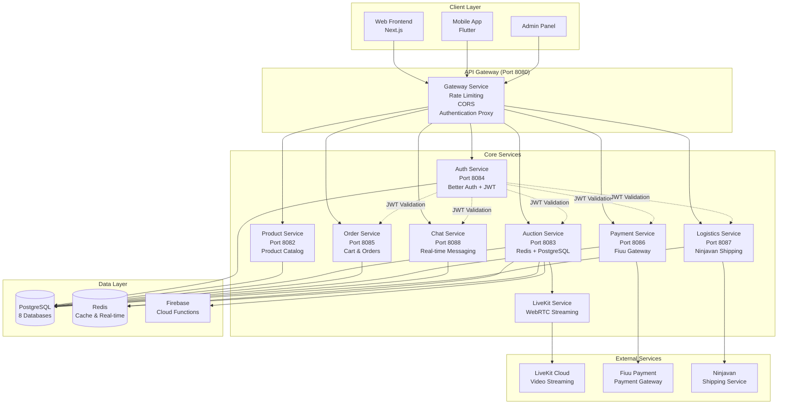
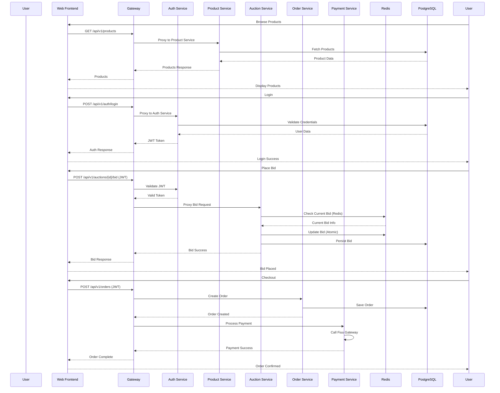
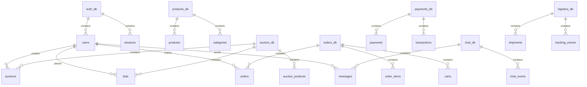
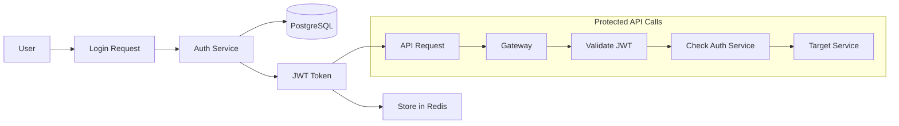

# Blytz Platform Service Architecture Diagram

## 🏗️ Overall Architecture



## 🔄 Service Interaction Flow



## 🗄️ Database Architecture



## 🚀 API Routing Structure

```
Frontend → Gateway (8080)
         ├── /api/v1/auth/* → Auth Service (8084)
         ├── /api/v1/products/* → Product Service (8082)
         ├── /api/v1/auctions/* → Auction Service (8083)
         ├── /api/v1/orders/* → Order Service (8085)
         ├── /api/v1/payments/* → Payment Service (8086)
         ├── /api/v1/chat/* → Chat Service (8088)
         ├── /api/v1/logistics/* → Logistics Service (8087)
         └── /api/public/* → Mock data & LiveKit tokens
```

## 🔐 Authentication Flow



## 🎯 Key Service Dependencies

### Auth Service (Port 8084)
- **Independent**: No dependencies on other services
- **Provides**: JWT validation for all other services
- **Database**: `auth_db`

### Product Service (Port 8082)
- **Independent**: No dependencies on other services
- **Database**: `products_db`

### Auction Service (Port 8083)
- **Depends on**: Auth Service (user validation)
- **External**: Firebase (notifications), LiveKit (streaming)
- **Database**: `auction_db` + Redis (real-time bidding)

### Order Service (Port 8085)
- **Depends on**: Auth Service, Product Service, Auction Service
- **Database**: `orders_db`

### Payment Service (Port 8086)
- **Depends on**: Auth Service, Order Service
- **External**: Fiuu Payment Gateway
- **Database**: `payments_db`

### Chat Service (Port 8088)
- **Depends on**: Auth Service
- **Database**: `chat_db`

### Logistics Service (Port 8087)
- **Depends on**: Auth Service, Order Service
- **External**: Ninjavan Shipping API
- **Database**: `logistics_db`

### LiveKit Service
- **Depends on**: Auth Service
- **External**: LiveKit Cloud
- **Purpose**: WebRTC video streaming for live auctions

## 📊 Service Health Monitoring

All services expose `/health` endpoints that the Gateway can monitor:

```
Gateway Health Check → Individual Service Health Checks
                    ├── Auth Service Health
                    ├── Product Service Health
                    ├── Auction Service Health
                    ├── Order Service Health
                    ├── Payment Service Health
                    ├── Chat Service Health
                    ├── Logistics Service Health
                    └── Database Connectivity (PostgreSQL + Redis)
```

This architecture ensures:
- **Scalability**: Each service can scale independently
- **Reliability**: Failure in one service doesn't cascade
- **Security**: Centralized authentication through Auth Service
- **Performance**: Redis caching for real-time operations
- **Maintainability**: Clear separation of concerns