# Blytz Live Auction - Documentation Automation and Maintenance

## Overview

This document outlines the automation processes and maintenance procedures for keeping Blytz Live Auction platform documentation current, accurate, and valuable. It ensures consistent quality, reduces manual effort, and enables rapid response to documentation needs.

## Table of Contents

1. [Automation Overview](#automation-overview)
2. [CI/CD Integration](#cicd-integration)
3. [Content Generation Automation](#content-generation-automation)
4. [Quality Assurance Automation](#quality-assurance-automation)
5. [Maintenance Processes](#maintenance-processes)
6. [Monitoring and Alerting](#monitoring-and-alerting)
7. [Tools and Scripts](#tools-and-scripts)
8. [Schedules and Workflows](#schedules-and-workflows)

## Automation Overview

### Automation Goals

1. **Consistency**: Ensure all documentation follows standards
2. **Accuracy**: Automatically validate technical content
3. **Timeliness**: Update documentation with code changes
4. **Quality**: Maintain high documentation quality standards
5. **Accessibility**: Ensure WCAG compliance automatically
6. **Discoverability**: Optimize for search and navigation

### Automation Principles

- **Shift Left**: Catch issues early in development process
- **Fail Fast**: Automated checks provide immediate feedback
- **Continuous**: Integration with development workflows
- **Measurable**: Track automation effectiveness
- **Improvable**: Regularly refine automation processes

## CI/CD Integration

### GitHub Actions Workflows

#### 1. Documentation Quality Checks

```yaml
# .github/workflows/docs-quality.yml
name: Documentation Quality Checks

on:
  pull_request:
    paths: ['docs/**']
  push:
    paths: ['docs/**']
    branches: [main]

jobs:
  quality-checks:
    runs-on: ubuntu-latest
    steps:
      - name: Checkout repository
        uses: actions/checkout@v4

      - name: Setup Node.js
        uses: actions/setup-node@v4
        with:
          node-version: '18'

      - name: Install dependencies
        run: |
          npm install -g markdownlint-cli
          npm install -g cspell
          npm install -g markdown-link-check
          npm install -g alex

      - name: Check markdown formatting
        run: |
          markdownlint docs/**/*.md --config .markdownlint.json

      - name: Check spelling
        run: |
          cspell "docs/**/*.md" --config .cspell.json

      - name: Check links
        run: |
          markdown-link-check "docs/**/*.md" --config .mlc.json

      - name: Check writing style
        run: |
          alex "docs/**/*.md" --config .alexrc

      - name: Check code examples
        run: |
          ./scripts/validate-code-examples.sh

      - name: Generate quality report
        run: |
          ./scripts/generate-quality-report.sh
```

#### 2. API Documentation Generation

```yaml
# .github/workflows/docs-api-generation.yml
name: API Documentation Generation

on:
  push:
    paths: ['services/*/api/**']
    branches: [main]

jobs:
  generate-api-docs:
    runs-on: ubuntu-latest
    steps:
      - name: Checkout repository
        uses: actions/checkout@v4

      - name: Setup Go
        uses: actions/setup-go@v4
        with:
          go-version: '1.25'

      - name: Install documentation tools
        run: |
          go install github.com/swaggo/swag/cmd/swag@latest
          go install github.com/go-swagger/go-swagger/cmd/swagger@latest
          npm install -g @apidevtools/swagger-parser

      - name: Generate OpenAPI specifications
        run: |
          ./scripts/generate-api-docs.sh

      - name: Validate API documentation
        run: |
          ./scripts/validate-api-docs.sh

      - name: Update documentation
        run: |
          git config --local user.email "docs-bot@blytz.app"
          git config --local user.name "Documentation Bot"
          git add docs/api/
          git commit -m "docs: Auto-update API documentation"
          git push
```

#### 3. Documentation Deployment

```yaml
# .github/workflows/docs-deploy.yml
name: Deploy Documentation

on:
  push:
    paths: ['docs/**']
    branches: [main]

jobs:
  deploy:
    runs-on: ubuntu-latest
    steps:
      - name: Checkout repository
        uses: actions/checkout@v4

      - name: Setup Node.js
        uses: actions/setup-node@v4
        with:
          node-version: '18'

      - name: Install dependencies
        run: |
          cd docs-site
          npm install

      - name: Build documentation site
        run: |
          cd docs-site
          npm run build

      - name: Deploy to staging
        run: |
          cd docs-site
          npm run deploy:staging

      - name: Run smoke tests
        run: |
          ./scripts/test-deployed-docs.sh staging

      - name: Deploy to production
        if: github.ref == 'refs/heads/main'
        run: |
          cd docs-site
          npm run deploy:production

      - name: Notify team
        run: |
          curl -X POST https://hooks.slack.com/services/YOUR/SLACK/WEBHOOK \
            -H 'Content-type: application/json' \
            --data '{"text":"📚 Documentation updated and deployed"}'
```

### Branch Protection Rules

```yaml
# .github/branch-protection.yml
protection:
  main:
    required_status_checks:
      strict: true
      contexts:
        - "Documentation Quality Checks"
        - "API Documentation Generation"
        - "Build and Test"
    enforce_admins: true
    required_pull_request_reviews:
      required_approving_review_count: 1
      dismiss_stale_reviews: true
      require_code_owner_reviews: false
    restrictions:
      users: []
      teams: ["documentation-team"]
```

## Content Generation Automation

### 1. API Documentation Generation

#### OpenAPI Specification Generation

```bash
#!/bin/bash
# scripts/generate-api-docs.sh

set -e

echo "Generating API documentation..."

# Create output directory
mkdir -p docs/api/generated

# Generate OpenAPI specs for each service
services=("auth" "products" "auctions" "orders" "payments" "chat" "logistics" "livekit" "notifications")

for service in "${services[@]}"; do
    echo "Generating docs for $service service..."
    
    # Find main.go file
    main_file="services/$service-service/main.go"
    if [ ! -f "$main_file" ]; then
        echo "Main file not found: $main_file"
        continue
    fi
    
    # Generate OpenAPI specification
    swag init -g cmd/main.go -o docs/api/generated/$service -p services/$service-service/internal/api -p services/$service-service/internal/models --instanceName Blytz --title "Blytz $service API"
    
    # Generate swagger.json
    swag generate --outputTypes json --outputDir docs/api/generated/$service --outputFile swagger.json
    
    # Generate swagger.yaml
    swag generate --outputTypes yaml --outputDir docs/api/generated/$service --outputFile swagger.yaml
    
    # Generate markdown documentation
    swag generate --outputTypes markdown --outputDir docs/api/generated/$service --outputFile README.md
    
    echo "✅ Generated $service API documentation"
done

# Generate combined API documentation
echo "Generating combined API documentation..."
cat > docs/api/API_DOCUMENTATION_INDEX.md << 'EOF'
# Blytz Live Auction - API Documentation Index

## Overview

This document provides comprehensive API documentation for all Blytz Live Auction platform services.

## Services

EOF

# Add service links to index
for service in "${services[@]}"; do
    echo "- [$service Service API](./generated/$service/README.md)" >> docs/api/API_DOCUMENTATION_INDEX.md
done

cat >> docs/api/API_DOCUMENTATION_INDEX.md << 'EOF'

## General Information

- **Base URL**: https://api.blytz.app/api/v1
- **Authentication**: JWT Bearer tokens required for protected endpoints
- **Rate Limiting**: 100 requests per minute per user
- **Error Format**: Consistent JSON error responses

## Quick Links

- [Authentication Service](./generated/auth/README.md)
- [Product Service](./generated/products/README.md)
- [Auction Service](./generated/auctions/README.md)
- [Order Service](./generated/orders/README.md)
- [Payment Service](./generated/payments/README.md)
- [Chat Service](./generated/chat/README.md)
- [Logistics Service](./generated/logistics/README.md)
- [LiveKit Service](./generated/livekit/README.md)
- [Notification Service](./generated/notifications/README.md)

---

**Generated on**: $(date +%Y-%m-%d)
**Version**: Auto-generated v$(git rev-parse --short HEAD)
EOF

echo "✅ API documentation generation completed"
```

#### 2. Architecture Diagrams

```bash
#!/bin/bash
# scripts/generate-diagrams.sh

set -e

echo "Generating architecture diagrams..."

# Create diagrams directory
mkdir -p docs/architecture/diagrams

# Generate service architecture diagram
echo "Generating service architecture diagram..."
docker run --rm -v $(pwd):/work \
  pms1969/structurizr:latest \
  build -w /work/docs/architecture/diagrams \
  docs/architecture/diagrams/service-architecture

# Generate data flow diagram
echo "Generating data flow diagram..."
docker run --rm -v $(pwd):/work \
  plantuml/plantuml:latest \
  -tpng docs/architecture/data-flow.puml \
  -o docs/architecture/diagrams/data-flow.png

# Generate deployment diagram
echo "Generating deployment diagram..."
docker run --rm -v $(pwd):/work \
  mermaid-cli/md2png \
  -i docs/architecture/deployment.md \
  -o docs/architecture/diagrams/deployment.png

# Generate technology stack diagram
echo "Generating technology stack diagram..."
docker run --rm -v $(pwd):/work \
  node:18-alpine \
  sh -c "cd /work && npx @mermaid-js/mermaid-cli -i docs/architecture/technology-stack.md -o docs/architecture/diagrams/technology-stack.png"

echo "✅ Architecture diagrams generated"
```

#### 3. Code Examples Generation

```bash
#!/bin/bash
# scripts/generate-code-examples.sh

set -e

echo "Generating code examples..."

# Create examples directory
mkdir -p docs/developer/code-examples

# Generate JavaScript examples
echo "Generating JavaScript examples..."
cat > docs/developer/code-examples/javascript/authentication.js << 'EOF'
// Blytz API - JavaScript Examples
// Authentication

const axios = require('axios');

const API_BASE_URL = 'https://api.blytz.app/api/v1';

// User registration
async function registerUser(userData) {
    try {
        const response = await axios.post(\`\${API_BASE_URL}/auth/register\`, userData);
        return response.data;
    } catch (error) {
        console.error('Registration failed:', error.response.data);
        throw error;
    }
}

// User login
async function loginUser(credentials) {
    try {
        const response = await axios.post(\`\${API_BASE_URL}/auth/login\`, credentials);
        return response.data;
    } catch (error) {
        console.error('Login failed:', error.response.data);
        throw error;
    }
}

// Token refresh
async function refreshToken(refreshToken) {
    try {
        const response = await axios.post(\`\${API_BASE_URL}/auth/refresh\`, {
            refresh_token: refreshToken
        });
        return response.data;
    } catch (error) {
        console.error('Token refresh failed:', error.response.data);
        throw error;
    }
}

module.exports = {
    registerUser,
    loginUser,
    refreshToken
};
EOF

# Generate Python examples
echo "Generating Python examples..."
cat > docs/developer/code-examples/python/authentication.py << 'EOF'
# Blytz API - Python Examples
# Authentication

import requests
import json

API_BASE_URL = 'https://api.blytz.app/api/v1'

class BlytzAPI:
    def __init__(self):
        self.base_url = API_BASE_URL
        self.session = requests.Session()
    
    def register_user(self, user_data):
        """Register a new user"""
        try:
            response = self.session.post(
                f"{self.base_url}/auth/register",
                json=user_data
            )
            response.raise_for_status()
            return response.json()
        except requests.exceptions.RequestException as e:
            print(f"Registration failed: {e.response.json()}")
            raise
    
    def login_user(self, credentials):
        """Authenticate user"""
        try:
            response = self.session.post(
                f"{self.base_url}/auth/login",
                json=credentials
            )
            response.raise_for_status()
            return response.json()
        except requests.exceptions.RequestException as e:
            print(f"Login failed: {e.response.json()}")
            raise
    
    def refresh_token(self, refresh_token):
        """Refresh JWT token"""
        try:
            response = self.session.post(
                f"{self.base_url}/auth/refresh",
                json={"refresh_token": refresh_token}
            )
            response.raise_for_status()
            return response.json()
        except requests.exceptions.RequestException as e:
            print(f"Token refresh failed: {e.response.json()}")
            raise

# Usage example
if __name__ == "__main__":
    api = BlytzAPI()
    
    # Register user
    user_data = {
        "email": "user@example.com",
        "password": "password123",
        "name": "Test User"
    }
    
    try:
        result = api.register_user(user_data)
        print("Registration successful:", result)
    except Exception as e:
        print("Registration failed:", str(e))
EOF

echo "✅ Code examples generated"
```

## Quality Assurance Automation

### 1. Automated Testing

#### Link Validation

```bash
#!/bin/bash
# scripts/validate-links.sh

set -e

echo "Validating documentation links..."

# Install markdown-link-check if not present
if ! command -v markdown-link-check &> /dev/null; then
    npm install -g markdown-link-check
fi

# Check internal links
echo "Checking internal links..."
markdown-link-check "docs/**/*.md" --config .mlc.json > link-check-results.txt

# Check external links
echo "Checking external links..."
find docs -name "*.md" -exec grep -o "https://[^)]*" {} \; | \
    sort -u | xargs -I {} -P 10 curl -f -s -o /dev/null -w "%{http_code}\n" | \
    paste - <(sort -u) - | awk '$2 != "200" {print $1}' > broken-external-links.txt

# Generate report
cat > link-validation-report.md << EOF
# Link Validation Report

## Summary
- Internal links checked: $(grep -c "✓" link-check-results.txt || true)
- External links checked: $(wc -l < broken-external-links.txt | awk '{print $1}')
- Broken links found: $(wc -l < broken-external-links.txt | awk '{print $1}')

## Broken External Links
EOF

if [ -s broken-external-links.txt ]; then
    echo "## Issues Found" >> link-validation-report.md
    cat broken-external-links.txt >> link-validation-report.md
fi

echo "Link validation completed"
```

#### Code Example Validation

```bash
#!/bin/bash
# scripts/validate-code-examples.sh

set -e

echo "Validating code examples..."

# Find all code blocks in documentation
find docs -name "*.md" -exec grep -l "```" {} \; > code-files.txt

# Validate JavaScript examples
echo "Validating JavaScript examples..."
find docs -name "*.js" -exec node -c {} \; 2>&1 | tee js-validation.log

# Validate Python examples
echo "Validating Python examples..."
find docs -name "*.py" -exec python -m py_compile {} \; 2>&1 | tee python-validation.log

# Validate Go examples
echo "Validating Go examples..."
find docs -name "*.go" -exec go build {} \; 2>&1 | tee go-validation.log

# Generate validation report
cat > code-validation-report.md << EOF
# Code Example Validation Report

## JavaScript Validation
\`\`\`bash
if [ -s js-validation.log ]; then
    echo "Issues found:" >> code-validation-report.md
    cat js-validation.log >> code-validation-report.md
else
    echo "✅ All JavaScript examples valid" >> code-validation-report.md
fi
\`\`\`

## Python Validation
\`\`\`bash
if [ -s python-validation.log ]; then
    echo "Issues found:" >> code-validation-report.md
    cat python-validation.log >> code-validation-report.md
else
    echo "✅ All Python examples valid" >> code-validation-report.md
fi
\`\`\`

## Go Validation
\`\`\`bash
if [ -s go-validation.log ]; then
    echo "Issues found:" >> code-validation-report.md
    cat go-validation.log >> code-validation-report.md
else
    echo "✅ All Go examples valid" >> code-validation-report.md
fi
\`\`\`

EOF

echo "Code example validation completed"
```

#### 2. Content Quality Checks

```bash
#!/bin/bash
# scripts/quality-check.sh

set -e

echo "Running content quality checks..."

# Check for required front matter
echo "Checking front matter..."
find docs -name "*.md" -exec sh -c '
    if ! grep -q "^---" "$1"; then
        echo "❌ Missing front matter in: $1"
        exit 1
    fi
' \;

# Check for required metadata
echo "Checking metadata..."
find docs -name "*.md" -exec sh -c '
    if ! grep -q "Last Updated:" "$1"; then
        echo "❌ Missing Last Updated in: $1"
        exit 1
    fi
    
    if ! grep -q "Version:" "$1"; then
        echo "❌ Missing Version in: $1"
        exit 1
    fi
' \;

# Check for broken image references
echo "Checking image references..."
find docs -name "*.md" -exec grep -o "!\[.*\](.*)" {} \; | \
    grep -o "\](.*)" | sed 's/\]//' | \
    while read image; do
        if [ ! -f "docs/$image" ]; then
            echo "❌ Broken image reference: $image"
        fi
    done

# Check for table of contents
echo "Checking table of contents..."
find docs -name "*.md" -exec sh -c '
    file_size=$(wc -l < "$1")
    if [ $file_size -gt 100 ]; then
        if ! grep -q "## Table of Contents" "$1"; then
            echo "⚠️ Long document without TOC: $1"
        fi
    fi
' \;

echo "✅ Content quality checks completed"
```

### 3. Accessibility Testing

```bash
#!/bin/bash
# scripts/accessibility-check.sh

set -e

echo "Running accessibility checks..."

# Install accessibility tools
if ! command -v pa11y &> /dev/null; then
    npm install -g pa11y
fi

if ! command -v axe &> /dev/null; then
    npm install -g axe-cli
fi

# Check built documentation site
echo "Checking documentation site accessibility..."
cd docs-site
npm run build

# Run Pa11y tests
echo "Running Pa11y tests..."
pa11y http://localhost:3000 --reporter json > accessibility-report.json

# Run Axe tests
echo "Running Axe tests..."
axe http://localhost:3000 --format json > axe-report.json

# Generate accessibility report
cat > accessibility-report.md << EOF
# Accessibility Report

## Pa11y Results
\`\`\`bash
node -e "console.log(JSON.stringify(JSON.parse(require('fs').readFileSync('accessibility-report.json')), null, 2))"
\`\`\`

## Axe Results
\`\`\`bash
node -e "console.log(JSON.stringify(JSON.parse(require('fs').readFileSync('axe-report.json')), null, 2))"
\`\`\`

## Recommendations
- Fix color contrast issues
- Add ARIA labels where missing
- Ensure keyboard navigation works
- Provide alt text for all images
- Implement proper heading structure

EOF

echo "✅ Accessibility checks completed"
```

## Maintenance Processes

### 1. Regular Maintenance Schedule

#### Daily Tasks
```bash
#!/bin/bash
# scripts/daily-maintenance.sh

set -e

echo "Running daily documentation maintenance..."

# Check for broken links
./scripts/validate-links.sh

# Check documentation site health
curl -f https://docs.blytz.app/health || echo "Documentation site down"

# Update last updated timestamps
find docs -name "*.md" -exec touch {} \;

# Generate daily usage report
./scripts/generate-usage-report.sh

echo "✅ Daily maintenance completed"
```

#### Weekly Tasks
```bash
#!/bin/bash
# scripts/weekly-maintenance.sh

set -e

echo "Running weekly documentation maintenance..."

# Update API documentation
./scripts/generate-api-docs.sh

# Check for outdated content
find docs -name "*.md" -exec sh -c '
    last_updated=$(grep "Last Updated:" "$1" | cut -d" " -f2)
    if [ -n "$last_updated" ]; then
        file_date=$(date -d "$last_updated" +%s)
        current_date=$(date +%s)
        days_old=$(( (current_date - file_date) / 86400))
        if [ $days_old -gt 30 ]; then
            echo "⚠️ Outdated content: $1 ($days_old days old)"
        fi
    fi
' \;

# Update search index
./scripts/update-search-index.sh

# Generate weekly analytics report
./scripts/generate-analytics-report.sh

echo "✅ Weekly maintenance completed"
```

#### Monthly Tasks
```bash
#!/bin/bash
# scripts/monthly-maintenance.sh

set -e

echo "Running monthly documentation maintenance..."

# Comprehensive content audit
./scripts/content-audit.sh

# Update user feedback analysis
./scripts/analyze-feedback.sh

# Check for SEO optimization
./scripts/seo-check.sh

# Update documentation metrics
./scripts/update-metrics.sh

# Archive old documentation versions
./scripts/archive-old-versions.sh

echo "✅ Monthly maintenance completed"
```

### 2. Content Review Process

#### Review Triggers
- **Scheduled Reviews**: Monthly comprehensive reviews
- **Event-Driven Reviews**: After major feature releases
- **User-Triggered Reviews**: Based on user feedback volume
- **Quality Thresholds**: When quality metrics drop below standards

#### Review Workflow

```mermaid
graph LR
    SCHEDULE[Schedule Review] --> PLAN[Review Planning]
    PLAN --> ASSIGN[Assign Reviewers]
    ASSIGN --> REVIEW[Content Review]
    REVIEW --> FEEDBACK[Collect Feedback]
    FEEDBACK --> REVISE[Content Updates]
    REVISE --> APPROVE[Final Approval]
    APPROVE --> PUBLISH[Update Publication]
    PUBLISH --> ANALYZE[Analyze Impact]
```



#### Review Categories

1. **Technical Accuracy**
   - API documentation matches implementation
   - Code examples compile and run
   - Configuration instructions work
   - Security best practices followed

2. **Content Quality**
   - Writing is clear and concise
   - Structure follows documentation standards
   - Examples are practical and relevant
   - Links and references work

3. **User Experience**
   - Navigation is intuitive
   - Search terms are included
   - Information architecture is logical
   - Accessibility standards are met

## Monitoring and Alerting

### 1. Documentation Site Monitoring

#### Health Checks

```bash
#!/bin/bash
# scripts/health-monitor.sh

# Check documentation site availability
response=$(curl -s -o /dev/null -w "%{http_code}" https://docs.blytz.app/health)

if [ "$response" != "200" ]; then
    echo "🚨 Documentation site is down (HTTP $response)"
    
    # Send alert
    curl -X POST https://hooks.slack.com/services/YOUR/SLACK/WEBHOOK \
        -H 'Content-type: application/json' \
        --data '{"text":"🚨 Documentation site is down! HTTP '$response'"}'
    
    # Send email
    sendmail docs-team@blytz.app << EOF
Subject: Documentation Site Down

The documentation site is currently down.

HTTP Status: $response
Time: $(date)

Please investigate immediately.
EOF
else
    echo "✅ Documentation site is healthy"
fi
```

#### Performance Monitoring

```javascript
// docs-site/public/monitoring.js
class DocumentationMonitor {
    constructor() {
        this.metrics = {
            pageLoadTimes: [],
            searchQueries: [],
            userInteractions: []
        };
        
        this.setupPerformanceMonitoring();
        this.setupSearchMonitoring();
        this.setupInteractionTracking();
    }
    
    setupPerformanceMonitoring() {
        // Monitor page load times
        window.addEventListener('load', () => {
            const loadTime = performance.timing.loadEventEnd - performance.timing.navigationStart;
            this.metrics.pageLoadTimes.push({
                url: window.location.pathname,
                loadTime: loadTime,
                timestamp: new Date().toISOString()
            });
            
            // Send to analytics
            this.sendMetric('page_load_time', loadTime);
        });
    }
    
    setupSearchMonitoring() {
        // Monitor search functionality
        const searchInput = document.querySelector('#search-input');
        if (searchInput) {
            searchInput.addEventListener('search', (event) => {
                this.metrics.searchQueries.push({
                    query: event.target.value,
                    results: this.getSearchResultsCount(),
                    timestamp: new Date().toISOString()
                });
                
                this.sendMetric('search_query', {
                    query: event.target.value,
                    resultCount: this.getSearchResultsCount()
                });
            });
        }
    }
    
    setupInteractionTracking() {
        // Track user interactions
        document.addEventListener('click', (event) => {
            if (event.target.closest('[data-track]')) {
                this.metrics.userInteractions.push({
                    element: event.target.tagName,
                    action: event.target.dataset.track,
                    page: window.location.pathname,
                    timestamp: new Date().toISOString()
                });
                
                this.sendMetric('user_interaction', {
                    element: event.target.tagName,
                    action: event.target.dataset.track,
                    page: window.location.pathname
                });
            }
        });
    }
    
    getSearchResultsCount() {
        const results = document.querySelectorAll('.search-result');
        return results.length;
    }
    
    sendMetric(type, data) {
        // Send to analytics endpoint
        fetch('/api/analytics', {
            method: 'POST',
            headers: {
                'Content-Type': 'application/json'
            },
            body: JSON.stringify({
                type: type,
                data: data,
                timestamp: new Date().toISOString(),
                userAgent: navigator.userAgent,
                page: window.location.pathname
            })
        });
    }
    
    getMetrics() {
        return this.metrics;
    }
}

// Initialize monitoring
const monitor = new DocumentationMonitor();
```

### 2. Alerting System

#### Alert Configuration

```yaml
# monitoring/alerting/documentation-alerts.yml
groups:
  - name: documentation
    rules:
      - alert: DocumentationSiteDown
        expr: up{job="documentation-site"} == 0
        for: 1m
        labels:
          severity: critical
          service: documentation
        annotations:
          summary: "Documentation site is down"
          description: "Documentation site has been down for more than 1 minute"
      
      - alert: HighErrorRate
        expr: rate(documentation_errors_total[5m]) > 0.1
        for: 2m
        labels:
          severity: warning
          service: documentation
        annotations:
          summary: "High documentation error rate"
          description: "Documentation error rate is {{ $value | humanizePercentage }}"
      
      - alert: SlowPageLoad
        expr: histogram_quantile(0.95, rate(page_load_duration_seconds_bucket[5m])) > 3
        for: 5m
        labels:
          severity: warning
          service: documentation
        annotations:
          summary: "Slow page load times"
          description: "95th percentile page load time is {{ $value }}s"
      
      - alert: SearchFailures
        expr: rate(search_failures_total[5m]) > 0.05
        for: 3m
        labels:
          severity: warning
          service: documentation
        annotations:
          summary: "High search failure rate"
          description: "Search failure rate is {{ $value | humanizePercentage }}"

receivers:
  - name: slack
    slack_configs:
      - api_url: 'https://hooks.slack.com/services/YOUR/SLACK/WEBHOOK'
        channel: '#documentation-alerts'
        send_resolved: true
        icon_emoji: ':books:'
  
  - name: email
    email_configs:
      - to: 'docs-team@blytz.app'
        subject: 'Documentation Alert: {{ .GroupLabels.alertname }}'
        body: |
          {{ range .Alerts.Firing }}
          Alert: {{ .Annotations.summary }}
          Description: {{ .Annotations.description }}
          {{ end }}
```

## Tools and Scripts

### 1. Documentation Tools Configuration

#### Markdown Linting Configuration

```json
// .markdownlint.json
{
  "default": true,
  "MD003": {
    "style": "punctuation"
  },
  "MD007": {
    "indent": 4
  },
  "MD013": {
    "line_length": false
  },
  "MD022": {
    "blanks_around_headings": false
  },
  "MD033": {
    "no_inline_html": false
  },
  "MD040": {
    "fenced_code_language": false
  },
  "MD041": {
    "first_line_h1": false
  }
}
```

#### Spell Check Configuration

```json
// .cspell.json
{
  "version": "0.2",
  "language": "en",
  "words": [
    "Blytz",
    "JWT",
    "API",
    "OAuth",
    "React",
    "Next.js",
    "PostgreSQL",
    "Redis",
    "Docker",
    "Kubernetes",
    "GitHub",
    "CI/CD"
  ],
  "ignorePaths": [
    "node_modules/**",
    ".git/**",
    "dist/**",
    "build/**"
  ],
  "ignoreRegExpList": [
    "/\\b[A-Z]{2,}\\b/g",
    "/0x[0-9A-F]+/g"
  ]
}
```

#### Link Check Configuration

```json
// .mlc.json
{
  "ignorePatterns": [
    {
      "pattern": "^http://localhost"
    },
    {
      "pattern": "^#"
    },
    {
      "pattern": "^mailto:"
    }
  ],
  "replacementPatterns": [
    {
      "pattern": "^/docs/",
      "replacement": ""
    }
  ],
  "httpHeaders": {
    "User-Agent": "documentation-link-check/1.0"
  }
}
```

### 2. Automation Scripts

#### Content Synchronization

```bash
#!/bin/bash
# scripts/sync-content.sh

set -e

echo "Synchronizing documentation content..."

# Sync from multiple sources
echo "Syncing API documentation..."
rsync -av --delete services/*/api/docs/ docs/api/generated/

echo "Syncing architecture diagrams..."
rsync -av --delete docs/architecture/diagrams/ docs/architecture/

echo "Syncing user guides..."
rsync -av --delete docs/user-content/ docs/user/

# Update timestamps
find docs -name "*.md" -exec touch {} \;

# Generate sitemap
./scripts/generate-sitemap.sh

echo "✅ Content synchronization completed"
```

#### Search Index Generation

```bash
#!/bin/bash
# scripts/update-search-index.sh

set -e

echo "Updating search index..."

# Create search index
cat > docs/search/index.json << EOF
{
  "pages": [
EOF

# Process all markdown files
find docs -name "*.md" -not -path "*/node_modules/*" | while read file; do
    title=$(grep "^# " "$file" | head -1 | sed 's/^# //')
    content=$(sed '/^#/,$d' "$file" | sed 's/"/\\"/g')
    url=$(echo "$file" | sed 's|docs/||g' | sed 's|.md$||g')
    
    cat >> docs/search/index.json << EOF
    {
      "title": "$title",
      "content": "$content",
      "url": "/$url",
      "file": "$file"
    },
EOF
done

# Close JSON array
sed -i '$ s/},$/}/' docs/search/index.json

echo "✅ Search index updated"
```

## Schedules and Workflows

### 1. Automation Schedule

#### Daily Automation (Cron Jobs)

```bash
# 0 2 * * * /path/to/scripts/daily-maintenance.sh
# 6 0 * * * /path/to/scripts/health-monitor.sh
# 12 0 * * * /path/to/scripts/generate-usage-report.sh
```

#### Weekly Automation

```bash
# 0 3 * * 1 /path/to/scripts/weekly-maintenance.sh
# 0 10 * * 1 /path/to/scripts/generate-api-docs.sh
# 0 14 * * 1 /path/to/scripts/quality-check.sh
```

#### Monthly Automation

```bash
# 0 2 1 * * /path/to/scripts/monthly-maintenance.sh
# 0 6 1 * * /path/to/scripts/content-audit.sh
# 0 8 1 * * /path/to/scripts/generate-analytics-report.sh
```

### 2. Workflow Integration

#### Development Workflow Integration

```yaml
# .github/workflows/docs-integration.yml
name: Documentation Integration

on:
  push:
    paths: ['services/**']
    branches: [main]

jobs:
  update-docs:
    runs-on: ubuntu-latest
    steps:
      - name: Checkout repository
        uses: actions/checkout@v4
      
      - name: Update API documentation
        run: |
          ./scripts/generate-api-docs.sh
          git add docs/api/
          git commit -m "docs: Auto-update API documentation"
          git push
      
      - name: Update code examples
        run: |
          ./scripts/generate-code-examples.sh
          git add docs/developer/code-examples/
          git commit -m "docs: Auto-update code examples"
          git push
      
      - name: Validate documentation
        run: |
          ./scripts/quality-check.sh
          ./scripts/validate-links.sh
```

#### Release Workflow Integration

```yaml
# .github/workflows/docs-release.yml
name: Documentation Release

on:
  release:
    types: [published]

jobs:
  update-release-docs:
    runs-on: ubuntu-latest
    steps:
      - name: Checkout repository
        uses: actions/checkout@v4
      
      - name: Update version information
        run: |
          VERSION=${{ github.event.release.tag_name }}
          echo "Updating documentation for version $VERSION"
          
          # Update version in documentation
          find docs -name "*.md" -exec sed -i "s/Version: .*/Version: $VERSION/" {} \;
          
          # Update last updated timestamp
          find docs -name "*.md" -exec sed -i "s/Last Updated: .*/Last Updated: $(date +%Y-%m-%d)/" {} \;
          
          git add docs/
          git commit -m "docs: Update for release $VERSION"
          git push
      
      - name: Deploy release documentation
        run: |
          cd docs-site
          npm run build
          npm run deploy:production
          
      - name: Notify team
        run: |
          curl -X POST https://hooks.slack.com/services/YOUR/SLACK/WEBHOOK \
            -H 'Content-type: application/json' \
            --data '{"text":"📚 Documentation updated for release '$VERSION'"}'
```

## Implementation Timeline

### Phase 1: Foundation Setup (Week 1-2)
- [ ] Configure CI/CD pipelines
- [ ] Set up monitoring and alerting
- [ ] Implement quality check scripts
- [ ] Configure documentation build process
- [ ] Train team on automation processes

### Phase 2: Content Automation (Week 3-4)
- [ ] Implement API documentation generation
- [ ] Set up code example validation
- [ ] Configure link checking automation
- [ ] Implement search index generation
- [ ] Set up accessibility testing

### Phase 3: Quality Assurance (Week 5-6)
- [ ] Implement automated testing workflows
- [ ] Set up content review processes
- [ ] Configure analytics and metrics
- [ ] Implement user feedback integration
- [ ] Set up performance monitoring

### Phase 4: Optimization (Week 7-8)
- [ ] Analyze automation effectiveness
- [ ] Optimize based on metrics
- [ ] Implement advanced automation features
- [ ] Set up predictive maintenance
- [ ] Establish continuous improvement process

---

## Success Metrics

### Automation Effectiveness
- **Documentation Accuracy**: 99%+ accuracy rate
- **Update Speed**: < 24 hours from code change to docs update
- **Quality Score**: 95%+ automated quality checks pass
- **User Satisfaction**: 4.5+ average user rating

### Operational Efficiency
- **Manual Effort Reduction**: 80% reduction in manual documentation tasks
- **Time to Publication**: < 2 hours from approval to publication
- **Error Detection**: 90% of issues caught by automation
- **Response Time**: < 1 hour for critical documentation issues

---

**Last Updated**: 2025-12-11  
**Version**: 1.0  
**Maintainer**: Documentation Automation Team

*This automation framework will continuously evolve to improve documentation quality and efficiency. Regular reviews and updates ensure it remains effective and relevant.*