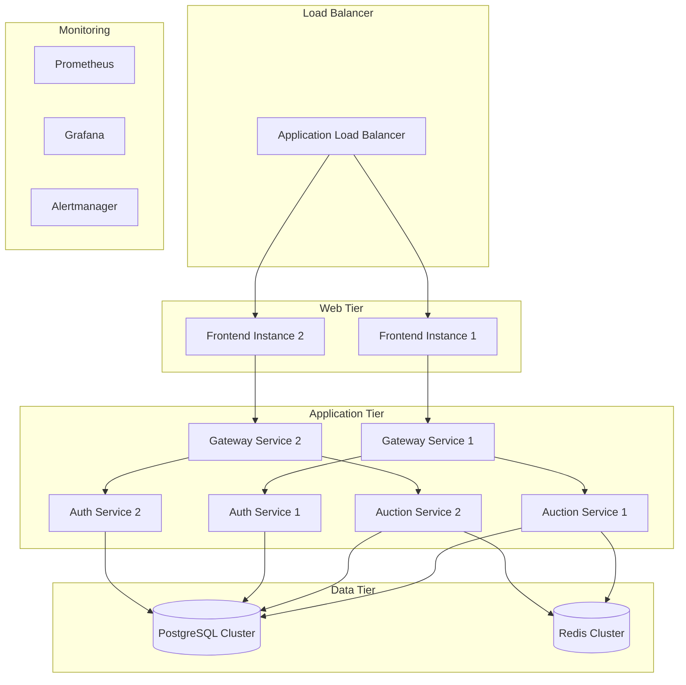

# Blytz Live Auction MVP - Comprehensive Deployment Guide

## Overview

This guide provides complete instructions for deploying the Blytz Live Auction MVP platform across different environments, from local development to production deployment.

## Table of Contents

1. [Prerequisites](#prerequisites)
2. [Environment Types](#environment-types)
3. [Infrastructure Requirements](#infrastructure-requirements)
4. [Local Development Setup](#local-development-setup)
5. [Staging Environment Deployment](#staging-environment-deployment)
6. [Production Environment Deployment](#production-environment-deployment)
7. [Database Setup](#database-setup)
8. [Monitoring Setup](#monitoring-setup)
9. [Security Configuration](#security-configuration)
10. [Backup and Recovery](#backup-and-recovery)
11. [Scaling Considerations](#scaling-considerations)
12. [Troubleshooting](#troubleshooting)

## Prerequisites

### System Requirements

**Minimum Requirements:**
- CPU: 4 cores
- RAM: 8GB
- Storage: 100GB SSD
- Network: 100Mbps

**Recommended Requirements:**
- CPU: 8 cores
- RAM: 16GB
- Storage: 500GB SSD
- Network: 1Gbps

### Software Dependencies

**Required Software:**
- Docker 20.10+
- Docker Compose 2.0+
- Go 1.25+ (for local development)
- Node.js 18+ (for frontend development)
- PostgreSQL 15+ (if not using Docker)
- Redis 7+ (if not using Docker)

**Cloud Provider Accounts:**
- AWS/Azure/GCP account
- LiveKit Cloud account
- Domain name provider
- SSL certificate provider

## Environment Types

### 1. Local Development
- **Purpose**: Development and testing
- **Scale**: Single machine
- **Database**: PostgreSQL in Docker
- **Monitoring**: Basic health checks

### 2. Staging Environment
- **Purpose**: Pre-production testing
- **Scale**: Small cluster (2-3 nodes)
- **Database**: Managed PostgreSQL
- **Monitoring**: Full monitoring stack

### 3. Production Environment
- **Purpose**: Live production
- **Scale**: Auto-scaling cluster
- **Database**: High-availability PostgreSQL
- **Monitoring**: Full observability

## Infrastructure Requirements

### Cloud Architecture



### Resource Allocation

**Staging Environment:**
- Frontend: 2x t3.medium (2 vCPU, 4GB RAM)
- Backend Services: 6x t3.small (1 vCPU, 2GB RAM)
- Database: db.t3.medium (2 vCPU, 4GB RAM)
- Redis: cache.t3.micro (1 vCPU, 0.5GB RAM)

**Production Environment:**
- Frontend: 3x t3.large (2 vCPU, 8GB RAM) + Auto-scaling
- Backend Services: 10x t3.medium + Auto-scaling
- Database: db.r6g.large (2 vCPU, 16GB RAM) + Read Replicas
- Redis: cache.r6g.large (2 vCPU, 13GB RAM) + Cluster

## Local Development Setup

### 1. Clone Repository

```bash
git clone https://github.com/gmsas95/blytz.live.latest.git
cd blytz.live.latest
```

### 2. Environment Configuration

```bash
# Copy environment templates
cp .env.production.template .env.local
cp frontend/.env.local.example frontend/.env.local

# Edit environment variables
nano .env.local
nano frontend/.env.local
```

### 3. Start Services with Docker Compose

```bash
# Start all services
docker-compose up -d

# Check service status
docker-compose ps

# View logs
docker-compose logs -f
```

### 4. Database Setup

```bash
# Run database migrations
./scripts/setup-database.sh

# Create seed data
./scripts/create-seed-data.sh
```

### 5. Verify Installation

```bash
# Test all services
./scripts/test-integration.sh

# Check individual services
curl http://localhost:8080/health
curl http://localhost:8085/health
curl http://localhost:8086/health
```

## Staging Environment Deployment

### 1. Infrastructure Setup

#### AWS CloudFormation Template

```yaml
AWSTemplateFormatVersion: '2010-09-09'
Description: 'Blytz Staging Environment'

Parameters:
  EnvironmentName:
    Type: String
    Default: 'staging'
  VpcCidr:
    Type: String
    Default: '10.0.0.0/16'

Resources:
  VPC:
    Type: AWS::EC2::VPC
    Properties:
      CidrBlock: !Ref VpcCidr
      EnableDnsHostnames: true
      EnableDnsSupport: true
      Tags:
        - Key: Name
          Value: !Sub '${EnvironmentName}-vpc'

  PublicSubnet1:
    Type: AWS::EC2::Subnet
    Properties:
      VpcId: !Ref VPC
      CidrBlock: !Sub '10.0.1.0/24'
      AvailabilityZone: !Select [0, !GetAZs '']
      MapPublicIpOnLaunch: true

  PublicSubnet2:
    Type: AWS::EC2::Subnet
    Properties:
      VpcId: !Ref VPC
      CidrBlock: !Sub '10.0.2.0/24'
      AvailabilityZone: !Select [1, !GetAZs '']
      MapPublicIpOnLaunch: true

  PrivateSubnet1:
    Type: AWS::EC2::Subnet
    Properties:
      VpcId: !Ref VPC
      CidrBlock: !Sub '10.0.3.0/24'
      AvailabilityZone: !Select [0, !GetAZs '']

  PrivateSubnet2:
    Type: AWS::EC2::Subnet
    Properties:
      VpcId: !Ref VPC
      CidrBlock: !Sub '10.0.4.0/24'
      AvailabilityZone: !Select [1, !GetAZs '']

  InternetGateway:
    Type: AWS::EC2::InternetGateway
    Properties:
      Tags:
        - Key: Name
          Value: !Sub '${EnvironmentName}-igw'

  AttachGateway:
    Type: AWS::EC2::VPCGatewayAttachment
    Properties:
      VpcId: !Ref VPC
      InternetGatewayId: !Ref InternetGateway

  PublicRouteTable:
    Type: AWS::EC2::RouteTable
    Properties:
      VpcId: !Ref VPC
      Tags:
        - Key: Name
          Value: !Sub '${EnvironmentName}-public-rt'

  PublicRoute:
    Type: AWS::EC2::Route
    DependsOn: AttachGateway
    Properties:
      RouteTableId: !Ref PublicRouteTable
      DestinationCidrBlock: '0.0.0.0/0'
      GatewayId: !Ref InternetGateway

  PublicSubnet1RouteTableAssociation:
    Type: AWS::EC2::SubnetRouteTableAssociation
    Properties:
      SubnetId: !Ref PublicSubnet1
      RouteTableId: !Ref PublicRouteTable

  PublicSubnet2RouteTableAssociation:
    Type: AWS::EC2::SubnetRouteTableAssociation
    Properties:
      SubnetId: !Ref PublicSubnet2
      RouteTableId: !Ref PublicRouteTable
```

### 2. Database Setup

#### Amazon RDS Configuration

```bash
# Create RDS instance
aws rds create-db-instance \
    --db-instance-identifier blytz-staging-db \
    --db-instance-class db.t3.medium \
    --engine postgres \
    --engine-version 15.4 \
    --master-username blytz_admin \
    --master-user-password your_secure_password \
    --allocated-storage 100 \
    --vpc-security-group-ids sg-xxxxxxxxx \
    --db-subnet-group-name default \
    --backup-retention-period 7 \
    --multi-az \
    --storage-type gp2 \
    --storage-encrypted

# Wait for instance to be available
aws rds wait db-instance-available \
    --db-instance-identifier blytz-staging-db
```

#### Redis Configuration

```bash
# Create Redis cluster
aws elasticache create-cache-cluster \
    --cache-cluster-id blytz-staging-redis \
    --cache-node-type cache.t3.micro \
    --engine redis \
    --num-cache-nodes 1 \
    --security-group-ids sg-xxxxxxxxx \
    --subnet-group-name default
```

### 3. Application Deployment

#### Docker Image Build and Push

```bash
# Build backend service images
docker build -t blytz/auth-service:staging ./services/auth-service
docker build -t blytz/product-service:staging ./services/product-service
docker build -t blytz/auction-service:staging ./services/auction-service
docker build -t blytz/order-service:staging ./services/order-service
docker build -t blytz/payment-service:staging ./services/payment-service
docker build -t blytz/chat-service:staging ./services/chat-service
docker build -t blytz/logistics-service:staging ./services/logistics-service
docker build -t blytz/gateway-service:staging ./services/gateway-service
docker build -t blytz/livekit-service:staging ./services/livekit-service
docker build -t blytz/notification-service:staging ./services/notification-service

# Build frontend image
docker build -t blytz/frontend:staging ./frontend

# Push to ECR
aws ecr get-login-password --region us-east-1 | docker login --username AWS --password-stdin xxxxxxxxxxxx.dkr.ecr.us-east-1.amazonaws.com

docker push blytz/auth-service:staging
docker push blytz/product-service:staging
docker push blytz/auction-service:staging
docker push blytz/order-service:staging
docker push blytz/payment-service:staging
docker push blytz/chat-service:staging
docker push blytz/logistics-service:staging
docker push blytz/gateway-service:staging
docker push blytz/livekit-service:staging
docker push blytz/notification-service:staging
docker push blytz/frontend:staging
```

#### Kubernetes Deployment

```yaml
# namespace.yaml
apiVersion: v1
kind: Namespace
metadata:
  name: blytz-staging

---
# configmap.yaml
apiVersion: v1
kind: ConfigMap
metadata:
  name: blytz-config
  namespace: blytz-staging
data:
  ENVIRONMENT: "staging"
  LOG_LEVEL: "info"
  DATABASE_HOST: "blytz-staging-db.xxxxxxxxxx.us-east-1.rds.amazonaws.com"
  REDIS_HOST: "blytz-staging-redis.xxxxxxxxxx.0001.use1.cache.amazonaws.com"
  LIVEKIT_URL: "https://blytz-staging-u5u72ozx.livekit.cloud"

---
# secret.yaml
apiVersion: v1
kind: Secret
metadata:
  name: blytz-secrets
  namespace: blytz-staging
type: Opaque
data:
  DATABASE_PASSWORD: <base64-encoded-password>
  JWT_SECRET: <base64-encoded-jwt-secret>
  LIVEKIT_API_KEY: <base64-encoded-api-key>
  LIVEKIT_API_SECRET: <base64-encoded-api-secret>

---
# auth-service-deployment.yaml
apiVersion: apps/v1
kind: Deployment
metadata:
  name: auth-service
  namespace: blytz-staging
spec:
  replicas: 2
  selector:
    matchLabels:
      app: auth-service
  template:
    metadata:
      labels:
        app: auth-service
    spec:
      containers:
      - name: auth-service
        image: blytz/auth-service:staging
        ports:
        - containerPort: 8085
        env:
        - name: PORT
          value: "8085"
        - name: DATABASE_URL
          value: "postgresql://blytz_admin:$(DATABASE_PASSWORD)@$(DATABASE_HOST):5432/auth_db"
        - name: REDIS_URL
          value: "redis://$(REDIS_HOST):6379"
        envFrom:
        - configMapRef:
            name: blytz-config
        - secretRef:
            name: blytz-secrets
        resources:
          requests:
            memory: "256Mi"
            cpu: "250m"
          limits:
            memory: "512Mi"
            cpu: "500m"
        livenessProbe:
          httpGet:
            path: /health
            port: 8085
          initialDelaySeconds: 30
          periodSeconds: 10
        readinessProbe:
          httpGet:
            path: /health
            port: 8085
          initialDelaySeconds: 5
          periodSeconds: 5

---
# auth-service-service.yaml
apiVersion: v1
kind: Service
metadata:
  name: auth-service
  namespace: blytz-staging
spec:
  selector:
    app: auth-service
  ports:
  - protocol: TCP
    port: 8085
    targetPort: 8085
  type: ClusterIP
```

### 4. Load Balancer Configuration

```yaml
# ingress.yaml
apiVersion: networking.k8s.io/v1
kind: Ingress
metadata:
  name: blytz-ingress
  namespace: blytz-staging
  annotations:
    kubernetes.io/ingress.class: "nginx"
    cert-manager.io/cluster-issuer: "letsencrypt-prod"
    nginx.ingress.kubernetes.io/ssl-redirect: "true"
spec:
  tls:
  - hosts:
    - staging.blytz.app
    secretName: blytz-tls
  rules:
  - host: staging.blytz.app
    http:
      paths:
      - path: /api/v1/auth
        pathType: Prefix
        backend:
          service:
            name: auth-service
            port:
              number: 8085
      - path: /api/v1/products
        pathType: Prefix
        backend:
          service:
            name: product-service
            port:
              number: 8086
      - path: /api/v1/auctions
        pathType: Prefix
        backend:
          service:
            name: auction-service
            port:
              number: 8087
      - path: /
        pathType: Prefix
        backend:
          service:
            name: frontend-service
            port:
              number: 3000
```

## Production Environment Deployment

### 1. High Availability Architecture

#### Multi-AZ Deployment

```yaml
# production-deployment.yaml
apiVersion: apps/v1
kind: Deployment
metadata:
  name: auth-service
  namespace: blytz-production
spec:
  replicas: 3
  strategy:
    type: RollingUpdate
    rollingUpdate:
      maxUnavailable: 1
      maxSurge: 1
  selector:
    matchLabels:
      app: auth-service
  template:
    metadata:
      labels:
        app: auth-service
        version: v1
    spec:
      affinity:
        podAntiAffinity:
          preferredDuringSchedulingIgnoredDuringExecution:
          - weight: 100
            podAffinityTerm:
              labelSelector:
                matchExpressions:
                - key: app
                  operator: In
                  values:
                  - auth-service
              topologyKey: kubernetes.io/hostname
      containers:
      - name: auth-service
        image: blytz/auth-service:production
        ports:
        - containerPort: 8085
        env:
        - name: PORT
          value: "8085"
        envFrom:
        - configMapRef:
            name: blytz-config
        - secretRef:
            name: blytz-secrets
        resources:
          requests:
            memory: "512Mi"
            cpu: "500m"
          limits:
            memory: "1Gi"
            cpu: "1000m"
        livenessProbe:
          httpGet:
            path: /health
            port: 8085
          initialDelaySeconds: 30
          periodSeconds: 10
          timeoutSeconds: 5
          failureThreshold: 3
        readinessProbe:
          httpGet:
            path: /health
            port: 8085
          initialDelaySeconds: 5
          periodSeconds: 5
          timeoutSeconds: 3
          failureThreshold: 3
```

### 2. Auto-scaling Configuration

```yaml
# hpa.yaml
apiVersion: autoscaling/v2
kind: HorizontalPodAutoscaler
metadata:
  name: auth-service-hpa
  namespace: blytz-production
spec:
  scaleTargetRef:
    apiVersion: apps/v1
    kind: Deployment
    name: auth-service
  minReplicas: 3
  maxReplicas: 10
  metrics:
  - type: Resource
    resource:
      name: cpu
      target:
        type: Utilization
        averageUtilization: 70
  - type: Resource
    resource:
      name: memory
      target:
        type: Utilization
        averageUtilization: 80
  behavior:
    scaleDown:
      stabilizationWindowSeconds: 300
      policies:
      - type: Percent
        value: 10
        periodSeconds: 60
    scaleUp:
      stabilizationWindowSeconds: 0
      policies:
      - type: Percent
        value: 100
        periodSeconds: 15
      - type: Pods
        value: 4
        periodSeconds: 15
      selectPolicy: Max
```

### 3. Database High Availability

```bash
# Create production RDS with Multi-AZ
aws rds create-db-instance \
    --db-instance-identifier blytz-production-db \
    --db-instance-class db.r6g.large \
    --engine postgres \
    --engine-version 15.4 \
    --master-username blytz_admin \
    --master-user-password your_production_password \
    --allocated-storage 1000 \
    --storage-type gp3 \
    --iops 3000 \
    --vpc-security-group-ids sg-xxxxxxxxx \
    --db-subnet-group-name production-subnet-group \
    --backup-retention-period 30 \
    --multi-az \
    --storage-encrypted \
    --kms-key-id alias/aws/rds \
    --monitoring-interval 60 \
    --enable-performance-insights \
    --performance-insights-retention-period 7

# Create read replicas
aws rds create-db-instance-read-replica \
    --db-instance-identifier blytz-production-db-replica-1 \
    --source-db-instance-identifier blytz-production-db \
    --db-instance-class db.r6g.large \
    --availability-zone us-east-1b
```

## Database Setup

### 1. Database Migration

```bash
#!/bin/bash
# migrate-database.sh

set -e

# Environment variables
DB_HOST=${DATABASE_HOST:-localhost}
DB_PORT=${DATABASE_PORT:-5432}
DB_USER=${DATABASE_USER:-blytz_admin}
DB_NAME=${DATABASE_NAME:-blytz_db}

# Wait for database to be ready
echo "Waiting for database to be ready..."
until pg_isready -h $DB_HOST -p $DB_PORT -U $DB_USER; do
  echo "Database is unavailable - sleeping"
  sleep 1
done

echo "Database is ready - running migrations"

# Run migrations for each service
services=("auth" "products" "auctions" "orders" "payments" "chat" "logistics" "notifications")

for service in "${services[@]}"; do
  echo "Running migrations for $service service..."
  
  # Create database if it doesn't exist
  psql -h $DB_HOST -p $DB_PORT -U $DB_USER -d postgres -c "CREATE DATABASE ${service}_db;" || true
  
  # Run migrations
  if [ -d "./services/${service}-service/migrations" ]; then
    migrate -path "./services/${service}-service/migrations" \
            -database "postgresql://$DB_USER:$DATABASE_PASSWORD@$DB_HOST:$DB_PORT/${service}_db?sslmode=require" \
            up
  fi
done

echo "All migrations completed successfully"
```

### 2. Seed Data

```bash
#!/bin/bash
# create-seed-data.sh

set -e

echo "Creating seed data..."

# Create admin user
psql $DATABASE_URL -c "
INSERT INTO users (id, email, password_hash, name, role, is_active, created_at, updated_at)
VALUES (
  gen_random_uuid(),
  'admin@blytz.app',
  '$2a$10$xxxxxxxxxxxxxxxxxxxxxxxxxxxxxxxxxxxxxxxxxxxxxxxxxxxxx',
  'System Administrator',
  'admin',
  true,
  NOW(),
  NOW()
) ON CONFLICT (email) DO NOTHING;
"

# Create sample categories
psql $DATABASE_URL -c "
INSERT INTO categories (id, name, description, created_at, updated_at)
VALUES 
  (gen_random_uuid(), 'Electronics', 'Electronic devices and gadgets', NOW(), NOW()),
  (gen_random_uuid(), 'Fashion', 'Clothing and accessories', NOW(), NOW()),
  (gen_random_uuid(), 'Home & Garden', 'Home improvement and garden supplies', NOW(), NOW())
ON CONFLICT DO NOTHING;
"

echo "Seed data created successfully"
```

## Monitoring Setup

### 1. Prometheus Configuration

```yaml
# prometheus-production.yml
global:
  scrape_interval: 15s
  evaluation_interval: 15s

rule_files:
  - "/etc/prometheus/rules/*.yml"

alerting:
  alertmanagers:
    - static_configs:
        - targets:
          - alertmanager:9093

scrape_configs:
  - job_name: 'kubernetes-pods'
    kubernetes_sd_configs:
      - role: pod
    relabel_configs:
      - source_labels: [__meta_kubernetes_pod_annotation_prometheus_io_scrape]
        action: keep
        regex: true
      - source_labels: [__meta_kubernetes_pod_annotation_prometheus_io_path]
        action: replace
        target_label: __metrics_path__
        regex: (.+)
      - source_labels: [__address__, __meta_kubernetes_pod_annotation_prometheus_io_port]
        action: replace
        regex: ([^:]+)(?::\d+)?;(\d+)
        replacement: $1:$2
        target_label: __address__
      - action: labelmap
        regex: __meta_kubernetes_pod_label_(.+)
      - source_labels: [__meta_kubernetes_namespace]
        action: replace
        target_label: kubernetes_namespace
      - source_labels: [__meta_kubernetes_pod_name]
        action: replace
        target_label: kubernetes_pod_name
```

### 2. Grafana Dashboards

```json
{
  "dashboard": {
    "title": "Blytz Production Overview",
    "tags": ["blytz", "production"],
    "timezone": "browser",
    "panels": [
      {
        "title": "Request Rate",
        "type": "graph",
        "targets": [
          {
            "expr": "sum(rate(http_requests_total[5m])) by (service)",
            "legendFormat": "{{service}}"
          }
        ]
      },
      {
        "title": "Error Rate",
        "type": "graph",
        "targets": [
          {
            "expr": "sum(rate(http_requests_total{status=~\"5..\"}[5m])) by (service) / sum(rate(http_requests_total[5m])) by (service)",
            "legendFormat": "{{service}}"
          }
        ]
      },
      {
        "title": "Response Time",
        "type": "graph",
        "targets": [
          {
            "expr": "histogram_quantile(0.95, sum(rate(http_request_duration_seconds_bucket[5m])) by (le, service))",
            "legendFormat": "95th percentile - {{service}}"
          }
        ]
      }
    ]
  }
}
```

## Security Configuration

### 1. Network Security

```yaml
# network-policy.yaml
apiVersion: networking.k8s.io/v1
kind: NetworkPolicy
metadata:
  name: blytz-network-policy
  namespace: blytz-production
spec:
  podSelector: {}
  policyTypes:
  - Ingress
  - Egress
  ingress:
  - from:
    - namespaceSelector:
        matchLabels:
          name: blytz-production
    - namespaceSelector:
        matchLabels:
          name: ingress-nginx
  egress:
  - to:
    - namespaceSelector:
        matchLabels:
          name: blytz-production
  - to: []
    ports:
    - protocol: TCP
      port: 53
    - protocol: UDP
      port: 53
  - to:
    - namespaceSelector:
        matchLabels:
          name: kube-system
    ports:
    - protocol: TCP
      port: 443
    - protocol: TCP
      port: 53
```

### 2. Pod Security

```yaml
# pod-security-policy.yaml
apiVersion: policy/v1beta1
kind: PodSecurityPolicy
metadata:
  name: blytz-restricted-psp
spec:
  privileged: false
  allowPrivilegeEscalation: false
  requiredDropCapabilities:
    - ALL
  volumes:
    - 'configMap'
    - 'emptyDir'
    - 'projected'
    - 'secret'
    - 'downwardAPI'
    - 'persistentVolumeClaim'
  runAsUser:
    rule: 'MustRunAsNonRoot'
  seLinux:
    rule: 'RunAsAny'
  fsGroup:
    rule: 'RunAsAny'
```

## Backup and Recovery

### 1. Database Backup

```bash
#!/bin/bash
# backup-database.sh

set -e

# Configuration
BACKUP_DIR="/backups"
RETENTION_DAYS=30
DB_INSTANCE="blytz-production-db"
S3_BUCKET="blytz-backups"

# Create backup directory
mkdir -p $BACKUP_DIR

# Generate backup filename
TIMESTAMP=$(date +%Y%m%d_%H%M%S)
BACKUP_FILE="$BACKUP_DIR/blytz_backup_$TIMESTAMP.sql"

# Create database snapshot
echo "Creating database snapshot..."
aws rds create-db-snapshot \
    --db-instance-identifier $DB_INSTANCE \
    --db-snapshot-identifier blytz-snapshot-$TIMESTAMP

# Wait for snapshot to complete
echo "Waiting for snapshot to complete..."
aws rds wait db-snapshot-available \
    --db-snapshot-identifier blytz-snapshot-$TIMESTAMP

# Export snapshot to S3
echo "Exporting snapshot to S3..."
aws rds start-export-task \
    --export-task-identifier blytz-export-$TIMESTAMP \
    --source-arn arn:aws:rds:us-east-1:123456789012:snapshot:blytz-snapshot-$TIMESTAMP \
    --s3-bucket-name $S3_BUCKET \
    --iam-role-arn arn:aws:iam::123456789012:role/rds-export-role \
    --kms-key-id alias/aws/rds

# Clean old backups
echo "Cleaning old backups..."
find $BACKUP_DIR -name "*.sql" -mtime +$RETENTION_DAYS -delete

echo "Backup completed successfully"
```

### 2. Application Backup

```bash
#!/bin/bash
# backup-application.sh

set -e

# Configuration
BACKUP_DIR="/backups"
RETENTION_DAYS=7
NAMESPACE="blytz-production"

# Create backup directory
mkdir -p $BACKUP_DIR

# Backup Kubernetes resources
echo "Backing up Kubernetes resources..."
kubectl get all,configmaps,secrets,pvc -n $NAMESPACE -o yaml > $BACKUP_DIR/k8s-resources-$(date +%Y%m%d_%H%M%S).yaml

# Backup persistent volumes
echo "Backing up persistent volumes..."
kubectl get pvc -n $NAMESPACE -o jsonpath='{range .items[*]}{.metadata.name}{"\n"}{end}' | while read pvc; do
  echo "Backing up PVC: $pvc"
  kubectl exec -n $NAMESPACE deployment/backup -- tar czf - /data/$pvc > $BACKUP_DIR/pvc-$pvc-$(date +%Y%m%d_%H%M%S).tar.gz
done

# Clean old backups
echo "Cleaning old backups..."
find $BACKUP_DIR -name "*.yaml" -mtime +$RETENTION_DAYS -delete
find $BACKUP_DIR -name "*.tar.gz" -mtime +$RETENTION_DAYS -delete

echo "Application backup completed successfully"
```

## Scaling Considerations

### 1. Horizontal Scaling

```yaml
# cluster-autoscaler.yaml
apiVersion: apps/v1
kind: Deployment
metadata:
  name: cluster-autoscaler
  namespace: kube-system
spec:
  replicas: 1
  selector:
    matchLabels:
      app: cluster-autoscaler
  template:
    metadata:
      labels:
        app: cluster-autoscaler
    spec:
      containers:
      - image: k8s.gcr.io/autoscaling/cluster-autoscaler:v1.21.0
        name: cluster-autoscaler
        resources:
          limits:
            cpu: 100m
            memory: 300Mi
          requests:
            cpu: 100m
            memory: 300Mi
        command:
        - ./cluster-autoscaler
        - --v=4
        - --stderrthreshold=info
        - --cloud-provider=aws
        - --skip-nodes-with-local-storage=false
        - --expander=least-waste
        - --node-group-auto-discovery=asg:tag=k8s.io/cluster-autoscaler/enabled,k8s.io/cluster-autoscaler/blytz-production
        - --balance-similar-node-groups
        - --skip-nodes-with-system-pods=false
```

### 2. Vertical Scaling

```yaml
# vpa.yaml
apiVersion: autoscaling.k8s.io/v1
kind: VerticalPodAutoscaler
metadata:
  name: auth-service-vpa
  namespace: blytz-production
spec:
  targetRef:
    apiVersion: apps/v1
    kind: Deployment
    name: auth-service
  updatePolicy:
    updateMode: "Auto"
  resourcePolicy:
    containerPolicies:
    - containerName: auth-service
      maxAllowed:
        cpu: 2
        memory: 4Gi
      minAllowed:
        cpu: 100m
        memory: 128Mi
```

## Troubleshooting

### Common Issues and Solutions

#### 1. Service Not Starting

```bash
# Check pod status
kubectl get pods -n blytz-production

# Check pod logs
kubectl logs -f deployment/auth-service -n blytz-production

# Describe pod for detailed information
kubectl describe pod <pod-name> -n blytz-production

# Check events
kubectl get events -n blytz-production --sort-by='.lastTimestamp'
```

#### 2. Database Connection Issues

```bash
# Test database connectivity
kubectl exec -it deployment/auth-service -n blytz-production -- psql $DATABASE_URL -c "SELECT 1;"

# Check database logs
aws rds describe-db-log-files --db-instance-identifier blytz-production-db

# View database error logs
aws rds download-db-log-file-portion --db-instance-identifier blytz-production-db --log-file-name error/postgresql.log.2023-12-01-00
```

#### 3. Performance Issues

```bash
# Check resource usage
kubectl top pods -n blytz-production
kubectl top nodes

# Check database performance
aws rds describe-db-parameters --db-instance-identifier blytz-production-db

# View slow queries
SELECT query, mean_time, calls 
FROM pg_stat_statements 
ORDER BY mean_time DESC 
LIMIT 10;
```

### Emergency Procedures

#### Service Recovery

```bash
#!/bin/bash
# emergency-recovery.sh

set -e

NAMESPACE="blytz-production"
SERVICE=$1

if [ -z "$SERVICE" ]; then
  echo "Usage: $0 <service-name>"
  exit 1
fi

echo "Emergency recovery for $SERVICE..."

# Restart deployment
kubectl rollout restart deployment/$SERVICE -n $NAMESPACE

# Wait for rollout to complete
kubectl rollout status deployment/$SERVICE -n $NAMESPACE --timeout=300s

# Verify service health
kubectl wait --for=condition=ready pod -l app=$SERVICE -n $NAMESPACE --timeout=300s

echo "Emergency recovery completed for $SERVICE"
```

#### Database Recovery

```bash
#!/bin/bash
# database-recovery.sh

set -e

BACKUP_ID=$1
DB_INSTANCE="blytz-production-db"

if [ -z "$BACKUP_ID" ]; then
  echo "Usage: $0 <backup-id>"
  exit 1
fi

echo "Starting database recovery from backup $BACKUP_ID..."

# Restore from snapshot
aws rds restore-db-instance-from-db-snapshot \
    --db-instance-identifier $DB_INSTANCE-recovered \
    --db-snapshot-identifier $BACKUP_ID \
    --db-instance-class db.r6g.large \
    --multi-az \
    --publicly-accessible \
    --vpc-security-group-ids sg-xxxxxxxxx \
    --db-subnet-group-name production-subnet-group

# Wait for instance to be available
aws rds wait db-instance-available --db-instance-identifier $DB_INSTANCE-recovered

echo "Database recovery completed. New instance: $DB_INSTANCE-recovered"
```

## Conclusion

This comprehensive deployment guide provides all the necessary information to successfully deploy the Blytz Live Auction MVP platform across different environments. Following these guidelines ensures:

- **Reliability**: High availability and fault tolerance
- **Security**: Proper security controls and best practices
- **Scalability**: Auto-scaling and performance optimization
- **Maintainability**: Proper monitoring and backup procedures

For additional support or questions, refer to the operational runbooks or contact the DevOps team.

---

**Last Updated**: 2025-12-11  
**Version**: 1.0  
**Maintainer**: DevOps Team