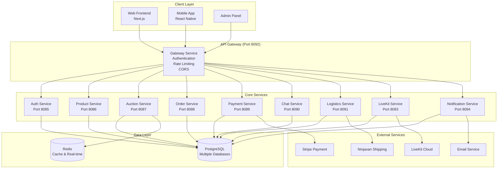
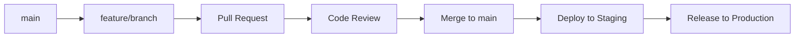

# Blytz Live Auction - Developer Onboarding Guide

## Welcome to the Blytz Development Team!

This guide will help you get familiar with the Blytz Live Auction platform architecture, development workflow, and best practices. Whether you're working on backend services, frontend, or mobile apps, this document provides everything you need to start contributing effectively.

## Table of Contents

1. [System Architecture Overview](#system-architecture-overview)
2. [Development Environment Setup](#development-environment-setup)
3. [Code Structure and Organization](#code-structure-and-organization)
4. [Development Workflow](#development-workflow)
5. [Backend Development](#backend-development)
6. [Frontend Development](#frontend-development)
7. [Mobile Development](#mobile-development)
8. [Testing Guidelines](#testing-guidelines)
9. [Code Quality Standards](#code-quality-standards)
10. [Security Best Practices](#security-best-practices)
11. [Performance Optimization](#performance-optimization)
12. [Debugging and Troubleshooting](#debugging-and-troubleshooting)
13. [Deployment and Release Process](#deployment-and-release-process)
14. [Resources and References](#resources-and-references)

## System Architecture Overview

### Microservices Architecture



### Technology Stack

#### Backend Services
- **Language**: Go 1.25+
- **Framework**: Gin Web Framework
- **Database**: PostgreSQL 15
- **Cache**: Redis 7
- **Authentication**: JWT with bcrypt
- **ORM**: GORM
- **Message Queue**: Redis Pub/Sub
- **Monitoring**: Prometheus + Grafana
- **Logging**: Structured JSON logging

#### Frontend
- **Framework**: Next.js 14 with App Router
- **Language**: TypeScript
- **Styling**: Tailwind CSS + shadcn/ui
- **State Management**: React Context + Zustand
- **HTTP Client**: Axios
- **Testing**: Jest + React Testing Library + Playwright

#### Mobile
- **Framework**: React Native with Expo
- **Language**: TypeScript
- **Navigation**: React Navigation
- **State Management**: Zustand
- **HTTP Client**: Axios
- **Testing**: Jest + React Native Testing Library

#### Infrastructure
- **Containerization**: Docker + Docker Compose
- **Orchestration**: Kubernetes
- **CI/CD**: GitHub Actions
- **Cloud**: AWS (Primary)
- **Monitoring**: Prometheus + Grafana + Loki
- **Load Balancer**: NGINX/ALB

## Development Environment Setup

### Prerequisites

#### Required Software
- **Go**: 1.25 or later
- **Node.js**: 18.0 or later
- **npm**: 8.0 or later
- **Docker**: 20.10 or later
- **Docker Compose**: 2.0 or later
- **Git**: 2.30 or later
- **PostgreSQL**: 15 or later (if not using Docker)
- **Redis**: 7 or later (if not using Docker)

#### Development Tools
- **IDE**: VS Code (recommended) with extensions:
  - Go extension
  - TypeScript and JavaScript Language Features
  - Tailwind CSS IntelliSense
  - Docker
  - GitLens
- **API Testing**: Postman or Insomnia
- **Database Management**: pgAdmin or DBeaver
- **Redis Client**: RedisInsight

### Environment Setup Steps

#### 1. Clone Repository

```bash
git clone https://github.com/gmsas95/blytz.live.latest.git
cd blytz.live.latest
```

#### 2. Backend Setup

```bash
# Install Go dependencies
cd services/auth-service
go mod download
go mod tidy

# Return to root and install all service dependencies
cd ../../
for service in services/*/; do
  echo "Installing dependencies for $service"
  cd "$service"
  go mod download
  go mod tidy
  cd ../../
done
```

#### 3. Frontend Setup

```bash
cd frontend
npm install
cd ..
```

#### 4. Mobile Setup

```bash
cd frontend-mobile-rn
npm install
cd ..
```

#### 5. Environment Configuration

```bash
# Copy environment templates
cp .env.production.template .env.local
cp frontend/.env.local.example frontend/.env.local

# Edit environment files
nano .env.local
nano frontend/.env.local
```

#### 6. Start Development Environment

```bash
# Start all services with Docker Compose
docker-compose up -d

# Or start services individually for development
cd services/auth-service && go run main.go &
cd ../product-service && go run main.go &
cd ../auction-service && go run main.go &
cd ../order-service && go run main.go &
cd ../payment-service && go run main.go &
cd ../chat-service && go run main.go &
cd ../logistics-service && go run main.go &
cd ../gateway-service && go run main.go &
cd ../livekit-service && go run main.go &
cd ../notification-service && go run main.go &

# Start frontend
cd frontend && npm run dev &

# Start mobile (optional)
cd ../frontend-mobile-rn && npm start &
```

### Development Scripts

#### Useful Commands

```bash
# Database operations
./scripts/setup-database.sh          # Initialize databases
./scripts/run-migrations.sh up      # Run migrations
./scripts/create-seed-data.sh       # Create test data

# Testing
./scripts/test-all.sh               # Run all tests
./scripts/test-integration.sh       # Integration tests
./scripts/test-performance.sh       # Performance tests

# Development helpers
./scripts/start-dev.sh              # Start development environment
./scripts/stop-dev.sh              # Stop development environment
./scripts/clean.sh                 # Clean up containers and volumes
```

## Code Structure and Organization

### Repository Structure

```
blytz.live.latest/
├── 📁 services/                    # Backend microservices
│   ├── auth-service/               # Authentication service
│   │   ├── main.go                # Service entry point
│   │   ├── go.mod                 # Go module file
│   │   ├── go.sum                 # Dependency checksums
│   │   ├── Dockerfile              # Container configuration
│   │   ├── internal/               # Private application code
│   │   │   ├── api/               # HTTP handlers, routes, middleware
│   │   │   │   ├── handlers/      # Request handlers
│   │   │   │   ├── routes/        # Route definitions
│   │   │   │   └── middleware/    # HTTP middleware
│   │   │   ├── services/           # Business logic
│   │   │   ├── models/             # Data models
│   │   │   ├── config/             # Configuration
│   │   │   └── database/          # Database setup
│   │   ├── pkg/                   # Public library code
│   │   └── tests/                 # Integration tests
│   ├── product-service/            # Product catalog service
│   ├── auction-service/            # Auction management service
│   ├── order-service/              # Order processing service
│   ├── payment-service/            # Payment processing service
│   ├── chat-service/              # Real-time messaging service
│   ├── logistics-service/          # Shipping and tracking service
│   ├── gateway-service/            # API gateway service
│   ├── livekit-service/           # Video streaming service
│   └── notification-service/       # Notification service
├── 📁 frontend/                   # Next.js web application
│   ├── src/                      # Source code
│   │   ├── app/                   # App Router pages
│   │   ├── components/            # Reusable components
│   │   ├── lib/                   # Utility libraries
│   │   ├── hooks/                 # Custom React hooks
│   │   ├── contexts/              # React contexts
│   │   └── types/                 # TypeScript type definitions
│   ├── public/                    # Static assets
│   ├── tests/                     # Test files
│   └── package.json              # Dependencies and scripts
├── 📁 frontend-mobile-rn/          # React Native mobile app
│   ├── src/                      # Source code
│   ├── android/                   # Android-specific code
│   ├── ios/                      # iOS-specific code
│   └── package.json              # Dependencies and scripts
├── 📁 shared/                     # Shared libraries
│   ├── pkg/                      # Common utilities
│   │   ├── auth/                  # Authentication utilities
│   │   ├── errors/                # Error handling
│   │   ├── utils/                 # General utilities
│   │   └── metrics/               # Metrics collection
│   └── go.mod                    # Go module for shared code
├── 📁 monitoring/                 # Monitoring configuration
│   ├── prometheus/                # Prometheus configuration
│   ├── grafana/                  # Grafana dashboards
│   ├── alertmanager/              # Alert routing
│   ├── loki/                     # Log aggregation
│   └── promtail/                  # Log collection
├── 📁 scripts/                    # Utility scripts
├── 📁 docs/                       # Documentation
├── 📁 tests/                      # Cross-service tests
├── 📁 config/                     # Configuration files
├── docker-compose.yml             # Development environment
├── go.work                       # Go workspace configuration
└── README.md                     # Project overview
```

### Service Structure Pattern

Each microservice follows this consistent structure:

```
service-name/
├── main.go                      # Entry point
├── go.mod                       # Dependencies
├── go.sum                       # Dependency checksums
├── Dockerfile                   # Container definition
├── internal/                    # Private code
│   ├── api/                    # HTTP layer
│   │   ├── handlers/           # Request handlers
│   │   ├── routes/             # Route definitions
│   │   └── middleware/         # HTTP middleware
│   ├── services/               # Business logic
│   ├── models/                 # Data models
│   ├── config/                 # Configuration
│   └── database/              # Database setup
├── pkg/                       # Public code
└── tests/                     # Tests
```

## Development Workflow

### Git Workflow

We use **GitHub Flow** with feature branches:



#### Branch Naming Conventions

- **Feature branches**: `feature/description-of-feature`
- **Bug fixes**: `fix/description-of-bug`
- **Hot fixes**: `hotfix/critical-fix-description`
- **Release**: `release/v1.2.3`

#### Commit Message Format

```
<type>(<scope>): <description>

[optional body]

[optional footer]
```

**Types**: feat, fix, docs, style, refactor, test, chore

**Examples**:
```bash
feat(auth): add JWT refresh token support
fix(payment): handle Stripe webhook failures
docs(api): update authentication endpoints
test(auction): add integration tests for bidding
```

### Pull Request Process

#### 1. Create Pull Request

```bash
# Push feature branch
git push origin feature/add-user-profile

# Create PR on GitHub
# Title: Add user profile functionality
# Description: Detailed explanation of changes
```

#### 2. PR Template

```markdown
## Description
Brief description of what this PR accomplishes.

## Type of Change
- [ ] Bug fix
- [ ] New feature
- [ ] Breaking change
- [ ] Documentation update

## Testing
- [ ] Unit tests pass
- [ ] Integration tests pass
- [ ] Manual testing completed
- [ ] Performance tests pass

## Checklist
- [ ] Code follows style guidelines
- [ ] Self-review completed
- [ ] Documentation updated
- [ ] Tests added/updated
- [ ] Security considerations addressed
```

#### 3. Code Review Requirements

- **At least one approval** from team member
- **All checks must pass** (CI/CD pipeline)
- **No merge conflicts** with main branch
- **Documentation updated** for API changes

### Continuous Integration

#### GitHub Actions Workflow

```yaml
# .github/workflows/ci.yml
name: CI/CD Pipeline

on:
  push:
    branches: [ main ]
  pull_request:
    branches: [ main ]

jobs:
  test-backend:
    runs-on: ubuntu-latest
    steps:
    - uses: actions/checkout@v3
    - uses: actions/setup-go@v3
      with:
        go-version: '1.25'
    - name: Run tests
      run: ./scripts/test-all.sh

  test-frontend:
    runs-on: ubuntu-latest
    steps:
    - uses: actions/checkout@v3
    - uses: actions/setup-node@v3
      with:
        node-version: '18'
    - name: Install dependencies
      run: cd frontend && npm ci
    - name: Run tests
      run: cd frontend && npm test

  security-scan:
    runs-on: ubuntu-latest
    steps:
    - uses: actions/checkout@v3
    - name: Run security scan
      run: ./scripts/security-scan.sh
```

## Backend Development

### Service Development Guidelines

#### 1. Project Structure

```go
// services/auth-service/main.go
package main

import (
    "context"
    "log"
    "net/http"
    "os"
    "os/signal"
    "syscall"
    "time"

    "github.com/gin-gonic/gin"
    "github.com/gmsas95/blytz.live.latest/services/auth-service/internal/api/routes"
    "github.com/gmsas95/blytz.live.latest/services/auth-service/internal/config"
    "github.com/gmsas95/blytz.live.latest/services/auth-service/internal/database"
    "github.com/gmsas95/blytz.live.latest/shared/pkg/metrics"
)

func main() {
    // Load configuration
    cfg := config.Load()
    
    // Initialize database
    db, err := database.Initialize(cfg.DatabaseURL)
    if err != nil {
        log.Fatal("Failed to initialize database:", err)
    }
    defer db.Close()
    
    // Setup router
    router := gin.Default()
    router.Use(metrics.MetricsMiddleware("auth-service"))
    routes.SetupRoutes(router, db, cfg)
    
    // Start server
    srv := &http.Server{
        Addr:    ":" + cfg.Port,
        Handler: router,
    }
    
    go func() {
        if err := srv.ListenAndServe(); err != nil && err != http.ErrServerClosed {
            log.Fatal("Server failed to start:", err)
        }
    }()
    
    // Graceful shutdown
    quit := make(chan os.Signal, 1)
    signal.Notify(quit, syscall.SIGINT, syscall.SIGTERM)
    <-quit
    
    ctx, cancel := context.WithTimeout(context.Background(), 30*time.Second)
    defer cancel()
    
    if err := srv.Shutdown(ctx); err != nil {
        log.Fatal("Server forced to shutdown:", err)
    }
    
    log.Println("Server exiting")
}
```

#### 2. Handler Pattern

```go
// services/auth-service/internal/api/handlers/auth.go
package handlers

import (
    "net/http"
    
    "github.com/gin-gonic/gin"
    "github.com/gmsas95/blytz.live.latest/services/auth-service/internal/services"
    "github.com/gmsas95/blytz.live.latest/shared/pkg/utils"
)

type AuthHandler struct {
    authService *services.AuthService
}

func NewAuthHandler(authService *services.AuthService) *AuthHandler {
    return &AuthHandler{
        authService: authService,
    }
}

// RegisterUser handles user registration
func (h *AuthHandler) RegisterUser(c *gin.Context) {
    var req services.RegisterUserRequest
    if err := c.ShouldBindJSON(&req); err != nil {
        utils.SendErrorResponse(c, utils.ErrInvalidRequestBody)
        return
    }
    
    user, err := h.authService.RegisterUser(&req)
    if err != nil {
        utils.SendErrorResponse(c, err)
        return
    }
    
    utils.SendSuccessResponse(c, http.StatusCreated, user)
}

// LoginUser handles user authentication
func (h *AuthHandler) LoginUser(c *gin.Context) {
    var req services.LoginUserRequest
    if err := c.ShouldBindJSON(&req); err != nil {
        utils.SendErrorResponse(c, utils.ErrInvalidRequestBody)
        return
    }
    
    token, user, err := h.authService.LoginUser(&req)
    if err != nil {
        utils.SendErrorResponse(c, err)
        return
    }
    
    response := gin.H{
        "token": token,
        "user":  user,
    }
    
    utils.SendSuccessResponse(c, http.StatusOK, response)
}
```

#### 3. Service Layer Pattern

```go
// services/auth-service/internal/services/auth.go
package services

import (
    "context"
    "errors"
    "time"
    
    "github.com/golang-jwt/jwt/v5"
    "golang.org/x/crypto/bcrypt"
    "gorm.io/gorm"
    
    "github.com/gmsas95/blytz.live.latest/services/auth-service/internal/models"
    "github.com/gmsas95/blytz.live.latest/shared/pkg/errors"
)

type AuthService struct {
    db  *gorm.DB
    cfg *config.Config
}

func NewAuthService(db *gorm.DB, cfg *config.Config) *AuthService {
    return &AuthService{
        db:  db,
        cfg: cfg,
    }
}

type RegisterUserRequest struct {
    Email    string `json:"email" binding:"required,email"`
    Password string `json:"password" binding:"required,min=8"`
    Name     string `json:"name" binding:"required,min=2,max=100"`
}

type LoginUserRequest struct {
    Email    string `json:"email" binding:"required,email"`
    Password string `json:"password" binding:"required"`
}

func (s *AuthService) RegisterUser(req *RegisterUserRequest) (*models.User, error) {
    // Check if user already exists
    var existingUser models.User
    result := s.db.Where("email = ?", req.Email).First(&existingUser)
    if result.Error == nil {
        return nil, errors.UserAlreadyExists
    }
    if !errors.Is(result.Error, gorm.ErrRecordNotFound) {
        return nil, errors.InternalServerError
    }
    
    // Hash password
    hashedPassword, err := bcrypt.GenerateFromPassword([]byte(req.Password), bcrypt.DefaultCost)
    if err != nil {
        return nil, errors.InternalServerError
    }
    
    // Create user
    user := &models.User{
        Email:        req.Email,
        PasswordHash: string(hashedPassword),
        Name:         req.Name,
        Role:         "user",
        IsActive:     true,
        CreatedAt:    time.Now(),
        UpdatedAt:    time.Now(),
    }
    
    if err := s.db.Create(user).Error; err != nil {
        return nil, errors.InternalServerError
    }
    
    // Clear password hash before returning
    user.PasswordHash = ""
    return user, nil
}

func (s *AuthService) LoginUser(req *LoginUserRequest) (string, *models.User, error) {
    // Find user
    var user models.User
    if err := s.db.Where("email = ?", req.Email).First(&user).Error; err != nil {
        if errors.Is(err, gorm.ErrRecordNotFound) {
            return nil, nil, errors.InvalidCredentials
        }
        return nil, nil, errors.InternalServerError
    }
    
    // Verify password
    if err := bcrypt.CompareHashAndPassword([]byte(user.PasswordHash), []byte(req.Password)); err != nil {
        return nil, nil, errors.InvalidCredentials
    }
    
    // Generate JWT token
    token, err := s.generateJWT(&user)
    if err != nil {
        return nil, nil, errors.InternalServerError
    }
    
    // Clear password hash before returning
    user.PasswordHash = ""
    return token, &user, nil
}

func (s *AuthService) generateJWT(user *models.User) (string, error) {
    claims := jwt.MapClaims{
        "user_id": user.ID,
        "email":   user.Email,
        "role":    user.Role,
        "exp":     time.Now().Add(time.Hour * 24).Unix(),
    }
    
    token := jwt.NewWithClaims(jwt.SigningMethodHS256, claims)
    return token.SignedString([]byte(s.cfg.JWTSecret))
}
```

#### 4. Model Pattern

```go
// services/auth-service/internal/models/user.go
package models

import (
    "time"
    
    "github.com/google/uuid"
    "gorm.io/gorm"
)

type User struct {
    ID           uuid.UUID `gorm:"primaryKey;type:uuid;default:gen_random_uuid()" json:"id"`
    Email        string    `gorm:"uniqueIndex;not null" json:"email"`
    PasswordHash string    `gorm:"not null" json:"-"`
    Name         string    `gorm:"not null" json:"name"`
    Role         string    `gorm:"default:user" json:"role"`
    IsActive     bool      `gorm:"default:true" json:"is_active"`
    CreatedAt    time.Time `json:"created_at"`
    UpdatedAt    time.Time `json:"updated_at"`
}

// TableName specifies the table name for the User model
func (User) TableName() string {
    return "users"
}

// BeforeCreate hook to generate UUID
func (u *User) BeforeCreate(tx *gorm.DB) error {
    if u.ID == uuid.Nil {
        u.ID = uuid.New()
    }
    return nil
}
```

### Database Operations

#### Migration Pattern

```go
// services/auth-service/migrations/001_create_users_table.go
package migrations

import (
    "github.com/golang-migrate/migrate/v4"
    _ "github.com/golang-migrate/migrate/v4/database/postgres"
    _ "github.com/golang-migrate/migrate/v4/source/file"
)

func CreateUsersTable(dbURL string) error {
    m, err := migrate.New(
        "file://migrations",
        dbURL,
    )
    if err != nil {
        return err
    }
    defer m.Close()

    if err := m.Up(); err != nil && err != migrate.ErrNoChange {
        return err
    }

    return nil
}
```

### Testing Guidelines

#### Unit Testing

```go
// services/auth-service/internal/services/auth_test.go
package services

import (
    "testing"
    
    "github.com/stretchr/testify/assert"
    "github.com/stretchr/testify/mock"
    "gorm.io/driver/sqlite"
    "gorm.io/gorm"
    
    "github.com/gmsas95/blytz.live.latest/services/auth-service/internal/models"
)

func TestAuthService_RegisterUser(t *testing.T) {
    // Setup test database
    db, err := gorm.Open(sqlite.Open(":memory:"), &gorm.Config{})
    assert.NoError(t, err)
    
    // Auto-migrate
    err = db.AutoMigrate(&models.User{})
    assert.NoError(t, err)
    
    // Create service
    cfg := &config.Config{JWTSecret: "test-secret"}
    service := NewAuthService(db, cfg)
    
    // Test case 1: Successful registration
    t.Run("Successful Registration", func(t *testing.T) {
        req := &RegisterUserRequest{
            Email:    "test@example.com",
            Password: "password123",
            Name:     "Test User",
        }
        
        user, err := service.RegisterUser(req)
        
        assert.NoError(t, err)
        assert.NotEmpty(t, user.ID)
        assert.Equal(t, req.Email, user.Email)
        assert.Equal(t, req.Name, user.Name)
        assert.Equal(t, "user", user.Role)
        assert.True(t, user.IsActive)
        assert.Empty(t, user.PasswordHash) // Password hash should not be returned
    })
    
    // Test case 2: Duplicate email
    t.Run("Duplicate Email", func(t *testing.T) {
        req := &RegisterUserRequest{
            Email:    "test@example.com",
            Password: "password456",
            Name:     "Another User",
        }
        
        user, err := service.RegisterUser(req)
        
        assert.Error(t, err)
        assert.Nil(t, user)
        assert.Equal(t, errors.UserAlreadyExists, err)
    })
}
```

#### Integration Testing

```go
// services/auth-service/tests/integration/auth_integration_test.go
package integration

import (
    "bytes"
    "encoding/json"
    "net/http"
    "net/http/httptest"
    "testing"
    
    "github.com/gin-gonic/gin"
    "github.com/stretchr/testify/assert"
    
    "github.com/gmsas95/blytz.live.latest/services/auth-service/internal/api/handlers"
    "github.com/gmsas95/blytz.live.latest/services/auth-service/internal/api/routes"
    "github.com/gmsas95/blytz.live.latest/services/auth-service/internal/services"
)

func TestAuthIntegration(t *testing.T) {
    // Setup test environment
    gin.SetMode(gin.TestMode)
    
    // Initialize test database
    db := setupTestDB(t)
    defer cleanupTestDB(t, db)
    
    // Create service and handler
    cfg := &config.Config{JWTSecret: "test-secret"}
    authService := services.NewAuthService(db, cfg)
    authHandler := handlers.NewAuthHandler(authService)
    
    // Setup router
    router := gin.New()
    routes.SetupAuthRoutes(router, authHandler)
    
    // Test user registration
    t.Run("User Registration Flow", func(t *testing.T) {
        registerReq := map[string]interface{}{
            "email":    "integration@test.com",
            "password": "integration123",
            "name":     "Integration Test User",
        }
        
        reqBody, _ := json.Marshal(registerReq)
        req := httptest.NewRequest("POST", "/api/v1/auth/register", bytes.NewBuffer(reqBody))
        req.Header.Set("Content-Type", "application/json")
        
        w := httptest.NewRecorder()
        router.ServeHTTP(w, req)
        
        assert.Equal(t, http.StatusCreated, w.Code)
        
        var response map[string]interface{}
        err := json.Unmarshal(w.Body.Bytes(), &response)
        assert.NoError(t, err)
        assert.True(t, response["success"].(bool))
        
        user := response["data"].(map[string]interface{})
        assert.Equal(t, registerReq["email"], user["email"])
        assert.Equal(t, registerReq["name"], user["name"])
    })
}
```

## Frontend Development

### Project Structure

#### Next.js App Router Structure

```
frontend/src/
├── app/                        # App Router pages
│   ├── layout.tsx              # Root layout
│   ├── page.tsx                # Homepage
│   ├── globals.css              # Global styles
│   ├── auth/                   # Authentication pages
│   │   ├── page.tsx            # Auth landing
│   │   ├── login/              # Login page
│   │   └── register/          # Registration page
│   ├── auctions/               # Auction pages
│   │   ├── page.tsx            # Auction listing
│   │   └── [id]/             # Dynamic auction page
│   └── api/                   # API routes
│       └── health/             # Health check
├── components/                 # Reusable components
│   ├── ui/                    # Base UI components
│   ├── forms/                 # Form components
│   ├── auction/               # Auction-specific components
│   └── layout/               # Layout components
├── lib/                      # Utility libraries
│   ├── api-client.ts          # API client
│   ├── auth.ts               # Authentication utilities
│   └── utils.ts              # General utilities
├── hooks/                    # Custom React hooks
│   ├── use-auth.ts           # Authentication hook
│   └── use-auction.ts        # Auction hook
├── contexts/                 # React contexts
│   └── auth-context.tsx     # Authentication context
├── types/                    # TypeScript definitions
│   ├── auth.ts              # Auth types
│   ├── auction.ts           # Auction types
│   └── api.ts               # API response types
└── styles/                   # Style files
    └── globals.css           # Global styles
```

### Component Development

#### Component Pattern

```tsx
// frontend/src/components/auction/AuctionCard.tsx
import React from 'react';
import Link from 'next/link';
import { formatCurrency, formatTimeLeft } from '@/lib/utils';
import { Auction } from '@/types/auction';
import { Button } from '@/components/ui/button';

interface AuctionCardProps {
  auction: Auction;
  onBid?: (auctionId: string, amount: number) => void;
}

export const AuctionCard: React.FC<AuctionCardProps> = ({ 
  auction, 
  onBid 
}) => {
  const handleBid = () => {
    if (onBid) {
      const minBid = auction.currentBid + auction.bidIncrement;
      onBid(auction.id, minBid);
    }
  };

  return (
    <div className="border rounded-lg p-4 shadow-sm hover:shadow-md transition-shadow">
      {/* Product Image */}
      <div className="relative h-48 mb-4">
        
        {auction.isLive && (
          <span className="absolute top-2 right-2 bg-red-500 text-white px-2 py-1 rounded text-sm">
            LIVE
          </span>
        )}
      </div>

      {/* Auction Info */}
      <div className="space-y-2">
        <h3 className="font-semibold text-lg line-clamp-2">
          <Link 
            href={`/auctions/${auction.id}`}
            className="hover:text-blue-600 transition-colors"
          >
            {auction.product.name}
          </Link>
        </h3>
        
        <p className="text-gray-600 text-sm line-clamp-2">
          {auction.product.description}
        </p>

        <div className="flex justify-between items-center">
          <div>
            <p className="text-sm text-gray-500">Current Bid</p>
            <p className="text-xl font-bold text-green-600">
              {formatCurrency(auction.currentBid)}
            </p>
          </div>
          
          <div className="text-right">
            <p className="text-sm text-gray-500">Time Left</p>
            <p className="font-semibold">
              {formatTimeLeft(auction.endTime)}
            </p>
          </div>
        </div>

        {/* Action Buttons */}
        <div className="flex gap-2 mt-4">
          <Button 
            onClick={handleBid}
            className="flex-1"
            disabled={!auction.isActive}
          >
            Place Bid
          </Button>
          
          <Button 
            variant="outline"
            className="flex-1"
          >
            Watch
          </Button>
        </div>
      </div>
    </div>
  );
};
```

#### Custom Hook Pattern

```tsx
// frontend/src/hooks/use-auction.ts
import { useState, useEffect, useCallback } from 'react';
import { useAuth } from '@/contexts/auth-context';
import { apiClient } from '@/lib/api-client';
import { Auction, Bid } from '@/types/auction';

export const useAuction = (auctionId: string) => {
  const [auction, setAuction] = useState<Auction | null>(null);
  const [bids, setBids] = useState<Bid[]>([]);
  const [loading, setLoading] = useState(true);
  const [error, setError] = useState<string | null>(null);
  const { user } = useAuth();

  // Fetch auction details
  const fetchAuction = useCallback(async () => {
    try {
      setLoading(true);
      const response = await apiClient.get(`/auctions/${auctionId}`);
      setAuction(response.data);
      setError(null);
    } catch (err) {
      setError(err instanceof Error ? err.message : 'Failed to fetch auction');
    } finally {
      setLoading(false);
    }
  }, [auctionId]);

  // Fetch bids
  const fetchBids = useCallback(async () => {
    try {
      const response = await apiClient.get(`/auctions/${auctionId}/bids`);
      setBids(response.data);
    } catch (err) {
      console.error('Failed to fetch bids:', err);
    }
  }, [auctionId]);

  // Place bid
  const placeBid = useCallback(async (amount: number) => {
    if (!user) {
      throw new Error('You must be logged in to place a bid');
    }

    try {
      const response = await apiClient.post(`/auctions/${auctionId}/bid`, {
        amount,
      });
      
      // Update local state
      setAuction(prev => prev ? {
        ...prev,
        currentBid: amount,
        bidCount: prev.bidCount + 1,
      } : null);
      
      setBids(prev => [response.data, ...prev]);
      
      return response.data;
    } catch (err) {
      throw new Error(err instanceof Error ? err.message : 'Failed to place bid');
    }
  }, [auctionId, user]);

  // Initial fetch
  useEffect(() => {
    fetchAuction();
    fetchBids();
  }, [fetchAuction, fetchBids]);

  // Set up real-time updates
  useEffect(() => {
    if (!auction?.isLive) return;

    const ws = new WebSocket(`${process.env.NEXT_PUBLIC_WS_URL}/auctions/${auctionId}`);
    
    ws.onmessage = (event) => {
      const data = JSON.parse(event.data);
      
      switch (data.type) {
        case 'bid_placed':
          setAuction(prev => prev ? {
            ...prev,
            currentBid: data.amount,
            bidCount: prev.bidCount + 1,
          } : null);
          setBids(prev => [data.bid, ...prev]);
          break;
          
        case 'auction_ended':
          setAuction(prev => prev ? {
            ...prev,
            isActive: false,
            endTime: new Date().toISOString(),
          } : null);
          break;
      }
    };

    return () => {
      ws.close();
    };
  }, [auction?.isLive, auctionId]);

  return {
    auction,
    bids,
    loading,
    error,
    placeBid,
    refetch: fetchAuction,
  };
};
```

### API Integration

#### API Client Setup

```tsx
// frontend/src/lib/api-client.ts
import axios, { AxiosInstance, AxiosRequestConfig, AxiosResponse } from 'axios';
import { useAuth } from '@/contexts/auth-context';

class ApiClient {
  private client: AxiosInstance;

  constructor() {
    this.client = axios.create({
      baseURL: process.env.NEXT_PUBLIC_API_URL || 'http://localhost:8092/api/v1',
      timeout: 10000,
      headers: {
        'Content-Type': 'application/json',
      },
    });

    // Request interceptor for authentication
    this.client.interceptors.request.use(
      (config) => {
        const token = localStorage.getItem('auth_token');
        if (token) {
          config.headers.Authorization = `Bearer ${token}`;
        }
        return config;
      },
      (error) => Promise.reject(error)
    );

    // Response interceptor for error handling
    this.client.interceptors.response.use(
      (response) => response,
      (error) => {
        if (error.response?.status === 401) {
          // Handle unauthorized access
          localStorage.removeItem('auth_token');
          window.location.href = '/auth/login';
        }
        return Promise.reject(error);
      }
    );
  }

  async get<T>(url: string, config?: AxiosRequestConfig): Promise<AxiosResponse<T>> {
    return this.client.get(url, config);
  }

  async post<T>(url: string, data?: any, config?: AxiosRequestConfig): Promise<AxiosResponse<T>> {
    return this.client.post(url, data, config);
  }

  async put<T>(url: string, data?: any, config?: AxiosRequestConfig): Promise<AxiosResponse<T>> {
    return this.client.put(url, data, config);
  }

  async delete<T>(url: string, config?: AxiosRequestConfig): Promise<AxiosResponse<T>> {
    return this.client.delete(url, config);
  }
}

export const apiClient = new ApiClient();
```

### Testing

#### Component Testing

```tsx
// frontend/src/components/auction/__tests__/AuctionCard.test.tsx
import React from 'react';
import { render, screen, fireEvent, waitFor } from '@testing-library/react';
import { AuthProvider } from '@/contexts/auth-context';
import { AuctionCard } from '../AuctionCard';
import { mockAuction } from '@/__mocks__/auction';

const renderWithAuth = (component: React.ReactElement) => {
  return render(
    <AuthProvider>
      {component}
    </AuthProvider>
  );
};

describe('AuctionCard', () => {
  const mockOnBid = jest.fn();

  beforeEach(() => {
    mockOnBid.mockClear();
  });

  it('renders auction information correctly', () => {
    renderWithAuth(
      <AuctionCard 
        auction={mockAuction} 
        onBid={mockOnBid}
      />
    );

    expect(screen.getByText(mockAuction.product.name)).toBeInTheDocument();
    expect(screen.getByText(mockAuction.product.description)).toBeInTheDocument();
    expect(screen.getByText(/\$1,000\.00/)).toBeInTheDocument(); // Current bid
  });

  it('shows LIVE badge for live auctions', () => {
    const liveAuction = { ...mockAuction, isLive: true };
    
    renderWithAuth(
      <AuctionCard 
        auction={liveAuction} 
        onBid={mockOnBid}
      />
    );

    expect(screen.getByText('LIVE')).toBeInTheDocument();
  });

  it('calls onBid with correct amount when Place Bid is clicked', async () => {
    renderWithAuth(
      <AuctionCard 
        auction={mockAuction} 
        onBid={mockOnBid}
      />
    );

    const bidButton = screen.getByText('Place Bid');
    fireEvent.click(bidButton);

    await waitFor(() => {
      expect(mockOnBid).toHaveBeenCalledWith(
        mockAuction.id,
        mockAuction.currentBid + mockAuction.bidIncrement
      );
    });
  });

  it('disables bid button for inactive auctions', () => {
    const inactiveAuction = { ...mockAuction, isActive: false };
    
    renderWithAuth(
      <AuctionCard 
        auction={inactiveAuction} 
        onBid={mockOnBid}
      />
    );

    const bidButton = screen.getByText('Place Bid');
    expect(bidButton).toBeDisabled();
  });
});
```

## Mobile Development

### React Native Structure

#### Navigation Setup

```tsx
// frontend-mobile-rn/src/navigation/AppNavigator.tsx
import React from 'react';
import { NavigationContainer } from '@react-navigation/native';
import { createNativeStackNavigator } from '@react-navigation/native-stack';
import { createBottomTabNavigator } from '@react-navigation/bottom-tabs';
import { useAuth } from '@/contexts/auth-context';

import LoginScreen from '@/screens/auth/LoginScreen';
import RegisterScreen from '@/screens/auth/RegisterScreen';
import HomeScreen from '@/screens/home/HomeScreen';
import AuctionsScreen from '@/screens/auctions/AuctionsScreen';
import ProfileScreen from '@/screens/profile/ProfileScreen';

const Stack = createNativeStackNavigator();
const Tab = createBottomTabNavigator();

const AuthStack = () => (
  <Stack.Navigator>
    <Stack.Screen name="Login" component={LoginScreen} />
    <Stack.Screen name="Register" component={RegisterScreen} />
  </Stack.Navigator>
);

const MainTabs = () => (
  <Tab.Navigator>
    <Tab.Screen name="Home" component={HomeScreen} />
    <Tab.Screen name="Auctions" component={AuctionsScreen} />
    <Tab.Screen name="Profile" component={ProfileScreen} />
  </Tab.Navigator>
);

export const AppNavigator: React.FC = () => {
  const { user, loading } = useAuth();

  if (loading) {
    return <LoadingScreen />;
  }

  return (
    <NavigationContainer>
      {user ? <MainTabs /> : <AuthStack />}
    </NavigationContainer>
  );
};
```

#### Native Module Integration

```tsx
// frontend-mobile-rn/src/services/LiveKitService.ts
import { LiveKitClient } from 'livekit-client';
import { Platform } from 'react-native';

export class LiveKitService {
  private client: LiveKitClient | null = null;

  async connect(roomName: string, token: string) {
    try {
      this.client = new LiveKitClient(
        Platform.OS === 'ios' 
          ? 'wss://blytz-live-u5u72ozx.livekit.cloud'
          : 'wss://blytz-live-u5u72ozx.livekit.cloud',
        token
      );

      await this.client.connect();
      await this.client.joinRoom(roomName);
      
      return true;
    } catch (error) {
      console.error('LiveKit connection failed:', error);
      return false;
    }
  }

  async disconnect() {
    if (this.client) {
      await this.client.disconnect();
      this.client = null;
    }
  }

  async startVideo() {
    if (this.client) {
      await this.client.startVideo();
    }
  }

  async stopVideo() {
    if (this.client) {
      await this.client.stopVideo();
    }
  }
}
```

## Code Quality Standards

### Go Code Standards

#### Formatting and Linting

```bash
# Format code
go fmt ./...

# Run linter
golangci-lint run

# Run vet
go vet ./...
```

#### Code Review Checklist

- [ ] Code follows Go conventions
- [ ] Functions have appropriate error handling
- [ ] Public functions have documentation
- [ ] Tests cover edge cases
- [ ] No hardcoded credentials
- [ ] Proper logging implemented
- [ ] Performance considerations addressed

### TypeScript/React Standards

#### ESLint Configuration

```json
// .eslintrc.json
{
  "extends": [
    "next/core-web-vitals",
    "@typescript-eslint/recommended",
    "prettier"
  ],
  "rules": {
    "@typescript-eslint/no-unused-vars": "error",
    "@typescript-eslint/explicit-function-return-type": "warn",
    "react-hooks/exhaustive-deps": "warn",
    "prefer-const": "error"
  }
}
```

#### Prettier Configuration

```json
// .prettierrc
{
  "semi": true,
  "trailingComma": "es5",
  "singleQuote": true,
  "printWidth": 80,
  "tabWidth": 2
}
```

## Security Best Practices

### Backend Security

#### Input Validation

```go
// Validate user input
type CreateUserRequest struct {
    Email    string `json:"email" binding:"required,email,max=255"`
    Password string `json:"password" binding:"required,min=8,max=128,containsany=!@#$%^&*"`
    Name     string `json:"name" binding:"required,min=2,max=100,ascii"`
}
```

#### SQL Injection Prevention

```go
// Use parameterized queries
query := "SELECT * FROM users WHERE email = ? AND is_active = ?"
result := db.Where(query, email, true).First(&user)
```

#### Authentication Middleware

```go
// JWT validation middleware
func AuthMiddleware() gin.HandlerFunc {
    return func(c *gin.Context) {
        authHeader := c.GetHeader("Authorization")
        if authHeader == "" {
            c.JSON(http.StatusUnauthorized, gin.H{"error": "Authorization header required"})
            c.Abort()
            return
        }

        tokenString := strings.TrimPrefix(authHeader, "Bearer ")
        token, err := jwt.Parse(tokenString, func(token *jwt.Token) (interface{}, error) {
            return []byte(os.Getenv("JWT_SECRET")), nil
        })

        if err != nil || !token.Valid {
            c.JSON(http.StatusUnauthorized, gin.H{"error": "Invalid token"})
            c.Abort()
            return
        }

        claims, ok := token.Claims.(jwt.MapClaims)
        if !ok {
            c.JSON(http.StatusUnauthorized, gin.H{"error": "Invalid token claims"})
            c.Abort()
            return
        }

        c.Set("user_id", claims["user_id"])
        c.Set("user_role", claims["role"])
        c.Next()
    }
}
```

### Frontend Security

#### XSS Prevention

```tsx
// Use React's built-in XSS protection
const UserInput: React.FC<{ content: string }> = ({ content }) => {
  // React automatically escapes content
  return <div>{content}</div>;
  
  // For HTML content, use DOMPurify
  const cleanHTML = DOMPurify.sanitize(htmlContent);
  return <div dangerouslySetInnerHTML={{ __html: cleanHTML }} />;
};
```

#### CSRF Protection

```tsx
// Include CSRF token in API requests
const apiClient = axios.create({
  baseURL: process.env.NEXT_PUBLIC_API_URL,
  headers: {
    'X-CSRF-Token': getCsrfToken(), // Get from meta tag or cookie
  },
});
```

## Performance Optimization

### Backend Performance

#### Database Optimization

```go
// Use indexes for frequently queried fields
type User struct {
    ID    string `gorm:"primaryKey;type:uuid;default:gen_random_uuid()" json:"id"`
    Email string `gorm:"uniqueIndex;not null" json:"email"` // Indexed
    Name  string `gorm:"index" json:"name"` // Indexed
}

// Use connection pooling
db, err := gorm.Open(postgres.Open(dsn), &gorm.Config{
    &gorm.Config{
        ConnPool: &sql.DB{
            MaxOpenConns: 25,
            MaxIdleConns: 5,
            ConnMaxLifetime: time.Hour,
        },
    },
})
```

#### Caching Strategy

```go
// Redis caching for frequently accessed data
func (s *AuctionService) GetAuction(id string) (*models.Auction, error) {
    // Try cache first
    cacheKey := fmt.Sprintf("auction:%s", id)
    cached, err := s.redis.Get(cacheKey).Result()
    if err == nil {
        var auction models.Auction
        json.Unmarshal([]byte(cached), &auction)
        return &auction, nil
    }

    // Fallback to database
    var auction models.Auction
    if err := s.db.First(&auction, "id = ?", id).Error; err != nil {
        return nil, err
    }

    // Cache the result
    data, _ := json.Marshal(auction)
    s.redis.Set(cacheKey, data, time.Minute*5)

    return &auction, nil
}
```

### Frontend Performance

#### Code Splitting

```tsx
// Dynamic imports for code splitting
const AuctionDetails = dynamic(() => import('@/components/auction/AuctionDetails'), {
  loading: () => <div>Loading...</div>,
});

const UserProfile = lazy(() => import('@/components/profile/UserProfile'));
```

#### Image Optimization

```tsx
// Next.js Image optimization
import Image from 'next/image';

const ProductImage: React.FC<{ src: string; alt: string }> = ({ src, alt }) => (
  <Image
    src={src}
    alt={alt}
    width={300}
    height={200}
    placeholder="blur"
    blurDataURL="data:image/jpeg;base64,..."
    priority={false}
  />
);
```

## Debugging and Troubleshooting

### Backend Debugging

#### Structured Logging

```go
// Use structured logging
logger.Info("User login attempt",
    zap.String("user_id", userID),
    zap.String("email", email),
    zap.String("ip", c.ClientIP()),
    zap.Duration("duration", time.Since(start)),
)

logger.Error("Database connection failed",
    zap.Error(err),
    zap.String("query", query),
    zap.Any("params", params),
)
```

#### Debug Mode

```go
// Enable debug mode in development
if os.Getenv("GIN_MODE") == "debug" {
    gin.SetMode(gin.DebugMode)
    router.Use(gin.Logger())
}
```

### Frontend Debugging

#### React DevTools

```tsx
// Add React DevTools in development
if (process.env.NODE_ENV === 'development') {
  const { default: ReactDevTools } = await import('react-devtools');
  ReactDevTools.inject();
}
```

#### Error Boundaries

```tsx
// Error boundary for debugging
class ErrorBoundary extends React.Component {
  constructor(props) {
    super(props);
    this.state = { hasError: false, error: null };
  }

  static getDerivedStateFromError(error) {
    return { hasError: true, error };
  }

  componentDidCatch(error, errorInfo) {
    console.error('Error caught by boundary:', error, errorInfo);
    // Send to error tracking service
  }

  render() {
    if (this.state.hasError) {
      return (
        <div>
          <h2>Something went wrong.</h2>
          <details>{this.state.error?.toString()}</details>
        </div>
      );
    }

    return this.props.children;
  }
}
```

## Deployment and Release Process

### Build Process

#### Backend Build

```dockerfile
# Multi-stage build for Go services
FROM golang:1.25-alpine AS builder

WORKDIR /app
COPY go.mod go.sum ./
RUN go mod download

COPY . .
RUN CGO_ENABLED=0 GOOS=linux go build -o main .

FROM alpine:latest
RUN apk --no-cache add ca-certificates
WORKDIR /root/
COPY --from=builder /app/main .
EXPOSE 8085
CMD ["./main"]
```

#### Frontend Build

```dockerfile
# Next.js production build
FROM node:18-alpine AS builder

WORKDIR /app
COPY package*.json ./
RUN npm ci --only=production

COPY . .
RUN npm run build

FROM node:18-alpine AS runner
WORKDIR /app

COPY --from=builder /app/public ./public
COPY --from=builder /app/.next/standalone ./
COPY --from=builder /app/.next/static ./.next/static

EXPOSE 3000
ENV PORT 3000
CMD ["node", "server.js"]
```

### Release Checklist

#### Pre-Release

- [ ] All tests passing
- [ ] Security scan completed
- [ ] Performance benchmarks met
- [ ] Documentation updated
- [ ] Migration scripts tested
- [ ] Backup procedures verified

#### Post-Release

- [ ] Monitor system health
- [ ] Check error rates
- [ ] Verify user functionality
- [ ] Update documentation
- [ ] Communicate changes

## Resources and References

### Documentation

- [API Documentation](../api/)
- [Deployment Guide](../deployment/)
- [Monitoring Setup](../monitoring/)
- [Testing Standards](../testing/)

### Tools and Links

- **Go Documentation**: https://golang.org/doc/
- **Next.js Documentation**: https://nextjs.org/docs
- **React Native Docs**: https://reactnative.dev/docs
- **Gin Framework**: https://gin-gonic.com/docs/
- **GORM Documentation**: https://gorm.io/docs/

### Team Communication

- **Slack**: #blytz-development
- **Code Reviews**: GitHub PRs
- **Standups**: Daily at 10 AM EST
- **Sprint Planning**: Bi-weekly

---

**Last Updated**: 2025-12-11  
**Version**: 1.0  
**Maintainer**: Development Team Lead

*This guide will be updated regularly as the platform evolves. Please check back frequently for new information and best practices.*