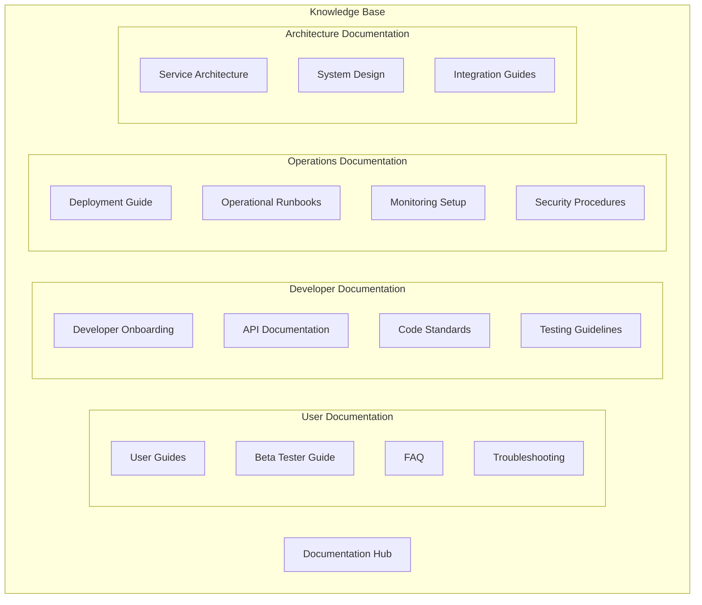
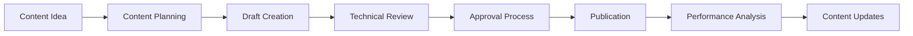
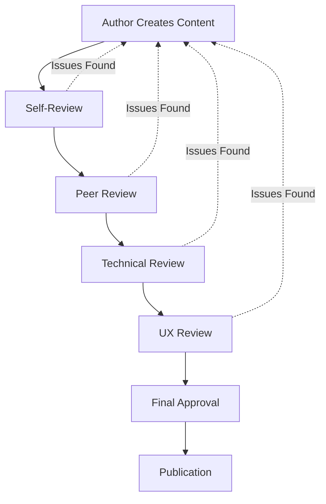

# Blytz Live Auction - Knowledge Base Architecture

## Overview

This document outlines the architecture and processes for maintaining Blytz Live Auction platform's knowledge base. It ensures documentation remains current, accessible, and valuable for all stakeholders.

## Table of Contents

1. [Knowledge Base Structure](#knowledge-base-structure)
2. [Content Management Strategy](#content-management-strategy)
3. [Documentation Lifecycle](#documentation-lifecycle)
4. [Quality Assurance](#quality-assurance)
5. [Automation and Tools](#automation-and-tools)
6. [Governance and Workflows](#governance-and-workflows)
7. [Analytics and Metrics](#analytics-and-metrics)
8. [Accessibility and Localization](#accessibility-and-localization)

## Knowledge Base Structure

### Documentation Hierarchy



### Directory Structure

```
docs/
├── 📚 knowledge-base/              # Knowledge base management
│   ├── 📋 CONTENT_STRATEGY.md     # Content management strategy
│   ├── 🔄 LIFECYCLE.md          # Documentation lifecycle
│   ├── ✅ QUALITY_ASSURANCE.md   # Quality standards
│   ├── 🤖 AUTOMATION.md           # Automation tools
│   ├── 👥 GOVERNANCE.md           # Governance processes
│   ├── 📊 ANALYTICS.md             # Usage analytics
│   └── 🌍 ACCESSIBILITY.md           # Accessibility standards
├── 👥 user/                       # User-facing documentation
│   ├── 📖 USER_GUIDE.md            # General user guide
│   ├── 🧪 BETA_TESTER_GUIDE.md    # Beta tester guide
│   ├── ❓ FAQ.md                   # Frequently asked questions
│   └── 🔧 TROUBLESHOOTING.md       # Troubleshooting guide
├── 👨‍💻 developer/                 # Developer documentation
│   ├── 🚀 DEVELOPER_ONBOARDING.md  # Onboarding guide
│   ├── 📡 API_DOCUMENTATION.md      # Complete API reference
│   ├── 📏 CODE_STANDARDS.md         # Coding standards
│   └── 🧪 TESTING_STANDARDS.md       # Testing guidelines
├── 🔧 operations/                  # Operations documentation
│   ├── 🚀 DEPLOYMENT_GUIDE.md      # Deployment procedures
│   ├── 📚 RUNBOOKS/               # Operational runbooks
│   ├── 📊 MONITORING/              # Monitoring setup
│   └── 🔒 SECURITY/               # Security procedures
└── 🏗️ architecture/               # Architecture documentation
    ├── 🏛️ SERVICE_ARCHITECTURE.md  # Service design
    ├── 🎯 SYSTEM_DESIGN.md         # System architecture
    └── 🔗 INTEGRATION_GUIDES.md    # Integration guides
```

### Content Categories

#### 1. User Documentation
**Target Audience**: End users, beta testers, customers
**Content Types**:
- Getting started guides
- Feature tutorials
- FAQ and troubleshooting
- Best practices
- Policy information

#### 2. Developer Documentation
**Target Audience**: Software engineers, API users
**Content Types**:
- API reference and examples
- SDK documentation
- Development setup guides
- Code examples and patterns
- Integration tutorials

#### 3. Operations Documentation
**Target Audience**: DevOps engineers, system administrators
**Content Types**:
- Deployment procedures
- Monitoring and alerting
- Incident response
- Security procedures
- Capacity planning

#### 4. Architecture Documentation
**Target Audience**: System architects, technical leads
**Content Types**:
- System design documents
- Service architecture
- Integration patterns
- Technology decisions
- Scalability guidelines

## Content Management Strategy

### Content Creation Workflow



#### 1. Content Planning

**Planning Process**:
- **Monthly Content Planning**: Review and plan content needs
- **User Feedback Analysis**: Identify documentation gaps from user questions
- **Feature Release Planning**: Align documentation with product releases
- **Analytics Review**: Use metrics to prioritize content updates

**Planning Template**:
```markdown
# Content Plan - [Month/Quarter]

## Priority Topics
1. [Topic 1] - [Priority] - [Target Audience]
2. [Topic 2] - [Priority] - [Target Audience]
3. [Topic 3] - [Priority] - [Target Audience]

## Content Calendar
- Week 1: [Topic assignments]
- Week 2: [Topic assignments]
- Week 3: [Topic assignments]
- Week 4: [Topic assignments]

## Success Metrics
- User satisfaction scores
- Documentation usage analytics
- Support ticket reduction
- Search success rates
```

#### 2. Content Creation Standards

**Quality Standards**:
- **Accuracy**: All technical information verified
- **Clarity**: Written for target audience level
- **Completeness**: Covers topic comprehensively
- **Current**: Reflects latest platform state
- **Accessible**: Meets accessibility guidelines

**Template Requirements**:
```markdown
# Document Template

## Metadata
- **Title**: Clear, descriptive title
- **Author**: Content creator name
- **Reviewers**: Technical reviewers
- **Last Updated**: Timestamp of last update
- **Version**: Document version number
- **Target Audience**: Primary audience
- **Related Docs**: Links to related documentation

## Content Structure
- **Overview**: High-level summary
- **Prerequisites**: Required knowledge/setup
- **Main Content**: Detailed information
- **Examples**: Practical examples and code
- **Troubleshooting**: Common issues and solutions
- **Related Resources**: Additional helpful links
```

#### 3. Review and Approval Process

**Review Stages**:
- **Self-Review**: Author reviews own content
- **Peer Review**: Technical expert review
- **Editorial Review**: Clarity and style review
- **Final Approval**: Content owner approval

**Review Checklist**:
```markdown
## Content Review Checklist

### Technical Accuracy
- [ ] All code examples tested
- [ ] API endpoints verified
- [ ] Configuration instructions validated
- [ ] Security considerations addressed

### Content Quality
- [ ] Writing is clear and concise
- [ ] Structure follows template
- [ ] Examples are practical and relevant
- [ ] Links and references work

### User Experience
- [ ] Content addresses user needs
- [ ] Navigation is intuitive
- [ ] Search terms included
- [ ] Accessibility standards met
```

## Documentation Lifecycle

### Version Control Strategy

#### Document Versioning
- **Semantic Versioning**: Use MAJOR.MINOR.PATCH format
- **Change Log**: Maintain detailed changelog
- **Archive Policy**: Keep last 3 major versions
- **Linking**: Cross-reference related documents

#### Version Control Workflow
```bash
# Documentation version control
git checkout -b docs/new-feature
# Create/update documentation
git add .
git commit -m "docs: Add new API documentation v2.1.0"
git push origin docs/new-feature
# Create pull request for review
```

### Content Lifecycle Management

#### 1. Creation Phase
- **Requirements Gathering**: Identify documentation needs
- **Content Planning**: Schedule and assign content
- **Draft Creation**: Write initial content
- **Internal Review**: Technical accuracy review

#### 2. Publication Phase
- **Final Review**: Complete quality review
- **Approval**: Official approval for publication
- **Publication**: Deploy to production documentation site
- **Announcement**: Notify stakeholders of updates

#### 3. Maintenance Phase
- **Monitoring**: Track usage and feedback
- **Updates**: Regular content updates
- **Archival**: Move outdated content to archive
- **Retirement**: Remove obsolete content

#### 4. Retirement Phase
- **Deprecation Notice**: Mark content as deprecated
- **Migration Path**: Guide users to new content
- **Archive**: Move to archive with reference
- **Removal**: Complete content removal

### Content Refresh Schedule

#### Regular Updates
- **Daily**: Monitor for critical issues
- **Weekly**: Review user feedback and analytics
- **Monthly**: Update feature documentation
- **Quarterly**: Comprehensive content audit

#### Trigger-Based Updates
- **Feature Releases**: Update within 48 hours of release
- **Security Issues**: Update immediately upon resolution
- **API Changes**: Update before deployment
- **Platform Changes**: Update within 24 hours

## Quality Assurance

### Content Quality Metrics

#### 1. Accuracy Metrics
- **Technical Correctness**: 100% accuracy rate
- **API Documentation**: All endpoints documented and tested
- **Code Examples**: All examples compile and run
- **Configuration**: All setup instructions validated

#### 2. Usability Metrics
- **Task Completion**: Users can complete tasks using docs
- **Search Success**: Users find needed information
- **Navigation Success**: Users navigate content easily
- **User Satisfaction**: Positive feedback on documentation

#### 3. Content Coverage Metrics
- **Feature Coverage**: All features documented
- **API Coverage**: All public APIs documented
- **Error Scenarios**: Common errors addressed
- **Platform Coverage**: All platforms supported

### Quality Assurance Process

#### 1. Automated Testing
```yaml
# .github/workflows/docs-quality.yml
name: Documentation Quality Check

on:
  pull_request:
    paths:
      - 'docs/**'

jobs:
  quality-check:
    runs-on: ubuntu-latest
    steps:
      - uses: actions/checkout@v3
      - name: Check links
        run: |
          npm install -g markdown-link-check
          markdown-link-check docs/**/*.md
      
      - name: Check spelling
        run: |
          npm install -g cspell
          cspell "docs/**/*.md"
      
      - name: Validate examples
        run: |
          ./scripts/validate-code-examples.sh
```

#### 2. Manual Review Process
- **Technical Review**: Subject matter expert validation
- **User Experience Review**: Usability testing
- **Editorial Review**: Writing quality and style
- **Accessibility Review**: WCAG compliance check

#### 3. User Feedback Integration
```bash
# Feedback collection script
#!/bin/bash
# collect-feedback.sh

# Collect feedback from various sources
echo "Collecting user feedback..."

# From support tickets
curl -H "Authorization: Bearer $SUPPORT_TOKEN" \
  https://support.blytz.app/api/feedback \
  -G '{"type":"documentation","days":30}'

# From user surveys
curl -H "Authorization: Bearer $SURVEY_TOKEN" \
  https://surveys.blytz.app/api/responses \
  -G '{"type":"documentation","days":30}'

# From analytics
curl -H "Authorization: Bearer $ANALYTICS_TOKEN" \
  https://analytics.blytz.app/api/search-failures \
  -G '{"days":30}'
```

## Automation and Tools

### Documentation Generation Tools

#### 1. API Documentation Generation
```bash
#!/bin/bash
# generate-api-docs.sh

# Generate OpenAPI specification
echo "Generating OpenAPI specification..."
find services/ -name "*.go" -exec grep -l "swagger:" {} \; | \
  xargs swag init -g cmd.go -o docs/api

# Generate Postman collection
echo "Generating Postman collection..."
swagger2postmanv2 -s docs/api/swagger.yaml -o docs/api/postman-collection.json

# Generate client SDKs
echo "Generating client SDKs..."
swagger-codegen generate -i docs/api/swagger.yaml \
  -l typescript-axios \
  -o shared/sdk/typescript

# Validate generated documentation
echo "Validating generated documentation..."
swagger-codegen validate -i docs/api/swagger.yaml
```

#### 2. Architecture Diagrams
```bash
#!/bin/bash
# generate-diagrams.sh

# Generate service architecture diagram
echo "Generating service architecture..."
docker run --rm -v $(pwd):/work \
  pms1969/structurizr:latest \
  build -w /work/docs/architecture

# Generate data flow diagram
echo "Generating data flow diagram..."
docker run --rm -v $(pwd):/work \
  plantuml/plantuml:latest \
  -tpng docs/architecture/data-flow.puml

# Generate deployment diagram
echo "Generating deployment diagram..."
docker run --rm -v $(pwd):/work \
  mermaid-cli/md2png \
  -i docs/architecture/deployment.md \
  -o docs/architecture/deployment.png
```

### Content Management Automation

#### 1. Link Checking
```bash
#!/bin/bash
# check-links.sh

echo "Checking documentation links..."

# Find all markdown files
find docs -name "*.md" -exec markdown-link-check {} \; 2>&1 | \
  tee link-check-results.txt

# Check external links
find docs -name "*.md" -exec grep -o "https://[^)]*" {} \; | \
  sort -u | xargs -I {} curl -f -s -o /dev/null -w "%{http_code}\n" | \
  paste - <(sort -u) - | awk '$2 != "200" {print $1}'

echo "Link check completed. Results saved to link-check-results.txt"
```

#### 2. Content Validation
```bash
#!/bin/bash
# validate-content.sh

echo "Validating documentation content..."

# Check for required front matter
find docs -name "*.md" -exec sh -c '
  if ! grep -q "^---" "$1"; then
    echo "Missing front matter in: $1"
  fi
' \;

# Check for required metadata
find docs -name "*.md" -exec sh -c '
  if ! grep -q "Last Updated:" "$1"; then
    echo "Missing Last Updated in: $1"
  fi
' \;

# Check code examples
find docs -name "*.md" -exec sh -c '
  if grep -q "```" "$1"; then
    echo "Code examples found in: $1"
    # Extract and validate code blocks
    grep -n "```" "$1" > "$1.code-lines"
  fi
' \;

echo "Content validation completed"
```

### Automated Publishing

#### 1. Documentation Site Generation
```yaml
# .github/workflows/docs-deploy.yml
name: Deploy Documentation

on:
  push:
    branches: [main]
    paths: [docs/**]

jobs:
  deploy:
    runs-on: ubuntu-latest
    steps:
      - uses: actions/checkout@v3
      
      - name: Setup Node.js
        uses: actions/setup-node@v3
        with:
          node-version: '18'
      
      - name: Install dependencies
        run: |
          cd docs-site
          npm install
      
      - name: Build documentation site
        run: |
          cd docs-site
          npm run build
      
      - name: Deploy to production
        run: |
          cd docs-site
          npm run deploy
      
      - name: Notify team
        run: |
          curl -X POST https://hooks.slack.com/services/YOUR/SLACK/WEBHOOK \
            -H 'Content-type: application/json' \
            --data '{"text":"📚 Documentation updated and deployed"}'
```

#### 2. Multi-Format Export
```bash
#!/bin/bash
# export-formats.sh

echo "Exporting documentation to multiple formats..."

# Export to PDF
pandoc docs/user/BETA_TESTER_GUIDE.md \
  -o docs/exports/BETA_TESTER_GUIDE.pdf \
  --pdf-engine=xelatex \
  --variable=geometry:margin=1in

# Export to Word
pandoc docs/user/BETA_TESTER_GUIDE.md \
  -o docs/exports/BETA_TESTER_GUIDE.docx

# Export to HTML
pandoc docs/user/BETA_TESTER_GUIDE.md \
  -o docs/exports/BETA_TESTER_GUIDE.html \
  --standalone \
  --self-contained

# Generate table of contents
pandoc --toc --toc-depth=3 \
  docs/user/BETA_TESTER_GUIDE.md \
  -o docs/exports/BETA_TESTER_GUIDE_TOC.html

echo "Multi-format export completed"
```

## Governance and Workflows

### Documentation Governance Structure

#### 1. Documentation Team Roles

**Documentation Lead**:
- Oversees documentation strategy
- Maintains quality standards
- Coordinates content planning
- Manages documentation budget and resources

**Content Authors**:
- Create and update documentation
- Subject matter experts for their domains
- Work with technical reviewers
- Respond to user feedback

**Technical Reviewers**:
- Validate technical accuracy
- Test code examples and procedures
- Ensure security best practices
- Review API documentation

**User Experience Reviewers**:
- Test documentation usability
- Validate user workflows
- Check navigation and search
- Ensure accessibility compliance

#### 2. Content Approval Workflow



#### 3. Change Management Process

**Change Request Types**:
- **New Content**: Request for new documentation
- **Update Request**: Request to update existing content
- **Correction Request**: Report errors or inaccuracies
- **Improvement Request**: Suggest improvements

**Change Request Process**:
1. **Submit Request**: Create issue in documentation repository
2. **Triage**: Documentation lead reviews and categorizes
3. **Planning**: Add to content planning schedule
4. **Implementation**: Author creates or updates content
5. **Review**: Standard review process
6. **Publication**: Approved content published

### Documentation Standards Committee

#### Committee Composition
- **Documentation Lead**: Chairperson
- **Technical Lead**: Senior engineer representative
- **Product Lead**: Product manager representative
- **Support Lead**: Customer support representative
- **User Advocate**: User community representative

#### Meeting Schedule
- **Weekly**: Content planning and progress review
- **Monthly**: Quality metrics and strategy review
- **Quarterly**: Standards and process improvements
- **Annually**: Overall documentation strategy review

## Analytics and Metrics

### Documentation Analytics Setup

#### 1. Usage Tracking
```javascript
// Analytics implementation
import analytics from 'analytics-library';

// Track page views
analytics.track('pageview', {
  page: window.location.pathname,
  title: document.title,
  section: determineSection(window.location.pathname),
  timestamp: new Date().toISOString()
});

// Track search usage
analytics.track('search', {
  query: searchQuery,
  results: searchResults.length,
  clicked_result: clickedResult,
  timestamp: new Date().toISOString()
});

// Track feedback submissions
analytics.track('feedback', {
  type: feedbackType,
  rating: feedbackRating,
  comment: feedbackComment,
  page: window.location.pathname,
  timestamp: new Date().toISOString()
});

function determineSection(pathname) {
  if (pathname.includes('/api/')) return 'api-docs';
  if (pathname.includes('/user/')) return 'user-docs';
  if (pathname.includes('/developer/')) return 'developer-docs';
  return 'other';
}
```

#### 2. Search Analytics
```bash
#!/bin/bash
# search-analytics.sh

# Analyze search patterns
echo "Analyzing search patterns..."

# Extract search terms from logs
kubectl logs documentation-site --since=7d | \
  grep "search_query" | \
  jq -r '.search_query' | \
  sort | uniq -c | \
  head -20 > search-terms.txt

# Analyze search failures
kubectl logs documentation-site --since=7d | \
  grep "search_failed" | \
  jq -r '.search_query' | \
  sort | uniq -c | \
  head -10 > search-failures.txt

# Generate search analytics report
cat > search-analytics-report.md << EOF
# Search Analytics Report

## Top Search Terms
\`\`\`bash
cat search-terms.txt
\`\`\`

## Search Failures
\`\`\`bash
cat search-failures.txt
\`\`\`

## Recommendations
- Create documentation for top search failures
- Improve search keywords in popular content
- Add synonyms for common search terms
EOF

echo "Search analytics report generated"
```

#### 3. User Feedback Analysis
```bash
#!/bin/bash
# analyze-feedback.sh

echo "Analyzing user feedback..."

# Collect feedback from all sources
curl -s "https://feedback.blytz.app/api/feedback?days=30" | \
  jq '.feedback[] | select(.type == "documentation")' > feedback.json

# Analyze feedback trends
cat feedback.json | \
  jq -r '
    group_by(.category) |
    map({
      category: .category,
      count: length,
      avg_rating: map(.rating) | add / length
    })
  ' > feedback-analysis.json

# Generate feedback report
cat > feedback-report.md << EOF
# User Feedback Analysis

## Feedback Summary
\`\`\`bash
cat feedback-analysis.json | jq -r 'map("\(.category): \(.count) feedbacks, avg rating: \(.avg_rating)") | .[]'
\`\`\`

## Action Items
- Address categories with low ratings
- Create content for frequently requested topics
- Improve documentation for common pain points
EOF

echo "Feedback analysis completed"
```

### Key Performance Indicators (KPIs)

#### 1. Content Effectiveness KPIs
- **Task Success Rate**: % users completing tasks using docs
- **Search Success Rate**: % users finding needed information
- **Time to Success**: Average time to complete documentation task
- **User Satisfaction**: Average user rating (1-5 scale)

#### 2. Content Quality KPIs
- **Accuracy Rate**: % content without reported errors
- **Completeness Score**: Coverage of required information
- **Currency Score**: How up-to-date content is
- **Accessibility Score**: WCAG compliance percentage

#### 3. Operational KPIs
- **Content Update Frequency**: Average time to update content
- **Review Cycle Time**: Average time from draft to publication
- **Support Ticket Reduction**: % reduction in documentation-related tickets
- **Search Optimization**: Search result improvement metrics

### Reporting Dashboard

#### Dashboard Configuration
```yaml
# grafana/dashboards/documentation-analytics.json
{
  "dashboard": {
    "title": "Documentation Analytics",
    "panels": [
      {
        "title": "Page Views",
        "type": "stat",
        "targets": [
          {
            "expr": "sum(rate(page_views_total[5m]))",
            "legendFormat": "{{value}} views/sec"
          }
        ]
      },
      {
        "title": "Search Success Rate",
        "type": "stat",
        "targets": [
          {
            "expr": "rate(search_success_total[5m]) / rate(search_total[5m])",
            "legendFormat": "{{value | humanizePercentage}}"
          }
        ]
      },
      {
        "title": "User Feedback Rating",
        "type": "gauge",
        "targets": [
          {
            "expr": "avg(feedback_rating)",
            "legendFormat": "{{value}} / 5"
          }
        ]
      }
    ]
  }
}
```

## Accessibility and Localization

### Accessibility Standards

#### 1. WCAG 2.1 Compliance
- **Level AA**: Minimum compliance requirement
- **Level AAA**: Target for critical user documentation
- **Regular Audits**: Quarterly accessibility audits
- **User Testing**: Include users with disabilities in testing

#### 2. Accessibility Implementation Guidelines

**Content Structure**:
- Use proper heading hierarchy (h1 → h6)
- Provide descriptive alt text for images
- Ensure sufficient color contrast (4.5:1 minimum)
- Provide transcripts for video content

**Technical Implementation**:
- Semantic HTML5 elements
- ARIA labels and descriptions
- Keyboard navigation support
- Screen reader compatibility

**Testing Checklist**:
```markdown
## Accessibility Testing Checklist

### Visual Accessibility
- [ ] Sufficient color contrast
- [ ] Text resizable without breaking layout
- [ ] High contrast mode compatibility
- [ ] Screen magnifier compatibility

### Hearing Accessibility
- [ ] Video captions provided
- [ ] Audio transcripts available
- [ ] Visual indicators for audio content
- [ ] Volume controls available

### Motor Accessibility
- [ ] Full keyboard navigation
- [ ] Sufficient time limits for interactions
- [ ] No content that causes seizures
- [ ] Multiple input methods supported

### Cognitive Accessibility
- [ ] Clear and simple language
- [ ] Consistent navigation and layout
- [ ] Error identification and correction
- [ ] Help and documentation available
```

### Localization Strategy

#### 1. Multi-Language Support

**Target Languages**:
- **Primary**: English (US)
- **Secondary**: Spanish, French, German
- **Future**: Japanese, Chinese, Portuguese

**Implementation Approach**:
- **Internationalization (i18n)**: Separate content from code
- **Localization (l10n)**: Translate content for target markets
- **Cultural Adaptation**: Adapt examples and references
- **Regional Formats**: Date, time, and currency formats

#### 2. Translation Management

**Translation Process**:
1. **Content Extraction**: Export translatable strings
2. **Professional Translation**: Use professional translation services
3. **Community Review**: Native speaker review
4. **Integration**: Import translated content
5. **Quality Assurance**: Test translated documentation

**Translation Tools**:
```json
{
  "translation_platform": "Crowdin",
  "file_formats": {
    "source": "en.json",
    "target": ["es.json", "fr.json", "de.json"]
  },
  "quality_assurance": {
    "automated_checks": true,
    "community_review": true,
    "professional_validation": true
  }
}
```

### Implementation Timeline

#### Phase 1: Foundation (Week 1-2)
- Set up documentation infrastructure
- Define content standards and templates
- Implement automated quality checks
- Establish analytics and metrics

#### Phase 2: Content Creation (Week 3-6)
- Create core documentation set
- Implement review and approval workflows
- Set up automation tools
- Train documentation team

#### Phase 3: Optimization (Week 7-8)
- Analyze usage metrics and feedback
- Optimize content based on data
- Implement accessibility improvements
- Begin localization efforts

#### Phase 4: Maintenance (Ongoing)
- Regular content updates
- Continuous quality improvement
- Analytics-driven optimization
- Community engagement and feedback

---

## Implementation Checklist

### Immediate Actions (Week 1)
- [ ] Set up documentation repository structure
- [ ] Define content templates and standards
- [ ] Implement automated testing workflows
- [ ] Set up analytics and tracking
- [ ] Establish review and approval processes

### Short-term Goals (Month 1)
- [ ] Create core user documentation
- [ ] Develop comprehensive API documentation
- [ ] Implement operational runbooks
- [ ] Set up quality assurance processes
- [ ] Train documentation team

### Long-term Objectives (Months 2-6)
- [ ] Achieve full accessibility compliance
- [ ] Implement multi-language support
- [ ] Optimize based on user analytics
- [ ] Establish community contribution process
- [ ] Integrate with development workflows

---

**Last Updated**: 2025-12-11  
**Version**: 1.0  
**Maintainer**: Documentation Team Lead

*This knowledge base architecture will evolve as our documentation needs grow. Regular reviews and updates will ensure it remains effective and relevant.*