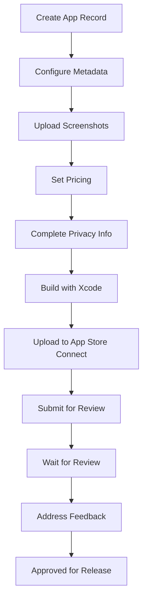
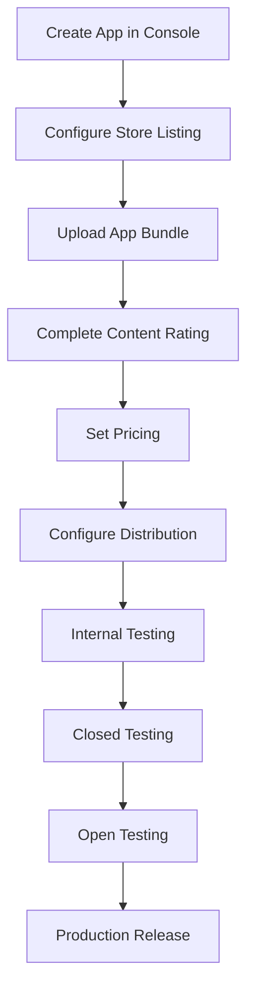
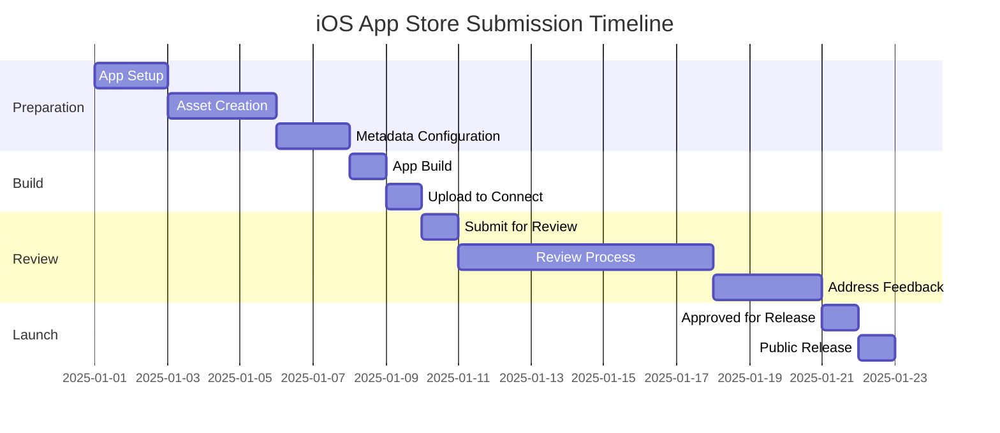
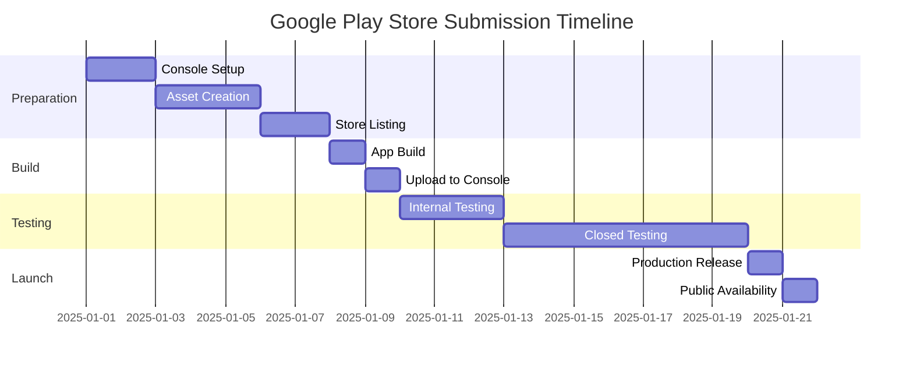

# 📱 App Store Submission Guide

**Purpose:** Complete guide for submitting Blytz mobile app to iOS App Store and Google Play Store  
**Timeline:** Week 4 (Submission Preparation)  
**Target:** Soft Launch with Beta Testers  

---

## 🍎 **iOS APP STORE SUBMISSION**

### **Prerequisites Checklist**
```yaml
Apple Developer Account:
  [ ] Apple Developer Program membership ($99/year)
  [ ] Account verified and active
  [ ] Legal entity information completed
  [ ] Contact information up to date

App Store Connect Setup:
  [ ] App Store Connect access enabled
  [ ] User roles and permissions configured
  [ ] Two-factor authentication enabled
  [ ] App metadata prepared

Technical Requirements:
  [ ] iOS app built with Xcode 14+
  [ ] 64-bit architecture support
  [ ] iOS 13.0+ deployment target
  [ ] App signing certificates ready
  [ ] Provisioning profiles configured
```

### **App Store Connect Configuration**

#### **App Information**
```json
{
  "app_info": {
    "name": "Blytz - Live Auction Marketplace",
    "subtitle": "Bid on unique items in real-time",
    "description": "Experience the thrill of live auctions from your mobile device. Blytz brings the excitement of real-time bidding to your fingertips. Browse unique items, place bids instantly, and win amazing deals in live auctions happening right now.\n\nKey Features:\n• Real-time live auctions\n• Instant bid notifications\n• Secure payment processing\n• Seller verification system\n• Mobile-optimized bidding interface\n• Live chat during auctions\n\nJoin thousands of buyers and sellers in Malaysia's premier auction marketplace.",
    "keywords": ["auction", "bidding", "marketplace", "shopping", "live auction", "malaysia", "blytz"],
    "category": "Shopping",
    "subcategory": "Shopping",
    "content_rights": "Does not contain third-party content",
    "primary_category": "Shopping",
    "secondary_category": "Lifestyle"
  }
}
```

#### **Pricing and Availability**
```json
{
  "pricing": {
    "availability": "Worldwide",
    "price": "Free",
    "availability_date": "2025-01-15",
    "countries": ["MY", "SG", "TH", "ID", "PH", "VN", "HK", "TW"],
    "b2b_app": false,
    "kids_app": false,
    "ads": true
  }
}
```

#### **App Privacy**
```json
{
  "privacy": {
    "data_collection": {
      "contact_info": ["Email Address", "Physical Address"],
      "user_content": ["Audio Data", "Photos", "Videos"],
      "usage_data": ["Product Interaction", "Advertising Data"],
      "identifiers": ["User ID", "Device ID"]
    },
    "data_usage": {
      "analytics": true,
      "app_functionality": true,
      "advertising": true,
      "third_party_advertising": true
    },
    "privacy_policy_url": "https://blytz.app/privacy",
    "privacy_policy": "Detailed privacy policy document"
  }
}
```

### **App Review Guidelines Compliance**

#### **Critical Guidelines to Address**
```yaml
Section 1.6 - App Completeness:
  - Ensure app is fully functional
  - No placeholder content or broken features
  - All user flows work end-to-end
  - Proper error handling implemented

Section 2.5.1 - Legal Requirements:
  - Privacy policy clearly accessible
  - Terms of service included
  - Age-appropriate content rating
  - Proper data handling disclosure

Section 3.1.1 - In-App Purchase:
  - Clear description of paid features
  - No external payment links
  - Proper receipt validation
  - Restore purchases functionality

Section 5.1.1 - Data Collection and Privacy:
  - Transparent data collection
  - User consent for data usage
  - Secure data storage
  - Data deletion capability
```

### **Build Submission Process**

#### **Step-by-Step Submission**


#### **Build Configuration**
```json
{
  "ios_build_settings": {
    "bundle_identifier": "com.blytz.auction",
    "version": "1.0.0",
    "build_number": "1",
    "min_os_version": "13.0",
    "supported_devices": ["iPhone", "iPad"],
    "architecture": "arm64",
    "signing": "Apple Distribution",
    "provisioning_profile": "App Store Distribution"
  }
}
```

#### **Required Screenshots**
```yaml
iPhone Screenshots (Required):
  - 6.7" Display: 1290 x 2796 pixels (PNG)
  - 6.5" Display: 1242 x 2688 pixels (PNG)
  - 5.5" Display: 1242 x 2208 pixels (PNG)

iPad Screenshots (Optional):
  - 12.9" Display: 2048 x 2732 pixels (PNG)
  - 11" Display: 1668 x 2388 pixels (PNG)

App Preview Videos (Optional):
  - Format: .mp4
  - Resolution: 1080p (1920x1080)
  - Duration: 15-30 seconds
  - Frame Rate: 30fps
```

---

## 🤖 **GOOGLE PLAY STORE SUBMISSION**

### **Prerequisites Checklist**
```yaml
Google Play Developer Account:
  [ ] Google Play Developer account ($25 one-time)
  [ ] Account verified and active
  [ ] Developer identity verified
  [ ] Contact information complete

Play Console Setup:
  [ ] App created in Play Console
  [ ] Store listing information prepared
  [ ] Content rating questionnaire completed
  [ ] Pricing and distribution configured

Technical Requirements:
  [ ] Android App Bundle (.aab) built
  - Target SDK 33+ (Android 13)
  - Minimum SDK 21+ (Android 5.0)
  - 64-bit native libraries
  - Proper signing configuration
  - App signing key secured
```

### **Play Console Configuration**

#### **Store Listing**
```json
{
  "store_listing": {
    "app_name": "Blytz - Live Auction Marketplace",
    "short_description": "Bid on unique items in real-time live auctions",
    "full_description": "Experience the thrill of live auctions from your mobile device. Blytz brings the excitement of real-time bidding to your fingertips. Browse unique items, place bids instantly, and win amazing deals in live auctions happening right now.\n\nKey Features:\n• Real-time live auctions\n• Instant bid notifications\n• Secure payment processing\n• Seller verification system\n• Mobile-optimized bidding interface\n• Live chat during auctions\n\nJoin thousands of buyers and sellers in Malaysia's premier auction marketplace.",
    "application_type": "Game",
    "category": "Shopping",
    "tags": ["auction", "bidding", "marketplace", "shopping", "live auction"],
    "content_rating": "Everyone",
    "website": "https://blytz.app",
    "email": "support@blytz.app",
    "phone": "+60-123456789"
  }
}
```

#### **Graphic Assets**
```yaml
Required Assets:
  - App Icon: 512 x 512 pixels (PNG)
  - Feature Graphic: 1024 x 500 pixels (JPG/PNG)
  - Screenshots: 
    * Phone: 320-3840px (minimum 2, max 8)
    * Tablet: 600-7680px (minimum 1, max 8)
  - Promo Video: Optional (YouTube URL)

Asset Guidelines:
  - No text in feature graphic
  - High resolution and quality
  - Consistent branding
  - No device frames
  - Proper transparency for icons
```

#### **Content Rating**
```json
{
  "content_rating": {
    "age_group": "Everyone",
    "violence": "None",
    "language": "Mild",
    "mature_themes": "None",
    "substance_use": "None",
    "gambling": "None",
    "sex": "None",
    "privacy_policy": "https://blytz.app/privacy"
  }
}
```

### **Google Play Policies Compliance**

#### **Critical Policies to Address**
```yaml
User Data Policy:
  - Clear privacy policy
  - Limited data collection
  - Secure data transmission
  - User consent mechanisms
  - Data retention policies

Device and Network Abuse:
  - No excessive resource usage
  - Proper background processing
  - No unauthorized ads
  - No malware or harmful behavior

Payments Policy:
  - Google Play Billing for digital goods
  - Clear pricing information
  - No external payment links for digital goods
  - Proper receipt validation

Permissions Policy:
  - Justify all requested permissions
  - Request permissions at runtime
  - Provide clear permission rationale
  - Minimal permission usage
```

### **Build Submission Process**

#### **Step-by-Step Submission**


#### **Build Configuration**
```json
{
  "android_build_settings": {
    "package_name": "com.blytz.auction",
    "version_code": 1,
    "version_name": "1.0.0",
    "min_sdk_version": 21,
    "target_sdk_version": 33,
    "compile_sdk_version": 33,
    "build_tools_version": "33.0.0",
    "signing": "Release Key",
    "build_type": "app-bundle"
  }
}
```

---

## 🧪 **BETA TESTING STRATEGY**

### **iOS TestFlight Beta Testing**
```yaml
Internal Testing:
  Duration: 1-2 weeks
  Users: Development team (up to 100)
  Purpose: Technical validation and bug fixing
  Process: 
    - Build uploaded to TestFlight
    - Internal testers invited via email
    - Feedback collected via TestFlight

External Beta Testing:
  Duration: 2-4 weeks
  Users: 50-100 beta testers
  Purpose: User experience validation
  Process:
    - Build approved by Apple
    - Public link shared with testers
    - Feedback collected via TestFlight
    - Crash reports monitored

TestFlight Features:
  - Automatic crash reporting
  - In-app feedback
  - Version history
  - Remote notifications
  - Analytics integration
```

### **Google Play Internal Testing**
```yaml
Internal Testing:
  Duration: 1-2 weeks
  Users: Development team (up to 100)
  Purpose: Technical validation
  Process:
    - App uploaded to internal track
    - Testers added via email
    - Opt-in URL shared
    - Feedback via Google Play Console

Closed Testing:
  Duration: 2-4 weeks
  Users: 50-100 beta testers
  Purpose: User experience validation
  Process:
    - App promoted to closed track
    - Testers added via Google Groups
    - Opt-in URL shared
    - Feedback via Play Console

Open Testing:
  Duration: 1-2 weeks
  Users: Unlimited (public opt-in)
  Purpose: Wider user testing
  Process:
    - App promoted to open track
    - Public listing available
    - Anyone can opt-in
    - Public reviews and feedback
```

---

## 📊 **SUBMISSION TIMELINE**

### **iOS App Store Timeline**


### **Google Play Store Timeline**


---

## 🚨 **COMMON REJECTION REASONS & SOLUTIONS**

### **iOS App Store Rejections**
```yaml
Common Issues:
  - Incomplete app functionality
  - Missing privacy policy
  - Improper data handling
  - UI/UX guideline violations
  - Crash bugs or instability

Solutions:
  - Thorough testing before submission
  - Complete privacy policy implementation
  - Proper data collection disclosure
  - Follow Human Interface Guidelines
  - Comprehensive bug testing and fixing

Appeal Process:
  - Review rejection details carefully
  - Fix identified issues
  - Resubmit with explanation
  - Request expedited review if needed
```

### **Google Play Store Rejections**
```yaml
Common Issues:
  - Policy violations
  - Security vulnerabilities
  - Improper permissions
  - Malicious behavior
  - Copyright infringement

Solutions:
  - Thorough policy compliance review
  - Security audit and fixes
  - Minimal permission usage
  - Code security review
  - Proper asset licensing

Appeal Process:
  - Review rejection details
  - Fix identified issues
  - Resubmit with changes
  - Contact support if needed
```

---

## 📋 **PRE-SUBMISSION CHECKLIST**

### **Final Checklist**
```yaml
Technical Requirements:
  [ ] App builds successfully on both platforms
  [ ] All automated tests passing
  [ ] Code coverage meets requirements (>80%)
  [ ] Performance benchmarks met
  [ ] Security audit completed
  [ ] Crash reporting integrated
  [ ] Analytics implemented

App Store Requirements:
  [ ] All required assets created and uploaded
  [ ] Metadata completed accurately
  [ ] Privacy policy published
  [ ] Terms of service available
  [ ] Content rating completed
  [ ] Pricing and distribution configured
  [ ] Legal compliance verified

Testing Requirements:
  [ ] Internal testing completed
  [ ] Beta testing conducted
  [ ] User feedback collected
  [ ] Critical bugs fixed
  [ ] Performance validated
  [ ] Compatibility tested
  [ ] Accessibility tested

Documentation Requirements:
  [ ] App description written
  [ ] Release notes prepared
  [ ] Support documentation ready
  [ ] User guide created
  [ ] Developer contact info updated
```

---

## 🏁 **CONCLUSION**

This comprehensive app store submission guide ensures:

1. **Compliance**: Full adherence to both iOS and Google Play store policies
2. **Quality Assurance**: Thorough testing and validation before submission
3. **Efficient Process**: Streamlined submission workflow with clear timelines
4. **Risk Mitigation**: Proactive identification and resolution of common issues
5. **Beta Testing**: Structured beta testing program for user validation

### **Key Success Factors:**
- **Preparation**: Complete all requirements before submission
- **Testing**: Thorough testing across devices and scenarios
- **Compliance**: Strict adherence to store policies and guidelines
- **Documentation**: Clear and accurate app information
- **Monitoring**: Active monitoring of submission status and feedback

---

**Status:** Ready for Implementation  
**Next Action:** Begin app store setup and asset creation  
**Owner:** Mobile Development Team  
**Review Date:** Weekly during submission process