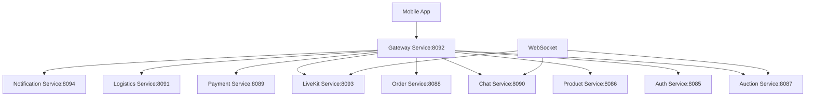

# 🔗 Mobile App Backend Integration Guide

**Purpose:** Complete integration between React Native mobile app and Blytz backend microservices  
**Timeline:** Week 3-4 (Integration Phase)  
**Target:** Full connectivity with all 10+ backend services  

---

## 📊 **BACKEND SERVICES OVERVIEW**

### **Available Microservices**
```yaml
Core Services:
  - Auth Service (Port 8085): User authentication and authorization
  - Product Service (Port 8086): Product catalog management
  - Auction Service (Port 8087): Real-time auction engine
  - Order Service (Port 8088): Order processing and management
  - Payment Service (Port 8089): Payment processing with Stripe

Support Services:
  - Chat Service (Port 8090): Real-time messaging
  - Logistics Service (Port 8091): Shipping and tracking
  - Gateway Service (Port 8092): API gateway and routing
  - LiveKit Service (Port 8093): Video streaming integration
  - Notification Service (Port 8094): Email/push notifications
```

### **API Architecture**


---

## 🔧 **MOBILE API CLIENT IMPLEMENTATION**

### **Unified API Client Architecture**
```typescript
// src/api/blytz/client.ts
import axios, { AxiosInstance, AxiosRequestConfig, AxiosResponse } from 'axios';
import AsyncStorage from '@react-native-async-storage/async-storage';
import { Platform } from 'react-native';

interface ApiConfig {
  baseURL: string;
  timeout: number;
  retryAttempts: number;
  retryDelay: number;
}

interface AuthTokens {
  token: string;
  refreshToken: string;
  expiresIn: number;
}

class BlytzApiClient {
  private client: AxiosInstance;
  private wsConnections: Map<string, WebSocket> = new Map();
  private config: ApiConfig;
  private isRefreshing: boolean = false;
  private refreshSubscribers: Array<(token: string) => void> = [];

  constructor(config: Partial<ApiConfig> = {}) {
    this.config = {
      baseURL: process.env.EXPO_PUBLIC_API_URL || 'https://api.blytz.app',
      timeout: 10000,
      retryAttempts: 3,
      retryDelay: 1000,
      ...config,
    };

    this.client = this.createAxiosInstance();
    this.setupInterceptors();
  }

  private createAxiosInstance(): AxiosInstance {
    return axios.create({
      baseURL: this.config.baseURL,
      timeout: this.config.timeout,
      headers: {
        'Content-Type': 'application/json',
        'X-Client-Platform': Platform.OS,
        'X-Client-Version': process.env.EXPO_PUBLIC_APP_VERSION || '1.0.0',
        'X-Client-Build': process.env.EXPO_PUBLIC_BUILD_NUMBER || '1',
      },
    });
  }

  private setupInterceptors(): void {
    // Request interceptor
    this.client.interceptors.request.use(
      async (config) => {
        const token = await this.getAuthToken();
        if (token) {
          config.headers.Authorization = `Bearer ${token}`;
        }
        return config;
      },
      (error) => Promise.reject(error)
    );

    // Response interceptor
    this.client.interceptors.response.use(
      (response) => response,
      async (error) => {
        const originalRequest = error.config;

        if (error.response?.status === 401 && !originalRequest._retry) {
          originalRequest._retry = true;
          
          if (!this.isRefreshing) {
            this.isRefreshing = true;
            try {
              const newToken = await this.refreshAuthToken();
              this.refreshSubscribers.forEach(callback => callback(newToken));
              this.refreshSubscribers = [];
              this.isRefreshing = false;
            } catch (refreshError) {
              this.refreshSubscribers = [];
              this.isRefreshing = false;
              await this.logout();
              return Promise.reject(refreshError);
            }
          }

          return new Promise((resolve) => {
            this.refreshSubscribers.push((token) => {
              originalRequest.headers.Authorization = `Bearer ${token}`;
              resolve(this.client(originalRequest));
            });
          });
        }

        return Promise.reject(error);
      }
    );
  }

  private async getAuthToken(): Promise<string | null> {
    try {
      return await AsyncStorage.getItem('auth_token');
    } catch (error) {
      console.error('Error getting auth token:', error);
      return null;
    }
  }

  private async refreshAuthToken(): Promise<string> {
    try {
      const refreshToken = await AsyncStorage.getItem('refresh_token');
      if (!refreshToken) {
        throw new Error('No refresh token available');
      }

      const response = await axios.post(`${this.config.baseURL}/auth/refresh`, {
        refresh_token: refreshToken,
      });

      const { token, refresh_token: newRefreshToken, expires_in } = response.data.data;
      
      await AsyncStorage.setItem('auth_token', token);
      await AsyncStorage.setItem('refresh_token', newRefreshToken);
      await AsyncStorage.setItem('token_expires', Date.now() + expires_in * 1000);

      return token;
    } catch (error) {
      console.error('Error refreshing token:', error);
      throw error;
    }
  }

  private async logout(): Promise<void> {
    try {
      await AsyncStorage.multiRemove(['auth_token', 'refresh_token', 'token_expires']);
      // Navigate to login screen
      // This would be handled by the auth context
    } catch (error) {
      console.error('Error during logout:', error);
    }
  }

  // HTTP Methods with retry logic
  private async request<T>(
    config: AxiosRequestConfig,
    attempt: number = 0
  ): Promise<AxiosResponse<T>> {
    try {
      return await this.client.request<T>(config);
    } catch (error: any) {
      if (
        attempt < this.config.retryAttempts &&
        this.shouldRetry(error) &&
        !config._retry
      ) {
        await this.delay(this.config.retryDelay * Math.pow(2, attempt));
        return this.request({ ...config, _retry: true }, attempt + 1);
      }
      throw error;
    }
  }

  private shouldRetry(error: any): boolean {
    if (!error.response) return true; // Network error
    const status = error.response.status;
    return [408, 429, 500, 502, 503, 504].includes(status);
  }

  private delay(ms: number): Promise<void> {
    return new Promise(resolve => setTimeout(resolve, ms));
  }

  // API Methods
  async get<T>(url: string, params?: any): Promise<T> {
    const response = await this.request<T>({
      method: 'GET',
      url,
      params,
    });
    return response.data;
  }

  async post<T>(url: string, data?: any): Promise<T> {
    const response = await this.request<T>({
      method: 'POST',
      url,
      data,
    });
    return response.data;
  }

  async put<T>(url: string, data?: any): Promise<T> {
    const response = await this.request<T>({
      method: 'PUT',
      url,
      data,
    });
    return response.data;
  }

  async delete<T>(url: string): Promise<T> {
    const response = await this.request<T>({
      method: 'DELETE',
      url,
    });
    return response.data;
  }

  // WebSocket connection
  createWebSocket(url: string, onMessage: (data: any) => void): WebSocket {
    const wsUrl = url.replace('http', 'ws');
    const ws = new WebSocket(wsUrl);

    ws.onopen = () => {
      console.log('WebSocket connected:', url);
    };

    ws.onmessage = (event) => {
      try {
        const data = JSON.parse(event.data);
        onMessage(data);
      } catch (error) {
        console.error('Error parsing WebSocket message:', error);
      }
    };

    ws.onerror = (error) => {
      console.error('WebSocket error:', error);
    };

    ws.onclose = () => {
      console.log('WebSocket disconnected:', url);
      // Implement reconnection logic
      setTimeout(() => {
        this.createWebSocket(url, onMessage);
      }, 5000);
    };

    this.wsConnections.set(url, ws);
    return ws;
  }

  closeWebSocket(url: string): void {
    const ws = this.wsConnections.get(url);
    if (ws) {
      ws.close();
      this.wsConnections.delete(url);
    }
  }

  // Cleanup
  cleanup(): void {
    this.wsConnections.forEach(ws => ws.close());
    this.wsConnections.clear();
  }
}

export const blytzApi = new BlytzApiClient();
```

---

## 🔐 **AUTHENTICATION SERVICE INTEGRATION**

### **Authentication API Implementation**
```typescript
// src/api/blytz/auth.ts
import { blytzApi } from './client';

export interface LoginRequest {
  email: string;
  password: string;
  device_token?: string;
}

export interface RegisterRequest {
  email: string;
  password: string;
  name: string;
  phone?: string;
  device_token?: string;
}

export interface AuthResponse {
  user: {
    id: string;
    email: string;
    name: string;
    phone?: string;
    role: string;
    is_verified: boolean;
    created_at: string;
  };
  token: string;
  refresh_token: string;
  expires_in: number;
}

export interface PasswordResetRequest {
  email: string;
}

export interface PasswordResetConfirmRequest {
  token: string;
  new_password: string;
}

class AuthService {
  async login(credentials: LoginRequest): Promise<AuthResponse> {
    const response = await blytzApi.post<AuthResponse>('/auth/login', {
      ...credentials,
      device_info: {
        platform: Platform.OS,
        version: Platform.Version,
        app_version: process.env.EXPO_PUBLIC_APP_VERSION,
      },
    });

    return response.data;
  }

  async register(userData: RegisterRequest): Promise<AuthResponse> {
    const response = await blytzApi.post<AuthResponse>('/auth/register', {
      ...userData,
      device_info: {
        platform: Platform.OS,
        version: Platform.Version,
        app_version: process.env.EXPO_PUBLIC_APP_VERSION,
      },
    });

    return response.data;
  }

  async logout(): Promise<void> {
    try {
      await blytzApi.post('/auth/logout');
    } catch (error) {
      console.error('Logout error:', error);
    } finally {
      // Clear local storage regardless of API call success
      await AsyncStorage.multiRemove(['auth_token', 'refresh_token', 'token_expires']);
    }
  }

  async refreshToken(): Promise<AuthResponse> {
    const response = await blytzApi.post<AuthResponse>('/auth/refresh');
    return response.data;
  }

  async requestPasswordReset(email: string): Promise<void> {
    await blytzApi.post<PasswordResetRequest>('/auth/password/reset', { email });
  }

  async confirmPasswordReset(token: string, newPassword: string): Promise<void> {
    await blytzApi.post<PasswordResetConfirmRequest>('/auth/password/reset/confirm', {
      token,
      new_password: newPassword,
    });
  }

  async changePassword(currentPassword: string, newPassword: string): Promise<void> {
    await blytzApi.post('/auth/password/change', {
      current_password: currentPassword,
      new_password: newPassword,
    });
  }

  async updateProfile(userData: Partial<RegisterRequest>): Promise<AuthResponse['user']> {
    const response = await blytzApi.put<AuthResponse['user']>('/auth/profile', userData);
    return response.data;
  }

  async verifyEmail(token: string): Promise<void> {
    await blytzApi.post('/auth/verify', { token });
  }

  async resendVerificationEmail(): Promise<void> {
    await blytzApi.post('/auth/verify/resend');
  }
}

export const authService = new AuthService();
```

### **Authentication Context Integration**
```typescript
// src/contexts/blytz/auth-context.tsx
import React, { createContext, useContext, useReducer, useEffect, ReactNode } from 'react';
import AsyncStorage from '@react-native-async-storage/async-storage';
import { authService, LoginRequest, RegisterRequest } from '../api/blytz/auth';

interface AuthState {
  user: any | null;
  token: string | null;
  isAuthenticated: boolean;
  loading: boolean;
  error: string | null;
}

interface AuthContextType extends AuthState {
  login: (credentials: LoginRequest) => Promise<void>;
  register: (userData: RegisterRequest) => Promise<void>;
  logout: () => Promise<void>;
  refreshToken: () => Promise<void>;
  clearError: () => void;
}

type AuthAction =
  | { type: 'LOGIN_START' }
  | { type: 'LOGIN_SUCCESS'; payload: any }
  | { type: 'LOGIN_FAILURE'; payload: string }
  | { type: 'LOGOUT' }
  | { type: 'CLEAR_ERROR' };

const authReducer = (state: AuthState, action: AuthAction): AuthState => {
  switch (action.type) {
    case 'LOGIN_START':
      return { ...state, loading: true, error: null };
    case 'LOGIN_SUCCESS':
      return {
        ...state,
        loading: false,
        isAuthenticated: true,
        user: action.payload.user,
        token: action.payload.token,
        error: null,
      };
    case 'LOGIN_FAILURE':
      return {
        ...state,
        loading: false,
        isAuthenticated: false,
        user: null,
        token: null,
        error: action.payload,
      };
    case 'LOGOUT':
      return {
        ...state,
        isAuthenticated: false,
        user: null,
        token: null,
        error: null,
      };
    case 'CLEAR_ERROR':
      return { ...state, error: null };
    default:
      return state;
  }
};

const AuthContext = createContext<AuthContextType | null>(null);

export const AuthProvider: React.FC<{ children: ReactNode }> = ({ children }) => {
  const [state, dispatch] = useReducer(authReducer, {
    user: null,
    token: null,
    isAuthenticated: false,
    loading: false,
    error: null,
  });

  useEffect(() => {
    // Check for existing token on app start
    checkExistingAuth();
  }, []);

  const checkExistingAuth = async () => {
    try {
      const token = await AsyncStorage.getItem('auth_token');
      const tokenExpires = await AsyncStorage.getItem('token_expires');
      
      if (token && tokenExpires && Date.now() < parseInt(tokenExpires)) {
        // Token is valid, get user profile
        const user = await authService.updateProfile({});
        dispatch({ type: 'LOGIN_SUCCESS', payload: { user, token } });
      } else {
        // Token expired or invalid, clear storage
        await AsyncStorage.multiRemove(['auth_token', 'refresh_token', 'token_expires']);
      }
    } catch (error) {
      console.error('Error checking existing auth:', error);
    }
  };

  const login = async (credentials: LoginRequest) => {
    try {
      dispatch({ type: 'LOGIN_START' });
      const response = await authService.login(credentials);
      
      // Store tokens
      await AsyncStorage.setItem('auth_token', response.token);
      await AsyncStorage.setItem('refresh_token', response.refresh_token);
      await AsyncStorage.setItem('token_expires', Date.now() + response.expires_in * 1000);
      
      dispatch({ type: 'LOGIN_SUCCESS', payload: response });
    } catch (error: any) {
      dispatch({ type: 'LOGIN_FAILURE', payload: error.message });
    }
  };

  const register = async (userData: RegisterRequest) => {
    try {
      dispatch({ type: 'LOGIN_START' });
      const response = await authService.register(userData);
      
      // Store tokens
      await AsyncStorage.setItem('auth_token', response.token);
      await AsyncStorage.setItem('refresh_token', response.refresh_token);
      await AsyncStorage.setItem('token_expires', Date.now() + response.expires_in * 1000);
      
      dispatch({ type: 'LOGIN_SUCCESS', payload: response });
    } catch (error: any) {
      dispatch({ type: 'LOGIN_FAILURE', payload: error.message });
    }
  };

  const logout = async () => {
    await authService.logout();
    dispatch({ type: 'LOGOUT' });
  };

  const refreshToken = async () => {
    try {
      const response = await authService.refreshToken();
      
      // Update stored tokens
      await AsyncStorage.setItem('auth_token', response.token);
      await AsyncStorage.setItem('refresh_token', response.refresh_token);
      await AsyncStorage.setItem('token_expires', Date.now() + response.expires_in * 1000);
      
      dispatch({ type: 'LOGIN_SUCCESS', payload: response });
    } catch (error) {
      logout();
    }
  };

  const clearError = () => {
    dispatch({ type: 'CLEAR_ERROR' });
  };

  return (
    <AuthContext.Provider
      value={{
        ...state,
        login,
        register,
        logout,
        refreshToken,
        clearError,
      }}
    >
      {children}
    </AuthContext.Provider>
  );
};

export const useAuth = () => {
  const context = useContext(AuthContext);
  if (!context) {
    throw new Error('useAuth must be used within an AuthProvider');
  }
  return context;
};
```

---

## 🛍️ **PRODUCT SERVICE INTEGRATION**

### **Product API Implementation**
```typescript
// src/api/blytz/products.ts
import { blytzApi } from './client';

export interface Product {
  id: string;
  name: string;
  description: string;
  category: string;
  condition: string;
  starting_price: number;
  current_bid?: number;
  images: string[];
  seller_id: string;
  seller_name: string;
  location: string;
  created_at: string;
  updated_at: string;
  auction_id?: string;
  status: 'active' | 'sold' | 'cancelled';
}

export interface ProductFilters {
  category?: string;
  condition?: string;
  min_price?: number;
  max_price?: number;
  location?: string;
  search?: string;
  sort_by?: 'price' | 'created_at' | 'name';
  sort_order?: 'asc' | 'desc';
  page?: number;
  limit?: number;
}

class ProductService {
  async getProducts(filters: ProductFilters = {}): Promise<Product[]> {
    const response = await blytzApi.get<Product[]>('/products', filters);
    return response.data;
  }

  async getProduct(id: string): Promise<Product> {
    const response = await blytzApi.get<Product>(`/products/${id}`);
    return response.data;
  }

  async getMyProducts(): Promise<Product[]> {
    const response = await blytzApi.get<Product[]>('/products/my');
    return response.data;
  }

  async createProduct(productData: Omit<Product, 'id' | 'created_at' | 'updated_at'>): Promise<Product> {
    const response = await blytzApi.post<Product>('/products', productData);
    return response.data;
  }

  async updateProduct(id: string, productData: Partial<Product>): Promise<Product> {
    const response = await blytzApi.put<Product>(`/products/${id}`, productData);
    return response.data;
  }

  async deleteProduct(id: string): Promise<void> {
    await blytzApi.delete(`/products/${id}`);
  }

  async uploadProductImages(productId: string, images: File[]): Promise<string[]> {
    const formData = new FormData();
    images.forEach((image, index) => {
      formData.append(`images[${index}]`, image);
    });
    formData.append('product_id', productId);

    const response = await blytzApi.post<string[]>('/products/upload-images', formData, {
      headers: {
        'Content-Type': 'multipart/form-data',
      },
    });
    return response.data;
  }

  async searchProducts(query: string, filters: ProductFilters = {}): Promise<Product[]> {
    const response = await blytzApi.get<Product[]>('/products/search', {
      q: query,
      ...filters,
    });
    return response.data;
  }

  async getCategories(): Promise<string[]> {
    const response = await blytzApi.get<string[]>('/products/categories');
    return response.data;
  }

  async getFeaturedProducts(): Promise<Product[]> {
    const response = await blytzApi.get<Product[]>('/products/featured');
    return response.data;
  }
}

export const productService = new ProductService();
```

---

## 🎵 **AUCTION SERVICE INTEGRATION**

### **Real-time Auction API Implementation**
```typescript
// src/api/blytz/auctions.ts
import { blytzApi } from './client';
import { Product } from './products';

export interface Auction {
  id: string;
  product_id: string;
  product: Product;
  seller_id: string;
  seller_name: string;
  starting_price: number;
  current_bid: number;
  reserve_price?: number;
  bid_count: number;
  start_time: string;
  end_time: string;
  status: 'upcoming' | 'active' | 'ended' | 'cancelled';
  winner_id?: string;
  winner_name?: string;
  final_price?: number;
  created_at: string;
  updated_at: string;
}

export interface Bid {
  id: string;
  auction_id: string;
  user_id: string;
  user_name: string;
  amount: number;
  placed_at: string;
  is_winning: boolean;
}

export interface AuctionFilters {
  status?: 'upcoming' | 'active' | 'ended';
  category?: string;
  min_price?: number;
  max_price?: number;
  location?: string;
  seller_id?: string;
  page?: number;
  limit?: number;
}

class AuctionService {
  private wsConnection: WebSocket | null = null;
  private bidCallbacks: Map<string, (bid: Bid) => void> = new Map();
  private auctionCallbacks: Map<string, (auction: Auction) => void> = new Map();

  async getAuctions(filters: AuctionFilters = {}): Promise<Auction[]> {
    const response = await blytzApi.get<Auction[]>('/auctions', filters);
    return response.data;
  }

  async getAuction(id: string): Promise<Auction> {
    const response = await blytzApi.get<Auction>(`/auctions/${id}`);
    return response.data;
  }

  async getMyAuctions(): Promise<Auction[]> {
    const response = await blytzApi.get<Auction[]>('/auctions/my');
    return response.data;
  }

  async createAuction(auctionData: Omit<Auction, 'id' | 'created_at' | 'updated_at' | 'current_bid' | 'bid_count'>): Promise<Auction> {
    const response = await blytzApi.post<Auction>('/auctions', auctionData);
    return response.data;
  }

  async placeBid(auctionId: string, amount: number): Promise<Bid> {
    const response = await blytzApi.post<Bid>(`/auctions/${auctionId}/bid`, { amount });
    return response.data;
  }

  async getBids(auctionId: string): Promise<Bid[]> {
    const response = await blytzApi.get<Bid[]>(`/auctions/${auctionId}/bids`);
    return response.data;
  }

  async getMyBids(): Promise<Bid[]> {
    const response = await blytzApi.get<Bid[]>('/auctions/my-bids');
    return response.data;
  }

  async endAuction(auctionId: string): Promise<Auction> {
    const response = await blytzApi.post<Auction>(`/auctions/${auctionId}/end`);
    return response.data;
  }

  async cancelAuction(auctionId: string, reason: string): Promise<void> {
    await blytzApi.post(`/auctions/${auctionId}/cancel`, { reason });
  }

  // WebSocket for real-time updates
  connectToAuction(auctionId: string, onBidUpdate: (bid: Bid) => void, onAuctionUpdate: (auction: Auction) => void): void {
    const wsUrl = `${blytzApi.config.baseURL.replace('http', 'ws')}/auctions/${auctionId}/live`;
    
    this.wsConnection = blytzApi.createWebSocket(wsUrl, (data) => {
      switch (data.type) {
        case 'bid_update':
          onBidUpdate(data.payload);
          break;
        case 'auction_update':
          onAuctionUpdate(data.payload);
          break;
        case 'auction_ended':
          onAuctionUpdate(data.payload);
          break;
        default:
          console.log('Unknown WebSocket message type:', data.type);
      }
    });

    this.bidCallbacks.set(auctionId, onBidUpdate);
    this.auctionCallbacks.set(auctionId, onAuctionUpdate);
  }

  disconnectFromAuction(auctionId: string): void {
    if (this.wsConnection) {
      this.wsConnection.close();
      this.wsConnection = null;
    }
    this.bidCallbacks.delete(auctionId);
    this.auctionCallbacks.delete(auctionId);
  }

  async getActiveAuctionsCount(): Promise<number> {
    const response = await blytzApi.get<{ count: number }>('/auctions/active/count');
    return response.data.count;
  }

  async getUpcomingAuctions(): Promise<Auction[]> {
    const response = await blytzApi.get<Auction[]>('/auctions/upcoming');
    return response.data;
  }
}

export const auctionService = new AuctionService();
```

---

## 💳 **PAYMENT SERVICE INTEGRATION**

### **Payment API Implementation**
```typescript
// src/api/blytz/payments.ts
import { blytzApi } from './client';

export interface PaymentIntent {
  id: string;
  client_secret: string;
  amount: number;
  currency: string;
  status: string;
  created: number;
  metadata?: Record<string, any>;
}

export interface PaymentMethod {
  id: string;
  type: 'card' | 'grabpay' | 'fpx' | 'apple_pay' | 'google_pay';
  last4?: string;
  brand?: string;
  expiry_month?: number;
  expiry_year?: number;
  is_default: boolean;
  created_at: string;
}

export interface Transaction {
  id: string;
  auction_id?: string;
  product_id?: string;
  amount: number;
  currency: string;
  status: 'pending' | 'processing' | 'completed' | 'failed' | 'refunded';
  payment_method: string;
  created_at: string;
  updated_at: string;
}

class PaymentService {
  async createPaymentIntent(amount: number, currency: string = 'myr', metadata?: Record<string, any>): Promise<PaymentIntent> {
    const response = await blytzApi.post<PaymentIntent>('/payments/create-intent', {
      amount,
      currency,
      metadata: {
        platform: 'mobile',
        ...metadata,
      },
    });
    return response.data;
  }

  async confirmPayment(paymentIntentId: string): Promise<Transaction> {
    const response = await blytzApi.post<Transaction>(`/payments/${paymentIntentId}/confirm`);
    return response.data;
  }

  async getPaymentMethods(): Promise<PaymentMethod[]> {
    const response = await blytzApi.get<PaymentMethod[]>('/payments/methods');
    return response.data;
  }

  async addPaymentMethod(paymentMethodData: any): Promise<PaymentMethod> {
    const response = await blytzApi.post<PaymentMethod>('/payments/methods', paymentMethodData);
    return response.data;
  }

  async setDefaultPaymentMethod(paymentMethodId: string): Promise<void> {
    await blytzApi.put(`/payments/methods/${paymentMethodId}/default`);
  }

  async deletePaymentMethod(paymentMethodId: string): Promise<void> {
    await blytzApi.delete(`/payments/methods/${paymentMethodId}`);
  }

  async getTransactions(filters: { page?: number; limit?: number; status?: string } = {}): Promise<Transaction[]> {
    const response = await blytzApi.get<Transaction[]>('/payments/transactions', filters);
    return response.data;
  }

  async getTransaction(id: string): Promise<Transaction> {
    const response = await blytzApi.get<Transaction>(`/payments/transactions/${id}`);
    return response.data;
  }

  async refundTransaction(transactionId: string, amount?: number): Promise<Transaction> {
    const response = await blytzApi.post<Transaction>(`/payments/transactions/${transactionId}/refund`, {
      amount,
    });
    return response.data;
  }

  async processAuctionPayment(auctionId: string, paymentIntentId: string): Promise<Transaction> {
    const response = await blytzApi.post<Transaction>(`/payments/auction/${auctionId}/pay`, {
      payment_intent_id: paymentIntentId,
    });
    return response.data;
  }

  async getPaymentStatus(paymentIntentId: string): Promise<PaymentIntent> {
    const response = await blytzApi.get<PaymentIntent>(`/payments/${paymentIntentId}/status`);
    return response.data;
  }
}

export const paymentService = new PaymentService();
```

---

## 📱 **PUSH NOTIFICATION INTEGRATION**

### **Notification Service Implementation**
```typescript
// src/services/notifications.ts
import { Notifications } from 'expo-notifications';
import { Platform } from 'react-native';
import AsyncStorage from '@react-native-async-storage/async-storage';
import { blytzApi } from '../api/blytz/client';

export interface NotificationData {
  type: 'auction_starting' | 'auction_ending' | 'bid_placed' | 'auction_won' | 'payment_received';
  auction_id?: string;
  product_id?: string;
  bid_amount?: number;
  time_remaining?: number;
  sender_name?: string;
}

class NotificationService {
  private isInitialized: boolean = false;

  async initialize(): Promise<void> {
    if (this.isInitialized) return;

    // Request permissions
    const { status } = await Notifications.requestPermissionsAsync();
    if (status !== 'granted') {
      console.warn('Notification permissions not granted');
      return;
    }

    // Set notification handler
    Notifications.setNotificationHandler({
      handleNotification: async () => ({
        shouldShowAlert: true,
        shouldPlaySound: true,
        shouldSetBadge: true,
      }),
    });

    // Get push token
    const token = await this.getPushToken();
    if (token) {
      await this.registerPushToken(token);
    }

    this.isInitialized = true;
  }

  private async getPushToken(): Promise<string | null> {
    try {
      if (Platform.OS === 'android') {
        const { data } = await Notifications.getDevicePushTokenAsync();
        return data;
      } else {
        const { data } = await Notifications.getExpoPushTokenAsync();
        return data;
      }
    } catch (error) {
      console.error('Error getting push token:', error);
      return null;
    }
  }

  private async registerPushToken(token: string): Promise<void> {
    try {
      await blytzApi.post('/notifications/register-token', {
        token,
        platform: Platform.OS,
        app_version: process.env.EXPO_PUBLIC_APP_VERSION,
      });

      // Store token locally
      await AsyncStorage.setItem('push_token', token);
    } catch (error) {
      console.error('Error registering push token:', error);
    }
  }

  async unregisterPushToken(): Promise<void> {
    try {
      const token = await AsyncStorage.getItem('push_token');
      if (token) {
        await blytzApi.post('/notifications/unregister-token', { token });
        await AsyncStorage.removeItem('push_token');
      }
    } catch (error) {
      console.error('Error unregistering push token:', error);
    }
  }

  async sendLocalNotification(title: string, body: string, data?: NotificationData): Promise<void> {
    try {
      await Notifications.scheduleNotificationAsync({
        content: {
          title,
          body,
          data: data as any,
          sound: 'default',
        },
        trigger: null, // Show immediately
      });
    } catch (error) {
      console.error('Error sending local notification:', error);
    }
  }

  async scheduleNotification(
    title: string,
    body: string,
    trigger: Date,
    data?: NotificationData
  ): Promise<string> {
    try {
      const identifier = await Notifications.scheduleNotificationAsync({
        content: {
          title,
          body,
          data: data as any,
          sound: 'default',
        },
        trigger,
      });
      return identifier;
    } catch (error) {
      console.error('Error scheduling notification:', error);
      return '';
    }
  }

  async cancelNotification(identifier: string): Promise<void> {
    try {
      await Notifications.cancelScheduledNotificationAsync(identifier);
    } catch (error) {
      console.error('Error canceling notification:', error);
    }
  }

  async getBadgeCount(): Promise<number> {
    try {
      const badgeCount = await Notifications.getBadgeCountAsync();
      return badgeCount;
    } catch (error) {
      console.error('Error getting badge count:', error);
      return 0;
    }
  }

  async setBadgeCount(count: number): Promise<void> {
    try {
      await Notifications.setBadgeCountAsync(count);
    } catch (error) {
      console.error('Error setting badge count:', error);
    }
  }

  async clearAllNotifications(): Promise<void> {
    try {
      await Notifications.dismissAllNotificationsAsync();
      await this.setBadgeCount(0);
    } catch (error) {
      console.error('Error clearing notifications:', error);
    }
  }

  // Handle notification responses
  onNotificationResponse = (response: any) => {
    const { notification } = response;
    const data = notification.request.content.data as NotificationData;

    // Handle different notification types
    switch (data.type) {
      case 'auction_starting':
      case 'auction_ending':
      case 'bid_placed':
        // Navigate to auction screen
        if (data.auction_id) {
          // Navigation logic here
          console.log('Navigate to auction:', data.auction_id);
        }
        break;
      case 'auction_won':
        // Navigate to payment screen
        if (data.auction_id) {
          console.log('Navigate to payment for auction:', data.auction_id);
        }
        break;
      case 'payment_received':
        // Navigate to transaction history
        console.log('Navigate to transaction history');
        break;
    }
  };
}

export const notificationService = new NotificationService();
```

---

## 🧪 **INTEGRATION TESTING**

### **API Integration Tests**
```typescript
// __tests__/integration/api.test.ts
import { authService } from '../../src/api/blytz/auth';
import { productService } from '../../src/api/blytz/products';
import { auctionService } from '../../src/api/blytz/auctions';
import { paymentService } from '../../src/api/blytz/payments';

describe('API Integration Tests', () => {
  let authToken: string;
  let testProduct: any;
  let testAuction: any;

  beforeAll(async () => {
    // Setup test user and get auth token
    const loginResponse = await authService.login({
      email: 'test@example.com',
      password: 'testpassword123',
    });
    authToken = loginResponse.token;
  });

  afterAll(async () => {
    // Cleanup
    await authService.logout();
  });

  describe('Authentication Service', () => {
    test('should login successfully', async () => {
      const response = await authService.login({
        email: 'test@example.com',
        password: 'testpassword123',
      });
      
      expect(response).toHaveProperty('token');
      expect(response).toHaveProperty('user');
      expect(response.user.email).toBe('test@example.com');
    });

    test('should get user profile', async () => {
      const profile = await authService.updateProfile({});
      expect(profile).toHaveProperty('email');
      expect(profile).toHaveProperty('name');
    });
  });

  describe('Product Service', () => {
    test('should get products list', async () => {
      const products = await productService.getProducts();
      expect(Array.isArray(products)).toBe(true);
    });

    test('should create product', async () => {
      const productData = {
        name: 'Test Product',
        description: 'Test Description',
        category: 'electronics',
        condition: 'new',
        starting_price: 100,
        images: ['test-image.jpg'],
        seller_id: 'test-seller-id',
        seller_name: 'Test Seller',
        location: 'Kuala Lumpur',
        status: 'active',
      };

      testProduct = await productService.createProduct(productData);
      expect(testProduct).toHaveProperty('id');
      expect(testProduct.name).toBe('Test Product');
    });

    test('should get product by ID', async () => {
      const product = await productService.getProduct(testProduct.id);
      expect(product.id).toBe(testProduct.id);
      expect(product.name).toBe('Test Product');
    });
  });

  describe('Auction Service', () => {
    test('should create auction', async () => {
      const auctionData = {
        product_id: testProduct.id,
        seller_id: 'test-seller-id',
        seller_name: 'Test Seller',
        starting_price: 100,
        reserve_price: 150,
        start_time: new Date().toISOString(),
        end_time: new Date(Date.now() + 24 * 60 * 60 * 1000).toISOString(), // 24 hours from now
        status: 'upcoming',
      };

      testAuction = await auctionService.createAuction(auctionData);
      expect(testAuction).toHaveProperty('id');
      expect(testAuction.product_id).toBe(testProduct.id);
    });

    test('should place bid', async () => {
      const bid = await auctionService.placeBid(testAuction.id, 120);
      expect(bid).toHaveProperty('id');
      expect(bid.amount).toBe(120);
      expect(bid.auction_id).toBe(testAuction.id);
    });

    test('should get auction bids', async () => {
      const bids = await auctionService.getBids(testAuction.id);
      expect(Array.isArray(bids)).toBe(true);
      expect(bids.length).toBeGreaterThan(0);
    });
  });

  describe('Payment Service', () => {
    test('should create payment intent', async () => {
      const paymentIntent = await paymentService.createPaymentIntent(10000, 'myr'); // 100 MYR in cents
      expect(paymentIntent).toHaveProperty('id');
      expect(paymentIntent).toHaveProperty('client_secret');
      expect(paymentIntent.amount).toBe(10000);
    });

    test('should get payment methods', async () => {
      const paymentMethods = await paymentService.getPaymentMethods();
      expect(Array.isArray(paymentMethods)).toBe(true);
    });
  });
});
```

---

## 📊 **PERFORMANCE MONITORING**

### **API Performance Monitoring**
```typescript
// src/services/performance-monitor.ts
import { blytzApi } from '../api/blytz/client';

interface PerformanceMetrics {
  endpoint: string;
  method: string;
  duration: number;
  status: number;
  timestamp: number;
  error?: string;
}

class PerformanceMonitor {
  private metrics: PerformanceMetrics[] = [];
  private maxMetrics: number = 1000;

  startTiming(endpoint: string, method: string): () => void {
    const startTime = Date.now();
    
    return () => {
      const duration = Date.now() - startTime;
      this.recordMetric(endpoint, method, duration, 200); // Default status
    };
  };

  recordMetric(endpoint: string, method: string, duration: number, status: number, error?: string): void {
    const metric: PerformanceMetrics = {
      endpoint,
      method,
      duration,
      status,
      timestamp: Date.now(),
      error,
    };

    this.metrics.push(metric);

    // Keep only recent metrics
    if (this.metrics.length > this.maxMetrics) {
      this.metrics = this.metrics.slice(-this.maxMetrics);
    }

    // Send to monitoring service
    this.sendMetric(metric);
  }

  private async sendMetric(metric: PerformanceMetrics): Promise<void> {
    try {
      await blytzApi.post('/metrics/performance', metric);
    } catch (error) {
      console.error('Error sending performance metric:', error);
    }
  }

  getAverageResponseTime(endpoint?: string): number {
    const filteredMetrics = endpoint 
      ? this.metrics.filter(m => m.endpoint === endpoint)
      : this.metrics;
    
    if (filteredMetrics.length === 0) return 0;
    
    const total = filteredMetrics.reduce((sum, m) => sum + m.duration, 0);
    return total / filteredMetrics.length;
  }

  getErrorRate(endpoint?: string): number {
    const filteredMetrics = endpoint 
      ? this.metrics.filter(m => m.endpoint === endpoint)
      : this.metrics;
    
    if (filteredMetrics.length === 0) return 0;
    
    const errors = filteredMetrics.filter(m => m.status >= 400).length;
    return (errors / filteredMetrics.length) * 100;
  }

  getSlowestEndpoints(limit: number = 10): Array<{ endpoint: string; avgDuration: number }> {
    const endpointStats = new Map<string, { total: number; count: number }>();

    this.metrics.forEach(metric => {
      const stats = endpointStats.get(metric.endpoint) || { total: 0, count: 0 };
      stats.total += metric.duration;
      stats.count += 1;
      endpointStats.set(metric.endpoint, stats);
    });

    return Array.from(endpointStats.entries())
      .map(([endpoint, stats]) => ({
        endpoint,
        avgDuration: stats.total / stats.count,
      }))
      .sort((a, b) => b.avgDuration - a.avgDuration)
      .slice(0, limit);
  }
}

export const performanceMonitor = new PerformanceMonitor();
```

---

## 🏁 **CONCLUSION**

This comprehensive backend integration guide provides:

1. **Complete API Client**: Unified HTTP client with authentication, retry logic, and WebSocket support
2. **Service Integration**: Full integration with all backend microservices
3. **Real-time Features**: WebSocket connections for live auctions and notifications
4. **Error Handling**: Robust error handling and token refresh mechanisms
5. **Performance Monitoring**: Built-in performance tracking and optimization
6. **Testing Framework**: Comprehensive integration tests for all services

### **Key Integration Points:**
- **Authentication**: JWT-based auth with token refresh
- **Products**: Full CRUD operations with image uploads
- **Auctions**: Real-time bidding with WebSocket updates
- **Payments**: Stripe integration with multiple payment methods
- **Notifications**: Push notifications for auction events

---

**Status:** Ready for Implementation  
**Next Action:** Begin API client implementation and service integration  
**Owner:** Mobile Development Team  
**Review Date:** Weekly during integration phase