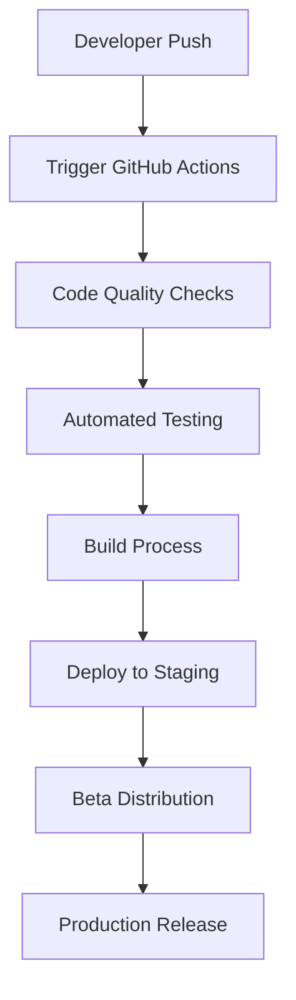

# 🔧 GitHub Actions CI/CD for Mobile App Deployment

**Purpose:** Automated build, test, and deployment pipeline for Blytz React Native mobile app  
**Platforms:** iOS & Android  
**Integration:** GitHub Repository with Expo builds  

---

## 📋 **CI/CD PIPELINE ARCHITECTURE**

### **Pipeline Overview**


### **Environment Configuration**
```yaml
GitHub Secrets Required:
  - EXPO_TOKEN: Expo account authentication
  - APPLE_ID: Apple Developer account
  - APPLE_APP_SPECIFIC_PASSWORD: App-specific password
  - GOOGLE_PLAY_JSON_KEY: Google Play service account key
  - SLACK_WEBHOOK: Build notifications
  - SENTRY_AUTH_TOKEN: Error tracking

Environment Variables:
  - NODE_ENV: development/staging/production
  - EXPO_PUBLIC_API_URL: Backend API endpoint
  - EXPO_PUBLIC_STRIPE_PUBLISHABLE_KEY: Stripe integration
```

---

## 🚀 **MAIN CI/CD WORKFLOW**

### **Complete GitHub Actions Workflow**
```yaml
# .github/workflows/mobile-ci-cd.yml
name: Mobile CI/CD Pipeline

on:
  push:
    branches: [main, develop]
    paths: ['frontend-mobile-rn/**']
  pull_request:
    branches: [main]
    paths: ['frontend-mobile-rn/**']
  release:
    types: [published]
    paths: ['frontend-mobile-rn/**']

env:
  NODE_VERSION: '18'
  WORKING_DIRECTORY: './frontend-mobile-rn'

jobs:
  # Code Quality and Testing
  quality-checks:
    name: Code Quality & Testing
    runs-on: ubuntu-latest
    
    steps:
      - name: Checkout code
        uses: actions/checkout@v4

      - name: Setup Node.js
        uses: actions/setup-node@v4
        with:
          node-version: ${{ env.NODE_VERSION }}
          cache: 'npm'
          cache-dependency-path: ${{ env.WORKING_DIRECTORY }}/package-lock.json

      - name: Install dependencies
        run: |
          cd ${{ env.WORKING_DIRECTORY }}
          npm ci

      - name: ESLint check
        run: |
          cd ${{ env.WORKING_DIRECTORY }}
          npm run lint

      - name: TypeScript check
        run: |
          cd ${{ env.WORKING_DIRECTORY }}
          npm run type-check

      - name: Run unit tests
        run: |
          cd ${{ env.WORKING_DIRECTORY }}
          npm run test:coverage

      - name: Upload coverage reports
        uses: codecov/codecov-action@v3
        with:
          directory: ${{ env.WORKING_DIRECTORY }}/coverage
          flags: mobile
          name: mobile-coverage

  # Android Build
  build-android:
    name: Build Android
    runs-on: ubuntu-latest
    needs: quality-checks
    if: github.ref == 'refs/heads/main' || github.event_name == 'release'
    
    steps:
      - name: Checkout code
        uses: actions/checkout@v4

      - name: Setup Node.js
        uses: actions/setup-node@v4
        with:
          node-version: ${{ env.NODE_VERSION }}
          cache: 'npm'
          cache-dependency-path: ${{ env.WORKING_DIRECTORY }}/package-lock.json

      - name: Setup Java
        uses: actions/setup-java@v4
        with:
          distribution: 'temurin'
          java-version: '17'

      - name: Setup Android SDK
        uses: android-actions/setup-android@v3

      - name: Install dependencies
        run: |
          cd ${{ env.WORKING_DIRECTORY }}
          npm ci

      - name: Setup Expo CLI
        run: |
          npm install -g @expo/cli eas-cli

      - name: Login to Expo
        run: |
          cd ${{ env.WORKING_DIRECTORY }}
          echo ${{ secrets.EXPO_TOKEN }} | eas login --non-interactive

      - name: Build Android APK (Preview)
        if: github.ref == 'refs/heads/main'
        run: |
          cd ${{ env.WORKING_DIRECTORY }}
          eas build --platform android --profile preview --non-interactive --output ./build/

      - name: Build Android AAB (Production)
        if: github.event_name == 'release'
        run: |
          cd ${{ env.WORKING_DIRECTORY }}
          eas build --platform android --profile production --non-interactive --output ./build/

      - name: Upload Android artifacts
        uses: actions/upload-artifact@v4
        with:
          name: android-build
          path: ${{ env.WORKING_DIRECTORY }}/build/
          retention-days: 30

      - name: Deploy to Google Play (Production)
        if: github.event_name == 'release'
        run: |
          cd ${{ env.WORKING_DIRECTORY }}
          eas submit --platform android --profile production --non-interactive

  # iOS Build
  build-ios:
    name: Build iOS
    runs-on: macos-latest
    needs: quality-checks
    if: github.ref == 'refs/heads/main' || github.event_name == 'release'
    
    steps:
      - name: Checkout code
        uses: actions/checkout@v4

      - name: Setup Node.js
        uses: actions/setup-node@v4
        with:
          node-version: ${{ env.NODE_VERSION }}
          cache: 'npm'
          cache-dependency-path: ${{ env.WORKING_DIRECTORY }}/package-lock.json

      - name: Install dependencies
        run: |
          cd ${{ env.WORKING_DIRECTORY }}
          npm ci

      - name: Setup Expo CLI
        run: |
          npm install -g @expo/cli eas-cli

      - name: Login to Expo
        run: |
          cd ${{ env.WORKING_DIRECTORY }}
          echo ${{ secrets.EXPO_TOKEN }} | eas login --non-interactive

      - name: Build iOS IPA (Preview)
        if: github.ref == 'refs/heads/main'
        run: |
          cd ${{ env.WORKING_DIRECTORY }}
          eas build --platform ios --profile preview --non-interactive --output ./build/

      - name: Build iOS IPA (Production)
        if: github.event_name == 'release'
        run: |
          cd ${{ env.WORKING_DIRECTORY }}
          eas build --platform ios --profile production --non-interactive --output ./build/

      - name: Upload iOS artifacts
        uses: actions/upload-artifact@v4
        with:
          name: ios-build
          path: ${{ env.WORKING_DIRECTORY }}/build/
          retention-days: 30

      - name: Deploy to TestFlight (Production)
        if: github.event_name == 'release'
        run: |
          cd ${{ env.WORKING_DIRECTORY }}
          eas submit --platform ios --profile production --non-interactive

  # Security Scanning
  security-scan:
    name: Security Scanning
    runs-on: ubuntu-latest
    needs: quality-checks
    
    steps:
      - name: Checkout code
        uses: actions/checkout@v4

      - name: Setup Node.js
        uses: actions/setup-node@v4
        with:
          node-version: ${{ env.NODE_VERSION }}
          cache: 'npm'
          cache-dependency-path: ${{ env.WORKING_DIRECTORY }}/package-lock.json

      - name: Install dependencies
        run: |
          cd ${{ env.WORKING_DIRECTORY }}
          npm ci

      - name: Run npm audit
        run: |
          cd ${{ env.WORKING_DIRECTORY }}
          npm audit --audit-level high

      - name: Run Snyk security scan
        uses: snyk/actions/node@master
        env:
          SNYK_TOKEN: ${{ secrets.SNYK_TOKEN }}
        with:
          args: --severity-threshold=high
          command: monitor
          args: >-
            --org=blytz
            --project-name=blytz-mobile

  # Notifications
  notify:
    name: Notify Team
    runs-on: ubuntu-latest
    needs: [build-android, build-ios]
    if: always()
    
    steps:
      - name: Notify Slack on Success
        if: needs.build-android.result == 'success' && needs.build-ios.result == 'success'
        uses: 8398a7/action-slack@v3
        with:
          status: success
          channel: '#mobile-deploys'
          text: '✅ Mobile app build completed successfully!'
        env:
          SLACK_WEBHOOK_URL: ${{ secrets.SLACK_WEBHOOK }}

      - name: Notify Slack on Failure
        if: needs.build-android.result == 'failure' || needs.build-ios.result == 'failure'
        uses: 8398a7/action-slack@v3
        with:
          status: failure
          channel: '#mobile-deploys'
          text: '❌ Mobile app build failed! Please check the logs.'
        env:
          SLACK_WEBHOOK_URL: ${{ secrets.SLACK_WEBHOOK }}
```

---

## 🧪 **TESTING WORKFLOW**

### **Separate Testing Workflow**
```yaml
# .github/workflows/mobile-testing.yml
name: Mobile Testing

on:
  push:
    branches: [main, develop]
    paths: ['frontend-mobile-rn/**']
  pull_request:
    branches: [main]
    paths: ['frontend-mobile-rn/**']
  schedule:
    - cron: '0 2 * * *' # Daily at 2 AM UTC

jobs:
  unit-tests:
    name: Unit Tests
    runs-on: ubuntu-latest
    
    steps:
      - name: Checkout code
        uses: actions/checkout@v4

      - name: Setup Node.js
        uses: actions/setup-node@v4
        with:
          node-version: '18'
          cache: 'npm'
          cache-dependency-path: frontend-mobile-rn/package-lock.json

      - name: Install dependencies
        run: |
          cd frontend-mobile-rn
          npm ci

      - name: Run unit tests
        run: |
          cd frontend-mobile-rn
          npm run test:coverage

      - name: Generate coverage report
        run: |
          cd frontend-mobile-rn
          npm run test:coverage:report

  integration-tests:
    name: Integration Tests
    runs-on: ubuntu-latest
    
    steps:
      - name: Checkout code
        uses: actions/checkout@v4

      - name: Setup Node.js
        uses: actions/setup-node@v4
        with:
          node-version: '18'
          cache: 'npm'
          cache-dependency-path: frontend-mobile-rn/package-lock.json

      - name: Install dependencies
        run: |
          cd frontend-mobile-rn
          npm ci

      - name: Start backend services
        run: |
          docker-compose -f docker-compose.test.yml up -d
          sleep 30

      - name: Run integration tests
        run: |
          cd frontend-mobile-rn
          npm run test:integration

      - name: Stop backend services
        run: |
          docker-compose -f docker-compose.test.yml down

  e2e-tests:
    name: E2E Tests
    runs-on: macos-latest
    
    steps:
      - name: Checkout code
        uses: actions/checkout@v4

      - name: Setup Node.js
        uses: actions/setup-node@v4
        with:
          node-version: '18'
          cache: 'npm'
          cache-dependency-path: frontend-mobile-rn/package-lock.json

      - name: Install dependencies
        run: |
          cd frontend-mobile-rn
          npm ci

      - name: Setup Expo CLI
        run: |
          npm install -g @expo/cli

      - name: Start Metro bundler
        run: |
          cd frontend-mobile-rn
          npx expo start --web &
          sleep 30

      - name: Run E2E tests
        run: |
          cd frontend-mobile-rn
          npm run test:e2e
```

---

## 📱 **BUILD PROFILES CONFIGURATION**

### **EAS Build Profiles**
```json
{
  "cli": {
    "version": ">= 3.0.0",
    "appVersionSource": "local"
  },
  "build": {
    "development": {
      "developmentClient": true,
      "distribution": "internal",
      "channel": "development",
      "env": {
        "EXPO_PUBLIC_API_URL": "https://api-staging.blytz.app",
        "EXPO_PUBLIC_ENVIRONMENT": "development"
      }
    },
    "preview": {
      "distribution": "internal",
      "channel": "preview",
      "env": {
        "EXPO_PUBLIC_API_URL": "https://api-staging.blytz.app",
        "EXPO_PUBLIC_ENVIRONMENT": "staging"
      },
      "android": {
        "buildType": "apk",
        "gradleCommand": ":app:assembleRelease"
      },
      "ios": {
        "scheme": "BlytzMobile"
      }
    },
    "production": {
      "channel": "production",
      "env": {
        "EXPO_PUBLIC_API_URL": "https://api.blytz.app",
        "EXPO_PUBLIC_ENVIRONMENT": "production"
      },
      "ios": {
        "autoIncrement": true,
        "enterpriseProvisioning": "default"
      },
      "android": {
        "autoIncrement": true,
        "buildType": "app-bundle"
      }
    }
  },
  "submit": {
    "production": {
      "ios": {
        "appleId": "${APPLE_ID}",
        "appleAppSpecificPassword": "${APPLE_APP_SPECIFIC_PASSWORD}",
        "ascAppId": "${ASC_APP_ID}"
      },
      "android": {
        "serviceAccountKeyPath": "./google-play-key.json",
        "track": "production"
      }
    }
  }
}
```

---

## 🔧 **ENVIRONMENT MANAGEMENT**

### **Environment Variables Setup**
```bash
# .env.development
EXPO_PUBLIC_API_URL=https://api-staging.blytz.app
EXPO_PUBLIC_ENVIRONMENT=development
EXPO_PUBLIC_STRIPE_PUBLISHABLE_KEY=pk_test_...
EXPO_PUBLIC_SENTRY_DSN=https://...
EXPO_PUBLIC_ANALYTICS_ENABLED=true

# .env.staging
EXPO_PUBLIC_API_URL=https://api-staging.blytz.app
EXPO_PUBLIC_ENVIRONMENT=staging
EXPO_PUBLIC_STRIPE_PUBLISHABLE_KEY=pk_test_...
EXPO_PUBLIC_SENTRY_DSN=https://...
EXPO_PUBLIC_ANALYTICS_ENABLED=true

# .env.production
EXPO_PUBLIC_API_URL=https://api.blytz.app
EXPO_PUBLIC_ENVIRONMENT=production
EXPO_PUBLIC_STRIPE_PUBLISHABLE=pk_live_...
EXPO_PUBLIC_SENTRY_DSN=https://...
EXPO_PUBLIC_ANALYTICS_ENABLED=true
```

---

## 📊 **MONITORING & NOTIFICATIONS**

### **Build Monitoring**
```yaml
Monitoring Setup:
  - Build success/failure notifications
  - Test coverage tracking
  - Performance metrics
  - Security scan results
  - Deployment status

Notification Channels:
  - Slack: #mobile-deploys channel
  - Email: Development team
  - GitHub: Status badges
  - Dashboard: Build metrics
```

### **Performance Metrics**
```yaml
Metrics to Track:
  - Build time trends
  - Test execution time
  - Code coverage percentage
  - Security vulnerability count
  - Deployment frequency
  - Success rate percentage

Alerting Rules:
  - Build failure: Immediate notification
  - Test coverage drop: Warning
  - Security vulnerability: Critical alert
  - Performance regression: Warning
```

---

## 🚀 **DEPLOYMENT TRIGGERS**

### **Automated Triggers**
```yaml
Development Builds:
  Trigger: Push to develop branch
  Action: Build and deploy to staging
  Distribution: Internal testing

Production Builds:
  Trigger: GitHub release
  Action: Build and submit to app stores
  Distribution: Public release

Hotfix Builds:
  Trigger: Push to hotfix/* branches
  Action: Fast-track build and deploy
  Distribution: Emergency release
```

### **Manual Triggers**
```yaml
Manual Deployment:
  Trigger: GitHub workflow dispatch
  Parameters: Environment, platform, version
  Use Case: Special releases, testing

Rollback:
  Trigger: GitHub workflow dispatch
  Action: Deploy previous version
  Use Case: Emergency rollback
```

---

## 📋 **MAINTENANCE & TROUBLESHOOTING**

### **Common Issues & Solutions**
```yaml
Build Failures:
  Issue: Node modules corruption
  Solution: Clear cache and reinstall
  Command: npm cache clean --force && rm -rf node_modules && npm ci

Certificate Issues:
  Issue: Expired signing certificates
  Solution: Renew certificates and update secrets
  Action: Update GitHub secrets

Dependency Conflicts:
  Issue: Version conflicts between packages
  Solution: Update package.json and lock file
  Action: Run npm audit fix

Environment Variables:
  Issue: Missing or incorrect environment variables
  Solution: Update environment files and GitHub secrets
  Action: Verify all required variables
```

### **Maintenance Tasks**
```yaml
Weekly:
  - Update dependencies
  - Check build performance
  - Review security scan results
  - Monitor storage usage

Monthly:
  - Update Expo SDK
  - Review and optimize workflows
  - Update documentation
  - Clean up old artifacts

Quarterly:
  - Security audit
  - Performance optimization
  - Tool updates
  - Architecture review
```

---

## 🏁 **CONCLUSION**

This GitHub Actions CI/CD pipeline provides:

1. **Automated Quality Assurance**: Code quality checks, testing, and security scanning
2. **Multi-Platform Builds**: Automated iOS and Android builds for all environments
3. **Deployment Automation**: Staging and production deployments with proper approvals
4. **Monitoring & Notifications**: Real-time build status and performance metrics
5. **Environment Management**: Proper separation of development, staging, and production
6. **Scalability**: Easy to extend with additional platforms and testing

The pipeline ensures consistent, reliable builds and deployments while maintaining high code quality and security standards.

---

**Status:** Ready for Implementation  
**Next Action:** Set up GitHub secrets and configure workflows  
**Owner:** DevOps Engineer  
**Review Date:** Monthly