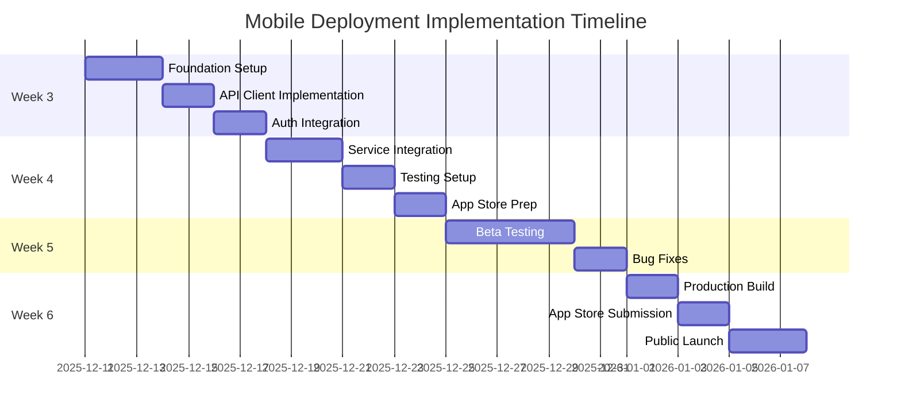

# 🗺️ Mobile Deployment Implementation Roadmap

**Purpose:** Step-by-step implementation guide for Blytz mobile app deployment  
**Timeline:** 6-week implementation plan (Weeks 3-8)  
**Target:** Production-ready mobile app with full deployment pipeline  

---

## 📅 **OVERALL TIMELINE**

### **6-Week Implementation Plan**


---

## 🎯 **WEEK 3: FOUNDATION & INTEGRATION**

### **Day 1-3: Foundation Setup**
```yaml
Priority: Critical
Owner: Mobile Development Team Lead
Deliverables:
  - Expo configuration complete
  - GitHub Actions CI/CD pipeline
  - Environment variables setup
  - Development workflow established

Tasks:
  [ ] Create app.json configuration
  [ ] Set up eas.json build profiles
  [ ] Configure GitHub Actions workflows
  [ ] Set up environment variables
  [ ] Initialize Git repository structure
  [ ] Install required dependencies

Acceptance Criteria:
  - App builds successfully in development
  - CI/CD pipeline runs without errors
  - All environment variables accessible
  - Code quality checks pass
```

### **Day 4-5: API Client Implementation**
```yaml
Priority: Critical
Owner: Backend Integration Specialist
Deliverables:
  - Unified API client with authentication
  - Request/response interceptors
  - Error handling and retry logic
  - WebSocket connection management

Tasks:
  [ ] Implement BlytzApiClient class
  [ ] Add authentication interceptors
  [ ] Implement token refresh logic
  [ ] Add WebSocket support
  [ ] Create error handling utilities
  [ ] Add performance monitoring

Acceptance Criteria:
  - API client connects to backend
  - Authentication flow works end-to-end
  - Token refresh handles expired tokens
  - WebSocket connections establish successfully
  - Error handling covers all scenarios
```

### **Day 6-7: Authentication Integration**
```yaml
Priority: Critical
Owner: Frontend Developer
Deliverables:
  - Authentication context implementation
  - Login/register screens
  - Token management
  - User session handling

Tasks:
  [ ] Create AuthContext with useAuth hook
  [ ] Implement login/register API calls
  [ ] Create login and register screens
  [ ] Add token storage management
  [ ] Implement logout functionality
  [ ] Add password reset flow

Acceptance Criteria:
  - Users can register new accounts
  - Users can login with existing accounts
  - Tokens are stored and managed correctly
  - Logout clears all user data
  - Password reset works end-to-end
```

---

## 🎯 **WEEK 4: SERVICE INTEGRATION & TESTING**

### **Day 1-3: Backend Service Integration**
```yaml
Priority: Critical
Owner: Backend Integration Specialist
Deliverables:
  - Product service integration
  - Auction service integration
  - Payment service integration
  - Notification service integration

Tasks:
  [ ] Implement ProductService class
  [ ] Implement AuctionService with WebSocket
  [ ] Implement PaymentService with Stripe
  [ ] Implement NotificationService
  [ ] Create service context providers
  [ ] Add real-time auction updates

Acceptance Criteria:
  - Products load from backend API
  - Auctions update in real-time
  - Payment processing works with Stripe
  - Push notifications are received
  - All services handle errors gracefully
```

### **Day 4-5: Testing Setup**
```yaml
Priority: High
Owner: QA Engineer
Deliverables:
  - Unit test suite
  - Integration test suite
  - E2E test framework
  - Test coverage reporting

Tasks:
  [ ] Set up Jest configuration
  [ ] Write unit tests for API clients
  [ ] Set up Detox for E2E testing
  [ ] Create integration test scenarios
  [ ] Configure test coverage reporting
  [ ] Set up test data fixtures

Acceptance Criteria:
  - Unit tests cover 80%+ of code
  - Integration tests validate API flows
  - E2E tests cover critical user journeys
  - Test reports generate automatically
  - All tests pass in CI/CD pipeline
```

### **Day 6-7: App Store Preparation**
```yaml
Priority: High
Owner: Mobile Team Lead
Deliverables:
  - App store assets created
  - Metadata prepared
  - Privacy policy published
  - Developer accounts ready

Tasks:
  [ ] Create app icons and splash screens
  [ ] Generate app store screenshots
  [ ] Write app descriptions and metadata
  [ ] Set up Apple Developer account
  [ ] Set up Google Play Developer account
  [ ] Create privacy policy and terms of service

Acceptance Criteria:
  - All required app store assets ready
  - Metadata complete and optimized
  - Privacy policy published and accessible
  - Developer accounts active and configured
  - App store listings created
```

---

## 🎯 **WEEK 5: BETA TESTING & ITERATION**

### **Day 1-5: Beta Testing Program**
```yaml
Priority: Critical
Owner: Product Manager
Deliverables:
  - Beta tester recruitment
  - TestFlight distribution
  - Google Play Internal Testing
  - Feedback collection system

Tasks:
  [ ] Recruit 50-100 beta testers
  [ ] Create TestFlight build and distribute
  [ ] Set up Google Play Internal Testing
  [ ] Implement in-app feedback system
  [ ] Create beta tester onboarding guide
  [ ] Set up analytics and crash reporting

Acceptance Criteria:
  - 50+ beta testers onboarded
  - Beta builds distributed successfully
  - Feedback collection system active
  - Crash reporting configured
  - Analytics tracking user behavior
  - Testers can report issues easily
```

### **Day 6-7: Bug Fixes & Optimization**
```yaml
Priority: High
Owner: Mobile Development Team
Deliverables:
  - Critical bugs fixed
  - Performance optimizations
  - User experience improvements
  - Stability improvements

Tasks:
  [ ] Analyze beta tester feedback
  [ ] Fix critical bugs reported
  [ ] Optimize app performance
  [ ] Improve user experience based on feedback
  [ ] Update app based on usability issues
  [ ] Prepare production-ready build

Acceptance Criteria:
  - All critical bugs resolved
  - App performance meets benchmarks
  - User experience issues addressed
  - Crash rate below 0.5%
  - App startup time under 3 seconds
  - Memory usage optimized
```

---

## 🎯 **WEEK 6: PRODUCTION LAUNCH**

### **Day 1-2: Production Build**
```yaml
Priority: Critical
Owner: DevOps Engineer
Deliverables:
  - Production iOS build
  - Production Android build
  - Final security audit
  - Performance validation

Tasks:
  [ ] Create production iOS build
  [ ] Create production Android build
  [ ] Conduct final security audit
  [ ] Validate performance metrics
  [ ] Test all payment flows
  [ ] Verify all integrations work

Acceptance Criteria:
  - Production builds pass all tests
  - Security audit completed with no critical issues
  - Performance meets all requirements
  - Payment processing works flawlessly
  - All integrations tested and working
  - Build artifacts ready for submission
```

### **Day 3-4: App Store Submission**
```yaml
Priority: Critical
Owner: Mobile Team Lead
Deliverables:
  - iOS App Store submission
  - Google Play Store submission
  - Review process monitoring
  - Contingency planning

Tasks:
  [ ] Submit to iOS App Store
  [ ] Submit to Google Play Store
  [ ] Monitor review process
  [ ] Prepare for potential rejections
  [ ] Create marketing materials
  [ ] Prepare launch announcement

Acceptance Criteria:
  - Apps submitted to both stores
  - Review process actively monitored
  - Contingency plans in place
  - Marketing materials ready
  - Launch announcement prepared
  - Support team trained and ready
```

### **Day 5-7: Public Launch**
```yaml
Priority: Critical
Owner: Product Manager
Deliverables:
  - Public app release
  - Launch marketing campaign
  - User support activation
  - Success metrics monitoring

Tasks:
  [ ] Coordinate app store releases
  [ ] Execute launch marketing campaign
  [ ] Activate user support channels
  - Monitor launch metrics
  [ ] Address any launch issues
  [ ] Gather initial user feedback

Acceptance Criteria:
  - Apps available in both stores
  - Marketing campaign executed
  - Support channels active
  - Launch metrics monitored
  - Issues addressed quickly
  - User feedback collected
```

---

## 📋 **DETAILED TASK BREAKDOWN**

### **Week 3 Detailed Tasks**

#### **Foundation Setup Tasks**
```yaml
Day 1 Tasks:
  - Create app.json with all required configurations
  - Set up eas.json with build profiles
  - Initialize GitHub repository with proper structure
  - Configure GitHub secrets for Expo and deployment

Day 2 Tasks:
  - Create GitHub Actions workflow files
  - Set up automated testing pipeline
  - Configure build agents for iOS and Android
  - Test CI/CD pipeline with sample build

Day 3 Tasks:
  - Set up environment variable management
  - Configure development, staging, and production environments
  - Test environment switching
  - Validate all configurations work correctly
```

#### **API Client Implementation Tasks**
```yaml
Day 4 Tasks:
  - Implement BlytzApiClient base class
  - Add HTTP methods with retry logic
  - Implement request/response interceptors
  - Add authentication token management

Day 5 Tasks:
  - Implement WebSocket connection handling
  - Add error handling and logging
  - Create performance monitoring hooks
  - Test API client with backend services
```

#### **Authentication Integration Tasks**
```yaml
Day 6 Tasks:
  - Create AuthContext with state management
  - Implement useAuth hook
  - Create login and register API services
  - Build login and register UI components

Day 7 Tasks:
  - Implement token storage with AsyncStorage
  - Add logout functionality
  - Create password reset flow
  - Test complete authentication flow
```

### **Week 4 Detailed Tasks**

#### **Service Integration Tasks**
```yaml
Day 1 Tasks:
  - Implement ProductService with CRUD operations
  - Create Product context and hooks
  - Build product listing and detail screens
  - Add product search functionality

Day 2 Tasks:
  - Implement AuctionService with WebSocket support
  - Create real-time bidding interface
  - Build auction listing and detail screens
  - Add bid placement functionality

Day 3 Tasks:
  - Implement PaymentService with Stripe integration
  - Create payment flow UI components
  - Add payment method management
  - Test payment processing end-to-end
```

---

## 🔧 **TECHNICAL REQUIREMENTS**

### **Development Environment Setup**
```yaml
Required Tools:
  - Node.js 18+
  - Expo CLI latest
  - Xcode 14+ (iOS development)
  - Android Studio latest (Android development)
  - Git version control

Required Accounts:
  - Apple Developer Account
  - Google Play Developer Account
  - Expo account
  - GitHub account
  - Stripe account

Required Dependencies:
  - Expo SDK 49+
  - React Native 0.72+
  - TypeScript 5+
  - Jest for testing
  - Detox for E2E testing
```

### **Code Quality Standards**
```yaml
Linting:
  - ESLint configuration
  - Prettier formatting
  - TypeScript strict mode
  - Pre-commit hooks

Testing:
  - Unit test coverage >80%
  - Integration tests for all API flows
  - E2E tests for critical user journeys
  - Performance testing

Security:
  - No hardcoded secrets
  - Proper input validation
  - Secure token storage
  - HTTPS only for API calls
```

---

## 📊 **SUCCESS METRICS**

### **Technical Metrics**
```yaml
Build Performance:
  - Build time <10 minutes
  - Build success rate >95%
  - Test execution time <5 minutes
  - Deployment time <15 minutes

App Performance:
  - Startup time <3 seconds
  - Memory usage <150MB
  - Crash rate <0.5%
  - API response time <200ms

Code Quality:
  - Test coverage >80%
  - Zero critical security issues
  - Zero high-priority bugs
  - Code complexity maintained
```

### **Business Metrics**
```yaml
User Acquisition:
  - 50+ beta testers recruited
  - 100+ downloads in first week
  - 4.0+ app store rating
  - <5% uninstall rate in first month

User Engagement:
  - 60%+ user retention after 7 days
  - 40%+ user retention after 30 days
  - 3+ average sessions per user
  - 10+ minutes average session duration

Technical Success:
  - 99.9% uptime for critical features
  - <1% error rate for API calls
  - <2 seconds average page load time
  - Successful payment rate >95%
```

---

## 🚨 **RISK MITIGATION**

### **High-Risk Areas**
```yaml
App Store Rejection:
  Risk: 2-7 day delay in launch
  Mitigation:
    - Thorough guideline compliance review
    - Pre-submission testing
    - Complete all requirements
    - Have web app as backup

Backend Integration Issues:
  Risk: Mobile app cannot connect to services
  Mitigation:
    - Comprehensive API testing
    - Mock data fallback
    - Robust error handling
    - Real-time monitoring

Performance Issues:
  Risk: Poor user experience leads to churn
  Mitigation:
    - Performance testing on target devices
    - Code optimization
    - Progressive loading
    - Performance monitoring

Security Vulnerabilities:
  Risk: Data breach or compliance issues
  Mitigation:
    - Security audit before launch
    - Regular dependency updates
    - Secure coding practices
    - Penetration testing
```

### **Contingency Planning**
```yaml
Timeline Delays:
  - Add 20% buffer to all estimates
  - Prioritize core features over nice-to-haves
  - Prepare phased launch approach
  - Have emergency release process

Technical Issues:
  - Rollback procedures for critical bugs
  - Emergency hotfix process
  - Communication templates for issues
  - 24/7 monitoring during launch week

Resource Constraints:
  - Cross-team knowledge sharing
  - Documentation for handoffs
  - External contractor backup
  - Clear escalation paths
```

---

## 🏁 **CONCLUSION**

This implementation roadmap provides:

1. **Clear Timeline**: 6-week structured plan with daily tasks
2. **Detailed Tasks**: Specific actionable items for each team member
3. **Success Metrics**: Measurable goals for each phase
4. **Risk Mitigation**: Proactive planning for potential issues
5. **Quality Standards**: Clear requirements for code and app quality

### **Key Success Factors:**
- **Early Integration**: Complete backend integration before beta testing
- **Comprehensive Testing**: Thorough testing across all phases
- **User Feedback**: Active beta testing program for validation
- **Performance Focus**: Continuous monitoring and optimization
- **Risk Management**: Proactive identification and mitigation of issues

### **Critical Path to Launch:**
1. **Week 3**: Foundation and authentication
2. **Week 4**: Service integration and testing
3. **Week 5**: Beta testing and iteration
4. **Week 6**: Production launch

With this roadmap, the Blytz mobile app can successfully launch to market within the planned timeline, providing users with a reliable and engaging auction experience.

---

**Status:** Ready for Execution  
**Next Action:** Begin Week 3 Foundation Setup  
**Owner:** Mobile Development Team Lead  
**Review Date:** Daily standups, weekly progress reviews