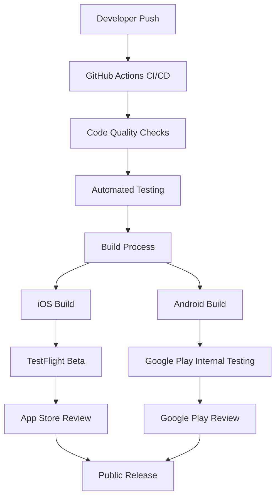
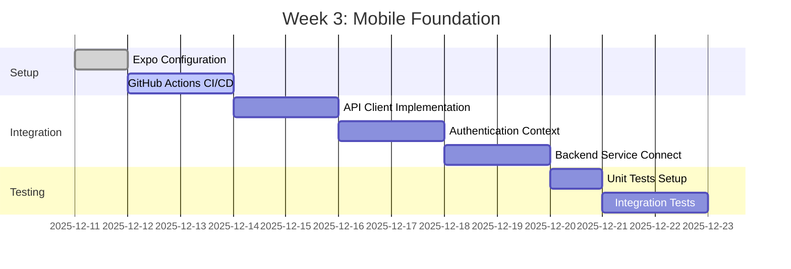
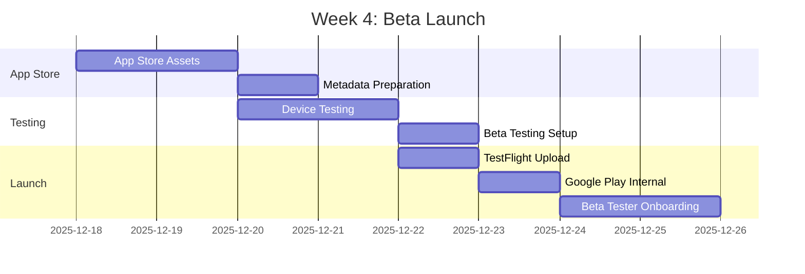
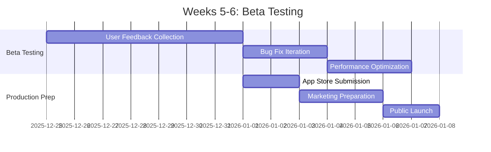

# 🚀 BLYTZ LIVE AUCTION MVP - MOBILE DEPLOYMENT STRATEGY

**Date:** December 11, 2025  
**Platform:** React Native (Expo)  
**Target:** iOS App Store & Google Play Store  
**Timeline:** Week 3-4 Priority (Soft Launch with Beta Testers)  
**Deployment Infrastructure:** GitHub Actions CI/CD  

---

## 📊 **CURRENT MOBILE APP ANALYSIS**

### **✅ Current State Assessment**
- **Framework**: React Native with Expo SDK 49
- **Build System**: Basic Expo build scripts
- **Payment Integration**: Stripe Connect implemented
- **Backend Integration**: Partial (payment endpoints only)
- **Testing**: Jest configured with basic setup
- **Code Quality**: ESLint + TypeScript configured

### **🔍 Architecture Analysis**
```typescript
// Current App Structure
frontend-mobile-rn/
├── App.tsx                    # Main entry point
├── package.json               # Dependencies and scripts
├── .env.stripe               # Environment configuration
└── src/
    ├── screens/               # UI screens (2 implemented)
    ├── api/blytz/            # API integration (empty)
    ├── contexts/blytz/        # React contexts (empty)
    ├── services/blytz/        # Business logic (empty)
    └── utils/                # Utilities (empty)
```

### **🚨 Critical Gaps Identified**
1. **Missing Expo Configuration**: No `app.json` or `eas.json`
2. **No CI/CD Pipeline**: No automated builds or testing
3. **Incomplete Backend Integration**: Only payment endpoints connected
4. **No App Store Assets**: Missing icons, splash screens, metadata
5. **No Analytics/Crash Reporting**: No monitoring integration
6. **No Deployment Scripts**: Manual build process only

---

## 🎯 **DEPLOYMENT STRATEGY OVERVIEW**

### **🏗️ Infrastructure Architecture**


### **📱 Platform-Specific Strategy**

#### **iOS Deployment Strategy**
```yaml
Platform: iOS App Store
Build Tool: Expo CLI + GitHub Actions
Beta Testing: TestFlight
Review Process: Apple App Review (2-7 days)
Critical Requirements:
  - Apple Developer Account ($99/year)
  - App Store Connect setup
  - iOS app signing certificates
  - Privacy policy and data usage
```

#### **Android Deployment Strategy**
```yaml
Platform: Google Play Store
Build Tool: Expo CLI + GitHub Actions
Beta Testing: Google Play Internal Testing
Review Process: Google Play Review (1-3 days)
Critical Requirements:
  - Google Play Developer Account ($25 one-time)
  - Play Console setup
  - Android app signing key
  - Content rating and compliance
```

---

## 🔧 **TECHNICAL IMPLEMENTATION PLAN**

### **Phase 1: Foundation Setup (Week 3)**

#### **1.1 Expo Configuration Setup**
```json
// app.json - Required Configuration
{
  "expo": {
    "name": "Blytz - Live Auction Marketplace",
    "slug": "blytz-auction",
    "version": "1.0.0",
    "orientation": "portrait",
    "icon": "./assets/icon.png",
    "userInterfaceStyle": "automatic",
    "splash": {
      "image": "./assets/splash.png",
      "resizeMode": "contain",
      "backgroundColor": "#635bff"
    },
    "assetBundlePatterns": ["**/*"],
    "ios": {
      "supportsTablet": true,
      "bundleIdentifier": "com.blytz.auction",
      "buildNumber": "1.0.0"
    },
    "android": {
      "adaptiveIcon": {
        "foregroundImage": "./assets/adaptive-icon.png",
        "backgroundColor": "#635bff"
      },
      "package": "com.blytz.auction",
      "versionCode": 1
    },
    "web": {
      "favicon": "./assets/favicon.png"
    },
    "plugins": [
      "@stripe/stripe-expo",
      "expo-font"
    ],
    "extra": {
      "eas": {
        "projectId": "blytz-auction-project"
      }
    }
  }
}
```

#### **1.2 EAS Configuration for Builds**
```json
// eas.json - Build Profiles
{
  "cli": {
    "version": ">= 3.0.0"
  },
  "build": {
    "development": {
      "developmentClient": true,
      "distribution": "internal"
    },
    "preview": {
      "distribution": "internal",
      "android": {
        "buildType": "apk"
      }
    },
    "production": {
      "ios": {
        "autoIncrement": true
      },
      "android": {
        "autoIncrement": true
      }
    }
  },
  "submit": {
    "production": {}
  }
}
```

#### **1.3 GitHub Actions CI/CD Pipeline**
```yaml
# .github/workflows/mobile-ci.yml
name: Mobile CI/CD Pipeline

on:
  push:
    branches: [main, develop]
    paths: ['frontend-mobile-rn/**']
  pull_request:
    branches: [main]
    paths: ['frontend-mobile-rn/**']

jobs:
  test:
    runs-on: ubuntu-latest
    steps:
      - uses: actions/checkout@v3
      - uses: actions/setup-node@v3
        with:
          node-version: '18'
          cache: 'npm'
          cache-dependency-path: frontend-mobile-rn/package-lock.json
      
      - name: Install dependencies
        run: |
          cd frontend-mobile-rn
          npm ci
      
      - name: Run tests
        run: |
          cd frontend-mobile-rn
          npm run test:coverage
      
      - name: Run linting
        run: |
          cd frontend-mobile-rn
          npm run lint
      
      - name: Type checking
        run: |
          cd frontend-mobile-rn
          npm run type-check

  build-android:
    needs: test
    runs-on: ubuntu-latest
    if: github.ref == 'refs/heads/main'
    steps:
      - uses: actions/checkout@v3
      - uses: actions/setup-node@v3
        with:
          node-version: '18'
          cache: 'npm'
          cache-dependency-path: frontend-mobile-rn/package-lock.json
      
      - name: Setup Expo CLI
        run: npm install -g @expo/cli eas-cli
      
      - name: Install dependencies
        run: |
          cd frontend-mobile-rn
          npm ci
      
      - name: Login to Expo
        run: |
          cd frontend-mobile-rn
          echo ${{ secrets.EXPO_TOKEN }} | eas login --non-interactive
      
      - name: Build Android APK
        run: |
          cd frontend-mobile-rn
          eas build --platform android --profile preview --non-interactive

  build-ios:
    needs: test
    runs-on: macos-latest
    if: github.ref == 'refs/heads/main'
    steps:
      - uses: actions/checkout@v3
      - uses: actions/setup-node@v3
        with:
          node-version: '18'
          cache: 'npm'
          cache-dependency-path: frontend-mobile-rn/package-lock.json
      
      - name: Setup Expo CLI
        run: npm install -g @expo/cli eas-cli
      
      - name: Install dependencies
        run: |
          cd frontend-mobile-rn
          npm ci
      
      - name: Login to Expo
        run: |
          cd frontend-mobile-rn
          echo ${{ secrets.EXPO_TOKEN }} | eas login --non-interactive
      
      - name: Build iOS IPA
        run: |
          cd frontend-mobile-rn
          eas build --platform ios --profile preview --non-interactive
```

### **Phase 2: Backend Integration (Week 3-4)**

#### **2.1 API Client Implementation**
```typescript
// src/api/blytz/client.ts - Unified API Client
import axios, { AxiosInstance, AxiosRequestConfig } from 'axios';
import AsyncStorage from '@react-native-async-storage/async-storage';

class BlytzApiClient {
  private client: AxiosInstance;
  private token: string | null = null;

  constructor() {
    this.client = axios.create({
      baseURL: process.env.EXPO_PUBLIC_API_URL || 'https://api.blytz.app',
      timeout: 10000,
      headers: {
        'Content-Type': 'application/json',
        'X-Client-Platform': 'react-native',
        'X-Client-Version': process.env.EXPO_PUBLIC_APP_VERSION || '1.0.0',
      },
    });

    this.setupInterceptors();
  }

  private setupInterceptors() {
    // Request interceptor for auth token
    this.client.interceptors.request.use(async (config) => {
      if (!this.token) {
        this.token = await AsyncStorage.getItem('auth_token');
      }
      if (this.token) {
        config.headers.Authorization = `Bearer ${this.token}`;
      }
      return config;
    });

    // Response interceptor for token refresh
    this.client.interceptors.response.use(
      (response) => response,
      async (error) => {
        if (error.response?.status === 401) {
          // Handle token refresh
          await this.refreshToken();
          // Retry original request
          return this.client.request(error.config);
        }
        return Promise.reject(error);
      }
    );
  }

  private async refreshToken() {
    try {
      const refreshToken = await AsyncStorage.getItem('refresh_token');
      const response = await axios.post(`${this.client.defaults.baseURL}/auth/refresh`, {
        refresh_token: refreshToken,
      });
      
      this.token = response.data.token;
      await AsyncStorage.setItem('auth_token', this.token);
    } catch (error) {
      // Handle refresh failure - logout user
      await AsyncStorage.multiRemove(['auth_token', 'refresh_token']);
      this.token = null;
    }
  }

  // API methods
  async login(email: string, password: string) {
    const response = await this.client.post('/auth/login', { email, password });
    await AsyncStorage.setItem('auth_token', response.data.token);
    await AsyncStorage.setItem('refresh_token', response.data.refresh_token);
    this.token = response.data.token;
    return response.data;
  }

  async register(userData: any) {
    const response = await this.client.post('/auth/register', userData);
    return response.data;
  }

  async getAuctions() {
    const response = await this.client.get('/auctions');
    return response.data;
  }

  async placeBid(auctionId: string, amount: number) {
    const response = await this.client.post(`/auctions/${auctionId}/bid`, { amount });
    return response.data;
  }

  async getProducts() {
    const response = await this.client.get('/products');
    return response.data;
  }

  async createPaymentIntent(amount: number, currency: string) {
    const response = await this.client.post('/payments/create-intent', {
      amount,
      currency,
      platform: 'mobile',
    });
    return response.data;
  }
}

export const blytzApi = new BlytzApiClient();
```

#### **2.2 Authentication Context**
```typescript
// src/contexts/blytz/auth-context.tsx
import React, { createContext, useContext, useReducer, useEffect } from 'react';
import { blytzApi } from '../api/blytz/client';

interface AuthState {
  user: any | null;
  token: string | null;
  isAuthenticated: boolean;
  loading: boolean;
  error: string | null;
}

interface AuthContextType extends AuthState {
  login: (email: string, password: string) => Promise<void>;
  register: (userData: any) => Promise<void>;
  logout: () => Promise<void>;
  refreshToken: () => Promise<void>;
}

const AuthContext = createContext<AuthContextType | null>(null);

const authReducer = (state: AuthState, action: any): AuthState => {
  switch (action.type) {
    case 'LOGIN_START':
      return { ...state, loading: true, error: null };
    case 'LOGIN_SUCCESS':
      return {
        ...state,
        loading: false,
        isAuthenticated: true,
        user: action.payload.user,
        token: action.payload.token,
        error: null,
      };
    case 'LOGIN_FAILURE':
      return {
        ...state,
        loading: false,
        isAuthenticated: false,
        user: null,
        token: null,
        error: action.payload,
      };
    case 'LOGOUT':
      return {
        ...state,
        isAuthenticated: false,
        user: null,
        token: null,
        error: null,
      };
    default:
      return state;
  }
};

export const AuthProvider: React.FC<{ children: React.ReactNode }> = ({ children }) => {
  const [state, dispatch] = useReducer(authReducer, {
    user: null,
    token: null,
    isAuthenticated: false,
    loading: false,
    error: null,
  });

  const login = async (email: string, password: string) => {
    try {
      dispatch({ type: 'LOGIN_START' });
      const response = await blytzApi.login(email, password);
      dispatch({ type: 'LOGIN_SUCCESS', payload: response });
    } catch (error: any) {
      dispatch({ type: 'LOGIN_FAILURE', payload: error.message });
    }
  };

  const register = async (userData: any) => {
    try {
      dispatch({ type: 'LOGIN_START' });
      const response = await blytzApi.register(userData);
      dispatch({ type: 'LOGIN_SUCCESS', payload: response });
    } catch (error: any) {
      dispatch({ type: 'LOGIN_FAILURE', payload: error.message });
    }
  };

  const logout = async () => {
    await AsyncStorage.multiRemove(['auth_token', 'refresh_token']);
    dispatch({ type: 'LOGOUT' });
  };

  const refreshToken = async () => {
    try {
      const response = await blytzApi.refreshToken();
      dispatch({ type: 'LOGIN_SUCCESS', payload: response });
    } catch (error) {
      logout();
    }
  };

  return (
    <AuthContext.Provider
      value={{
        ...state,
        login,
        register,
        logout,
        refreshToken,
      }}
    >
      {children}
    </AuthContext.Provider>
  );
};

export const useAuth = () => {
  const context = useContext(AuthContext);
  if (!context) {
    throw new Error('useAuth must be used within an AuthProvider');
  }
  return context;
};
```

### **Phase 3: App Store Preparation (Week 4)**

#### **3.1 App Store Assets Required**
```yaml
iOS App Store:
  - App Icon: 1024x1024 PNG
  - Screenshots: 6.7" Display (1290x2796), 6.5" Display (1242x2688)
  - App Preview Videos: Optional but recommended
  - Privacy Policy URL: Required
  - App Store Description: Marketing copy
  - Keywords: For App Store optimization
  - Category: Shopping/E-commerce
  - Content Rating: Complete questionnaire

Google Play Store:
  - App Icon: 512x512 PNG
  - Feature Graphic: 1024x500 JPG/PNG
  - Screenshots: Phone (320-3840px), Tablet (600-7680px)
  - App Preview Videos: Optional but recommended
  - Privacy Policy URL: Required
  - Store Listing: Description, full description, updates
  - Content Rating: Complete questionnaire
  - Target Audience: Age groups and content
```

#### **3.2 App Metadata Template**
```json
{
  "app_info": {
    "name": "Blytz - Live Auction Marketplace",
    "short_description": "Bid on unique items in real-time live auctions",
    "full_description": "Experience the thrill of live auctions from your mobile device. Blytz brings the excitement of real-time bidding to your fingertips. Browse unique items, place bids instantly, and win amazing deals in live auctions happening right now.\n\nKey Features:\n• Real-time live auctions\n• Instant bid notifications\n• Secure payment processing\n• Seller verification system\n• Mobile-optimized bidding interface\n• Live chat during auctions\n\nJoin thousands of buyers and sellers in Malaysia's premier auction marketplace.",
    "keywords": ["auction", "bidding", "marketplace", "shopping", "live auction", "malaysia"],
    "category": "Shopping",
    "content_rating": "Everyone",
    "privacy_policy": "https://blytz.app/privacy",
    "support_url": "https://blytz.app/support",
    "marketing_url": "https://blytz.app"
  }
}
```

---

## 🧪 **TESTING STRATEGY**

### **Automated Testing Pipeline**
```yaml
Unit Tests:
  Framework: Jest
  Coverage Target: 80%+
  Schedule: Every PR and push
  Scope: Components, utilities, API clients

Integration Tests:
  Framework: Jest + Detox
  Coverage: Critical user flows
  Schedule: Every PR to main
  Scope: Authentication, bidding, payments

E2E Tests:
  Framework: Detox (iOS) + Maestro (Android)
  Coverage: Core user journeys
  Schedule: Before releases
  Scope: Complete auction flow

Performance Tests:
  Tools: Flipper + React DevTools
  Metrics: App startup, memory usage, CPU
  Schedule: Weekly
  Scope: App performance benchmarks
```

### **Manual Testing Checklist**
```yaml
Beta Testing:
  Participants: 50-100 users
  Duration: 2 weeks
  Focus Areas:
    - User registration and login
    - Auction browsing and participation
    - Payment processing
    - Push notifications
    - App performance on different devices

Device Testing:
  iOS: iPhone 12, iPhone 13, iPhone 14, iPhone 15
  Android: Samsung Galaxy S21, Pixel 6, Xiaomi 12
  Network Conditions: 4G, 5G, WiFi, poor connectivity
```

---

## 🔒 **SECURITY CONSIDERATIONS**

### **Mobile App Security**
```yaml
Data Protection:
  - API keys stored in environment variables
  - Sensitive data encrypted in AsyncStorage
  - Certificate pinning for API calls
  - Jailbreak/root detection

Authentication Security:
  - JWT token management
  - Refresh token rotation
  - Biometric authentication support
  - Session timeout handling

Payment Security:
  - PCI compliance through Stripe
  - 3D Secure for card payments
  - Fraud detection integration
  - Secure payment flow

Network Security:
  - HTTPS only for API calls
  - Certificate pinning
  - Request/response encryption
  - API rate limiting
```

### **App Store Compliance**
```yaml
iOS App Store Guidelines:
  - Section 1.6: App completeness
  - Section 2.5.1: Legal requirements
  - Section 3.1.1: In-app purchase
  - Section 5.1.1: Data collection and privacy

Google Play Policies:
  - User Data policy
  - Device and Network Abuse policy
  - Payments policy
  - Permissions policy
```

---

## 📊 **MONITORING & ANALYTICS**

### **Crash Reporting Implementation**
```typescript
// src/services/analytics/crashlytics.ts
import crashlytics from '@react-native-firebase/crashlytics';
import analytics from '@react-native-firebase/analytics';

class CrashReportingService {
  init() {
    crashlytics().init();
  }

  logError(error: Error, context?: Record<string, any>) {
    if (context) {
      Object.keys(context).forEach(key => {
        crashlytics().setAttribute(key, context[key]);
      });
    }
    crashlytics().recordError(error);
  }

  logUser(userId: string, email: string) {
    crashlytics().setUserId(userId);
    crashlytics().setAttribute('user_email', email);
    analytics().setUserId(userId);
  }

  logEvent(eventName: string, parameters?: Record<string, any>) {
    analytics().logEvent(eventName, parameters);
  }

  logScreen(screenName: string) {
    analytics().logScreenView({
      screen_name: screenName,
      screen_class: screenName,
    });
  }
}

export const crashReporting = new CrashReportingService();
```

### **Analytics Integration**
```typescript
// src/services/analytics/analytics.ts
import analytics from '@react-native-firebase/analytics';

class AnalyticsService {
  // Auction Events
  logAuctionView(auctionId: string, category: string) {
    analytics().logEvent('auction_view', {
      auction_id: auctionId,
      category: category,
    });
  }

  logBidPlaced(auctionId: string, amount: number) {
    analytics().logEvent('bid_placed', {
      auction_id: auctionId,
      bid_amount: amount,
      currency: 'MYR',
    });
  }

  logAuctionWon(auctionId: string, finalAmount: number) {
    analytics().logEvent('auction_won', {
      auction_id: auctionId,
      final_amount: finalAmount,
      currency: 'MYR',
    });
  }

  // Payment Events
  logPaymentStarted(amount: number, method: string) {
    analytics().logEvent('begin_checkout', {
      value: amount,
      currency: 'MYR',
      payment_method: method,
    });
  }

  logPaymentCompleted(amount: number, method: string) {
    analytics().logEvent('purchase', {
      value: amount,
      currency: 'MYR',
      payment_method: method,
    });
  }

  // User Engagement
  logAppOpen() {
    analytics().logAppOpen();
  }

  logUserRetention(daysSinceInstall: number) {
    analytics().logEvent('user_retention', {
      days_since_install: daysSinceInstall,
    });
  }
}

export const analyticsService = new AnalyticsService();
```

---

## 🚀 **RELEASE MANAGEMENT**

### **Version Management Strategy**
```yaml
Versioning Scheme: Semantic Versioning (MAJOR.MINOR.PATCH)
  - MAJOR: Breaking changes or major features
  - MINOR: New features or significant improvements
  - PATCH: Bug fixes and minor improvements

Release Channels:
  - Development: Feature development and testing
  - Staging: Beta testing with internal team
  - Beta: External beta testers (TestFlight/Play Internal)
  - Production: Public release

Branch Strategy:
  - main: Production-ready code
  - develop: Integration branch for features
  - feature/*: Individual feature branches
  - hotfix/*: Critical bug fixes
```

### **Release Process Workflow**


### **Rollback Strategy**
```yaml
Emergency Rollback:
  - Monitor crash rates and user feedback
  - Quick hotfix process for critical issues
  - App store expedited review process
  - Communication plan for users

Gradual Rollout:
  - Phase 1: 5% of users (Day 1)
  - Phase 2: 20% of users (Day 3)
  - Phase 3: 50% of users (Day 7)
  - Phase 4: 100% of users (Day 14)
```

---

## 📅 **IMPLEMENTATION TIMELINE**

### **Week 3: Foundation & Integration**


### **Week 4: Beta Launch Preparation**


### **Week 5-6: Beta Testing & Iteration**


---

## 🎯 **SUCCESS METRICS & KPIs**

### **Technical Metrics**
```yaml
Build Success Rate:
  Target: >95%
  Measurement: CI/CD pipeline success rate

App Performance:
  Startup Time: <3 seconds
  Memory Usage: <150MB average
  Crash Rate: <0.5%
  ANR Rate (Android): <0.1%

API Performance:
  Response Time: <200ms (95th percentile)
  Error Rate: <1%
  Offline Functionality: Core features available
```

### **Business Metrics**
```yaml
User Acquisition:
  Beta Tester Target: 50-100 users
  App Store Downloads: Track post-launch
  User Retention: >40% after 7 days

Engagement Metrics:
  Daily Active Users: Track growth
  Auction Participation: >60% of users
  Bid Success Rate: >90%
  Payment Success Rate: >95%

Quality Metrics:
  App Store Rating: >4.0 stars
  User Reviews: Monitor sentiment
  Support Tickets: <5% of users
```

---

## 🚨 **RISK MITIGATION**

### **High-Risk Areas**
```yaml
App Store Rejection:
  Risk: Apple/Google rejection delays launch
  Mitigation:
    - Thorough guideline compliance review
    - Pre-submission testing
    - Contingency buffer in timeline
    - Web app fallback option

Backend Integration Issues:
  Risk: Mobile app cannot connect to services
  Mitigation:
    - Comprehensive API testing
    - Mock data fallback
    - Error handling implementation
    - Real-time monitoring

Payment Processing Failures:
  Risk: Users cannot complete transactions
  Mitigation:
    - Extensive payment testing
    - Multiple payment methods
    - Clear error messaging
    - Manual payment backup

Performance Issues:
  Risk: Poor user experience leads to churn
  Mitigation:
    - Performance testing on target devices
    - Code optimization
    - Progressive loading
    - Performance monitoring
```

### **Contingency Planning**
```yaml
Timeline Delays:
  - Add 20% buffer to all estimates
  - Prioritize core features over nice-to-haves
  - Prepare phased launch approach

Technical Issues:
  - Rollback procedures for critical bugs
  - Emergency hotfix process
  - Communication templates for issues

Resource Constraints:
  - Cross-team knowledge sharing
  - Documentation for handoffs
  - External contractor backup
```

---

## 📋 **IMPLEMENTATION CHECKLIST**

### **Pre-Launch Checklist**
```yaml
Technical Requirements:
  [ ] Expo configuration complete
  [ ] CI/CD pipeline working
  [ ] All automated tests passing
  [ ] Code coverage >80%
  [ ] Performance benchmarks met
  [ ] Security audit completed
  [ ] Crash reporting integrated
  [ ] Analytics implemented

App Store Requirements:
  [ ] App store assets created
  [ ] Metadata prepared
  [ ] Privacy policy published
  [ ] Support website ready
  [ ] Developer accounts active
  [ ] Signing certificates configured
  [ ] Content ratings completed
  [ ] Legal compliance verified

Beta Testing:
  [ ] Beta tester recruitment
  [ ] Testing feedback system
  [ ] Bug tracking process
  [ ] Communication plan
  [ ] Onboarding materials
  [ ] Success metrics defined
```

### **Launch Day Checklist**
```yaml
Final Preparations:
  [ ] Final build tested and approved
  [ ] App store submissions completed
  [ ] Marketing materials ready
  [ ] Support team trained
  [ ] Monitoring systems active
  [ ] Rollback plan prepared
  [ ] Communication templates ready
  [ ] Success metrics dashboard active

Post-Launch:
  [ ] Monitor crash rates
  [ ] Track app store reviews
  [ ] Analyze user feedback
  [ ] Monitor performance metrics
  [ ] Handle support tickets
  [ ] Plan next iteration
```

---

## 🏁 **CONCLUSION**

This comprehensive mobile deployment strategy provides a roadmap for successfully launching the Blytz Live Auction MVP mobile application. The strategy focuses on:

1. **Robust Infrastructure**: GitHub Actions CI/CD for automated builds and testing
2. **Comprehensive Integration**: Full backend connectivity with all microservices
3. **Quality Assurance**: Multi-layered testing approach to ensure reliability
4. **App Store Compliance**: Complete preparation for iOS and Android store submissions
5. **Risk Mitigation**: Proactive identification and mitigation of potential issues
6. **Performance Focus**: Monitoring and optimization for excellent user experience

### **Key Success Factors:**
- **Early Integration**: Complete backend integration before beta testing
- **Comprehensive Testing**: Thorough testing across devices and network conditions
- **User Feedback**: Active beta testing program for iterative improvements
- **Performance Monitoring**: Real-time monitoring for quick issue resolution
- **App Store Strategy**: Proper preparation to avoid rejection delays

With this strategy, the Blytz mobile app can successfully launch to market within the planned timeline, providing users with a reliable and engaging auction experience.

---

**Status:** Ready for Implementation  
**Next Action:** Begin Phase 1 - Foundation Setup (Week 3)  
**Review Date:** Weekly progress reviews with mobile team  
**Owner:** Mobile Development Team Lead