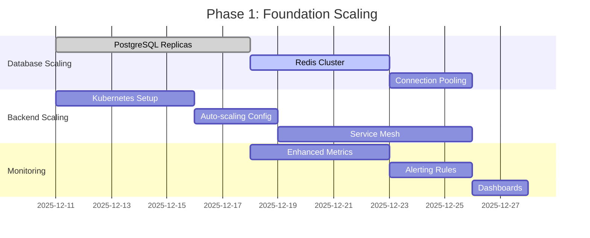
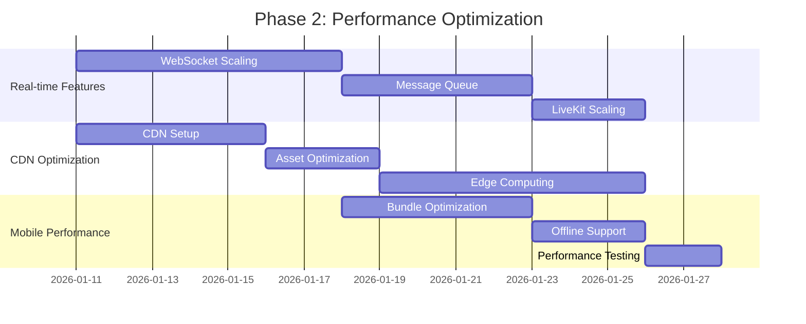
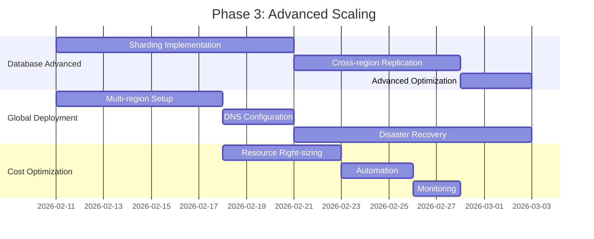

# 🚀 BLYTZ LIVE AUCTION MVP - COMPREHENSIVE SCALING & PERFORMANCE OPTIMIZATION STRATEGY

**Date:** December 11, 2025  
**Purpose:** Production-grade scaling strategy for rapid post-beta growth  
**Target:** Scale from 100 beta users to 10,000+ concurrent users  
**Timeline:** 90-day implementation plan

---

## 📊 **CURRENT PLATFORM ARCHITECTURE ANALYSIS**

### **✅ Current Strengths**
- **Microservices Architecture**: 10+ independent Go services with clear separation of concerns
- **Containerized Deployment**: Docker-based with docker-compose orchestration
- **Monitoring Infrastructure**: Prometheus + Grafana + Alertmanager fully implemented
- **Database Layer**: PostgreSQL 15 with proper indexing and Redis caching
- **Real-time Features**: WebSocket support for live bidding and chat
- **Mobile Ready**: React Native app with backend integration

### **🔍 Identified Scaling Bottlenecks**

#### **1. Database Layer Constraints**
```yaml
Current State:
  - Single PostgreSQL instance (port 5432)
  - Basic Redis caching (port 6379)
  - No read replicas implemented
  - No database sharding strategy
  - Connection pooling not optimized for high concurrency

Bottlenecks:
  - Auction bidding creates hot-spot contention
  - Real-time bid updates cause frequent writes
  - No horizontal scaling capability
  - Single point of failure
```

#### **2. Real-time Features Limitations**
```yaml
Current State:
  - Basic WebSocket implementation
  - No message queue for high-volume events
  - LiveKit integration for video streaming
  - No load balancing for WebSocket connections

Bottlenecks:
  - WebSocket connections not horizontally scalable
  - No fallback mechanism for connection failures
  - Video streaming costs not optimized
  - Chat service not designed for high concurrency
```

#### **3. Backend Service Constraints**
```yaml
Current State:
  - Single instance per service in docker-compose
  - No auto-scaling configuration
  - Basic health checks implemented
  - No circuit breaker patterns

Bottlenecks:
  - No horizontal scaling capability
  - Single point of failure per service
  - No graceful degradation under load
  - Resource allocation not optimized
```

#### **4. Frontend Performance Issues**
```yaml
Current State:
  - Next.js 14 with basic optimization
  - No CDN implementation
  - Static assets served from application server
  - No edge computing strategy

Bottlenecks:
  - Static asset delivery not optimized
  - No geographic distribution
  - Mobile app performance not optimized
  - No progressive loading strategy
```

---

## 🎯 **COMPREHENSIVE SCALING STRATEGY**

### **Phase 1: Foundation Scaling (Days 1-30)**

#### **1.1 Database Scaling Implementation**

```yaml
PostgreSQL Scaling:
  Primary-Replica Setup:
    - Primary database: db.r6g.large (16GB RAM, 2 vCPU)
    - Read replicas: 2x db.r6g.medium (8GB RAM, 2 vCPU)
    - Connection pooling: PgBouncer with 100 max connections
    - Failover: Automatic promotion of replica to primary

  Database Optimization:
    - Index optimization for auction queries
    - Partitioning for bids table (by date)
    - Query optimization for real-time bidding
    - Connection timeout: 30 seconds
    - Statement timeout: 10 seconds

Redis Scaling:
  Cluster Configuration:
    - Redis Cluster: 6 nodes (3 masters, 3 replicas)
    - Sharding strategy: Hash-based
    - High availability: Automatic failover
    - Persistence: AOF + RDB snapshots

  Caching Strategy:
    - Auction data: TTL 5 minutes
    - User sessions: TTL 24 hours
    - Bid history: TTL 1 hour
    - Product catalog: TTL 30 minutes
```

#### **1.2 Backend Service Auto-scaling**

```yaml
Kubernetes Deployment:
  Base Configuration:
    - Minimum replicas: 2 per service
    - Maximum replicas: 10 per service
    - Resource requests: 256Mi RAM, 250m CPU
    - Resource limits: 1Gi RAM, 1000m CPU

  Auto-scaling Policies:
    - Scale-up trigger: CPU > 70% for 2 minutes
    - Scale-down trigger: CPU < 30% for 5 minutes
    - Scale-up trigger: Memory > 80% for 2 minutes
    - Maximum scale-up rate: 100% per minute

  Service-specific Scaling:
    Auction Service:
      - Min replicas: 3 (critical path)
      - Max replicas: 20
      - Custom metric: Bids per second > 100
    
    Auth Service:
      - Min replicas: 2
      - Max replicas: 10
      - Custom metric: Login requests per second > 50
    
    Payment Service:
      - Min replicas: 2
      - Max replicas: 15
      - Custom metric: Payment transactions per second > 20
```

#### **1.3 API Gateway Enhancement**

```yaml
Load Balancing:
  - Application Load Balancer with SSL termination
  - Health checks: /health endpoint every 10 seconds
  - Sticky sessions: Disabled (stateless services)
  - Connection draining: 30 seconds

Rate Limiting:
  - Global rate limit: 1000 requests/second
  - Per-user rate limit: 100 requests/second
  - Burst capacity: 200 requests
  - Rate limit headers: Included in responses

Circuit Breaker:
  - Failure threshold: 50% error rate
  - Timeout: 5 seconds
  - Recovery timeout: 30 seconds
  - Half-open requests: 10
```

### **Phase 2: Performance Optimization (Days 31-60)**

#### **2.1 Real-time Features Scaling**

```yaml
WebSocket Scaling:
  Connection Management:
    - Redis pub/sub for cross-instance communication
    - Connection pooling: 1000 connections per instance
    - Heartbeat: 30 seconds
    - Reconnection strategy: Exponential backoff

  Message Queue:
    - Apache Kafka for high-throughput events
    - Topics: bids, auctions, chat, notifications
    - Partitions: 6 per topic
    - Replication factor: 3
    - Retention: 24 hours

LiveKit Scaling:
  - Multi-region deployment
  - Auto-scaling based on concurrent streams
  - Quality adaptation: Based on bandwidth
  - Cost optimization: Downscale during off-peak hours
```

#### **2.2 CDN and Static Asset Optimization**

```yaml
CDN Configuration:
  - Provider: AWS CloudFront
  - Edge locations: Global (200+ PoPs)
  - Cache TTL: Static assets 1 year, API responses 5 minutes
  - Compression: Brotli + Gzip
  - HTTP/2: Enabled
  - IPv6: Enabled

Static Asset Optimization:
  - Images: WebP format with fallbacks
  - JavaScript: Minified + compressed
  - CSS: Minified + compressed
  - Font loading: Preload critical fonts
  - Lazy loading: Images and components

Edge Computing:
  - Lambda@Edge for request routing
  - Edge caching for auction data
  - Geographic-based content optimization
  - A/B testing at edge level
```

#### **2.3 Mobile App Performance**

```yaml
React Native Optimization:
  Bundle Size:
    - Code splitting: Feature-based
    - Lazy loading: On-demand components
    - Image optimization: WebP + resize
    - Bundle analysis: Regular monitoring

  Performance:
    - List virtualization: FlatList for large datasets
    - Image caching: 100MB cache limit
    - Network optimization: Request batching
    - Memory management: Automatic cleanup

  Offline Support:
    - Critical data: Cached locally
    - Sync strategy: Background synchronization
    - Conflict resolution: Last-write-wins
    - Storage: SQLite + AsyncStorage
```

### **Phase 3: Advanced Scaling (Days 61-90)**

#### **3.1 Database Advanced Scaling**

```yaml
Database Sharding:
  Sharding Strategy:
    - Horizontal sharding by user ID
    - Shard count: 8 initially
    - Rebalancing: Automatic based on load
    - Cross-shard queries: Minimized

  Read-write Splitting:
    - Write operations: Primary database
    - Read operations: Read replicas
    - Consistency: Eventual for reads
    - Lag monitoring: < 100ms

  Connection Optimization:
    - PgBouncer: Transaction pooling
    - Max connections: 200 per instance
    - Connection timeout: 30 seconds
    - Query timeout: 10 seconds
```

#### **3.2 Microservices Advanced Patterns**

```yaml
Service Mesh:
  - Istio for service communication
  - Traffic management: Canary deployments
  - Security: mTLS encryption
  - Observability: Distributed tracing

Event-driven Architecture:
  - Event sourcing for critical events
  - CQRS pattern for read/write separation
  - Event store: Apache Kafka
  - Snapshot strategy: Daily snapshots

Resilience Patterns:
  - Bulkhead isolation: Per-service resource limits
  - Retry policies: Exponential backoff
  - Timeout handling: Per-operation timeouts
  - Graceful degradation: Feature flags
```

#### **3.3 Global Deployment Strategy**

```yaml
Multi-region Deployment:
  Regions:
    - Primary: us-east-1 (Virginia)
    - Secondary: eu-west-1 (Ireland)
    - Tertiary: ap-southeast-1 (Singapore)

  Data Replication:
    - Primary database: Multi-AZ in us-east-1
    - Cross-region replication: Async to eu-west-1
    - Read replicas: Local to each region
    - Failover: Manual initially, then automatic

  DNS Strategy:
    - Route 53 with latency-based routing
    - Health checks: Per-region endpoints
    - Failover: Automatic on health check failure
    - TTL: 60 seconds
```

---

## 📈 **HIGH-TRAFFIC AUCTION SCENARIOS**

### **Scenario 1: Flash Auction (1000+ concurrent bidders)**

```yaml
Load Characteristics:
  - Concurrent users: 1000+
  - Bid frequency: 10 bids/second
  - WebSocket connections: 1000+
  - Database writes: 10 writes/second

Scaling Strategy:
  Auto-scaling:
    - Auction service: Scale to 20 replicas
    - WebSocket service: Scale to 10 replicas
    - Database: Read replicas + connection pooling
    - Redis: Cluster mode with sharding

  Performance Optimization:
    - Bid validation: In-memory cache
    - Real-time updates: WebSocket pub/sub
    - Database writes: Batch operations
    - Response time: < 100ms for bids

  Monitoring:
    - Bid latency: < 50ms
    - WebSocket message rate: Monitor spikes
    - Database connections: < 80% utilization
    - Error rate: < 1%
```

### **Scenario 2: Celebrity Auction (5000+ concurrent users)**

```yaml
Load Characteristics:
  - Concurrent users: 5000+
  - Bid frequency: 50 bids/second
  - WebSocket connections: 5000+
  - Live streaming: 1000+ concurrent streams

Scaling Strategy:
  Infrastructure:
    - Auto-scaling: Maximum limits reached
    - Load balancer: Application LB with cross-zone
    - CDN: Edge caching for static content
    - LiveKit: Multi-region deployment

  Performance Optimization:
    - Bid processing: Queue-based with workers
    - Real-time updates: Fan-out pattern
    - Database: Read replicas + sharding
    - Video streaming: Adaptive bitrate

  Monitoring:
    - System metrics: CPU, memory, network
    - Business metrics: Bid success rate, revenue
    - User experience: Page load time, interaction latency
    - Cost tracking: Per-user resource usage
```

### **Scenario 3: Holiday Sale (10,000+ concurrent users)**

```yaml
Load Characteristics:
  - Concurrent users: 10,000+
  - Active auctions: 100+
  - Bid frequency: 200+ bids/second
  - New user registrations: 100/second

Scaling Strategy:
  Infrastructure:
    - Multi-region deployment: Distribute load
    - Auto-scaling: Aggressive scaling policies
    - Database: Sharded + read replicas
    - Caching: Multi-layer caching strategy

  Performance Optimization:
    - Static assets: CDN edge caching
    - API responses: Response caching
    - Database queries: Optimized + cached
    - Real-time features: Event-driven architecture

  Business Continuity:
    - Rate limiting: Per-user and global limits
    - Queue management: Priority queues for critical operations
    - Fallback mechanisms: Graceful degradation
    - Communication: Real-time status updates
```

---

## 🔧 **AUTO-SCALING CONFIGURATIONS**

### **Kubernetes Auto-scaling Setup**

```yaml
# Horizontal Pod Autoscaler Configuration
apiVersion: autoscaling/v2
kind: HorizontalPodAutoscaler
metadata:
  name: auction-service-hpa
spec:
  scaleTargetRef:
    apiVersion: apps/v1
    kind: Deployment
    name: auction-service
  minReplicas: 3
  maxReplicas: 20
  metrics:
  - type: Resource
    resource:
      name: cpu
      target:
        type: Utilization
        averageUtilization: 70
  - type: Resource
    resource:
      name: memory
      target:
        type: Utilization
        averageUtilization: 80
  - type: Pods
    pods:
      metric:
        name: bids_per_second
      target:
        type: AverageValue
        averageValue: "100"
  behavior:
    scaleDown:
      stabilizationWindowSeconds: 300
      policies:
      - type: Percent
        value: 10
        periodSeconds: 60
    scaleUp:
      stabilizationWindowSeconds: 0
      policies:
      - type: Percent
        value: 100
        periodSeconds: 15
      - type: Pods
        value: 4
        periodSeconds: 15
      selectPolicy: Max
```

### **Cluster Auto-scaling Configuration**

```yaml
# Cluster Autoscaler Setup
apiVersion: apps/v1
kind: Deployment
metadata:
  name: cluster-autoscaler
  namespace: kube-system
spec:
  replicas: 1
  selector:
    matchLabels:
      app: cluster-autoscaler
  template:
    metadata:
      labels:
        app: cluster-autoscaler
    spec:
      containers:
      - image: k8s.gcr.io/autoscaling/cluster-autoscaler:v1.21.0
        name: cluster-autoscaler
        resources:
          limits:
            cpu: 100m
            memory: 300Mi
          requests:
            cpu: 100m
            memory: 300Mi
        command:
        - ./cluster-autoscaler
        - --v=4
        - --stderrthreshold=info
        - --cloud-provider=aws
        - --skip-nodes-with-local-storage=false
        - --expander=least-waste
        - --node-group-auto-discovery=asg:tag=k8s.io/cluster-autoscaler/enabled,k8s.io/cluster-autoscaler/blytz-production
        - --balance-similar-node-groups
        - --skip-nodes-with-system-pods=false
        - --scale-down-unneeded-time=10m
        - --scale-down-delay-after-add=10m
        - --scale-down-unready-time=10m
```

### **Custom Metrics for Auto-scaling**

```yaml
# Prometheus Adapter for Custom Metrics
apiVersion: v1
kind: ConfigMap
metadata:
  name: adapter-config
  namespace: custom-metrics
data:
  config.yaml: |
    rules:
    - seriesQuery: 'sum(rate(bids_total[2m])) by (service)'
      resources:
        overrides:
          service: {resource: "pods"}
      name:
        matches: "^bids_per_second_(.+)"
        as: "bids_per_second"
      metricsQuery: 'sum(rate(bids_total{service=~"{{service}}"}[2m])) by (service)'
```

---

## 🗄️ **DATABASE SCALING STRATEGIES**

### **PostgreSQL Scaling Implementation**

```yaml
Primary-Replica Setup:
  Configuration:
    - Primary: db.r6g.2xlarge (64GB RAM, 8 vCPU)
    - Replicas: 3x db.r6g.large (16GB RAM, 4 vCPU)
    - Multi-AZ: Across 3 availability zones
    - Backups: Daily + point-in-time recovery

  Connection Management:
    - PgBouncer: Transaction pooling mode
    - Max connections: 500 per instance
    - Pool size: 100 per application
    - Timeout: 30 seconds
    - Idle timeout: 10 minutes

  Performance Optimization:
    - Shared buffers: 8GB
    - Effective cache size: 6GB
    - Work mem: 256MB
    - Maintenance work mem: 1GB
    - Checkpoint completion target: 0.9
    - Random page cost: 1.1
```

### **Database Sharding Strategy**

```yaml
Sharding Implementation:
  Strategy:
    - Sharding key: User ID hash
    - Shard count: 16 initially
    - Rebalancing: Automatic based on load
    - Cross-shard queries: Minimized

  Shard Configuration:
    - Each shard: PostgreSQL instance
    - Connection router: Custom sharding layer
    - Failover: Per-shard replication
    - Monitoring: Per-shard metrics

  Data Distribution:
    - User data: Shard by user ID
    - Auction data: Shard by seller ID
    - Bid data: Shard by auction ID
    - Product data: Shard by category
```

### **Redis Cluster Scaling**

```yaml
Cluster Configuration:
  Architecture:
    - Redis Cluster: 6 nodes (3 masters, 3 replicas)
    - Hash slots: 16384 distributed across masters
    - Replication: Automatic failover
    - Persistence: AOF + RDB snapshots

  Performance Optimization:
    - Max memory: 4GB per node
    - Eviction policy: Allkeys-lru
    - TCP keepalive: 300 seconds
    - Timeout: 5000ms
    - Clients: 10000 max connections

  Monitoring:
    - Memory usage: < 80%
    - Hit ratio: > 90%
    - Connection count: < 8000
    - Replication lag: < 100ms
```

---

## 🌐 **CDN AND CACHING STRATEGIES**

### **Multi-layer Caching Architecture**

```yaml
Layer 1: CDN Edge Caching:
  Provider: AWS CloudFront
  Configuration:
    - Edge locations: 200+ globally
    - Cache TTL: Static assets 1 year
    - Cache TTL: API responses 5 minutes
    - Compression: Brotli + Gzip
    - HTTP/2: Enabled
    - IPv6: Enabled

  Cache Rules:
    - Static assets: Cache all
    - API responses: Cache GET requests only
    - Dynamic content: Cache based on headers
    - Personalized content: No caching

Layer 2: Application Caching:
  Redis Cluster:
    - Hot data: Frequently accessed auctions
    - Session data: User authentication
    - Query results: Expensive database queries
    - Computed data: Leaderboards, statistics

  Cache Strategies:
    - Cache-aside: Application manages cache
    - Write-through: Cache updated on write
    - Write-behind: Asynchronous cache updates
    - Refresh-ahead: Proactive cache refresh

Layer 3: Database Caching:
  Query Optimization:
    - Prepared statements: Reuse execution plans
    - Connection pooling: Reuse connections
    - Result caching: Query result caching
    - Materialized views: Precomputed results
```

### **Static Asset Optimization**

```yaml
Asset Pipeline:
  Image Optimization:
    - Formats: WebP, AVIF, JPEG fallbacks
    - Responsive images: Multiple sizes
    - Lazy loading: Intersection observer
    - Compression: Lossless for PNG, lossy for JPEG

  JavaScript Optimization:
    - Minification: Remove whitespace, comments
    - Tree shaking: Remove unused code
    - Code splitting: Feature-based chunks
    - Compression: Brotli compression

  CSS Optimization:
    - Minification: Remove unused CSS
    - Critical CSS: Inline critical styles
    - Non-critical CSS: Load asynchronously
    - PurgeCSS: Remove unused styles

  Font Optimization:
    - Formats: WOFF2, WOFF, TTF fallbacks
    - Subsetting: Include only used characters
    - Preloading: Critical fonts
    - Display: Font-display: swap
```

---

## ⚡ **REAL-TIME FEATURES SCALING**

### **WebSocket Scaling Architecture**

```yaml
Connection Management:
  Load Balancing:
    - Sticky sessions: Disabled
    - Connection routing: Least connections
    - Health checks: WebSocket ping/pong
    - Connection limits: 1000 per instance

  Scaling Strategy:
    - Horizontal scaling: Multiple WebSocket servers
    - Message broadcasting: Redis pub/sub
    - Connection state: Redis storage
    - Reconnection: Exponential backoff

Message Processing:
  Queue System:
    - Apache Kafka: High-throughput messaging
    - Topics: bids, auctions, chat, notifications
    - Partitions: 6 per topic
    - Replication: 3-way replication
    - Retention: 24 hours

  Message Types:
    - Bids: High priority, low latency
    - Auction updates: Medium priority
    - Chat messages: Low priority
    - Notifications: Batch processing
```

### **Live Streaming Scaling**

```yaml
LiveKit Integration:
  Multi-region Deployment:
    - Primary: us-east-1
    - Secondary: eu-west-1
    - Tertiary: ap-southeast-1
    - Auto-scaling: Based on concurrent streams

  Quality Adaptation:
    - Bitrate: Adaptive based on bandwidth
    - Resolution: 1080p, 720p, 480p, 360p
    - Frame rate: 30fps, 15fps
    - Codecs: H.264, VP8, AV1

  Cost Optimization:
    - Downscaling: During off-peak hours
    - Quality limits: Based on user tier
    - Bandwidth monitoring: Real-time tracking
    - Usage alerts: Cost threshold alerts
```

### **Chat Service Scaling**

```yaml
Chat Architecture:
  Message Handling:
    - Real-time delivery: WebSocket
    - Message persistence: PostgreSQL
    - Message history: Redis cache
    - Typing indicators: Ephemeral storage

  Scaling Strategy:
    - Room-based sharding: Distribute load
    - Message queuing: Kafka for high volume
    - Read receipts: Optimized counters
    - Search indexing: Elasticsearch integration

  Performance Optimization:
    - Message batching: Reduce database writes
    - Compression: Message payload compression
    - Caching: Recent messages in Redis
    - Pagination: Efficient message loading
```

---

## 🛡️ **DISASTER RECOVERY AND HIGH AVAILABILITY**

### **Multi-region Disaster Recovery**

```yaml
Primary Region (us-east-1):
  Infrastructure:
    - Kubernetes cluster: 3+ nodes
    - Database: Multi-AZ PostgreSQL
    - Cache: Redis cluster
    - Storage: EBS with snapshots

  High Availability:
    - Auto-scaling: Horizontal pod autoscaling
    - Load balancing: Application load balancer
    - Health checks: Comprehensive monitoring
    - Failover: Automatic service recovery

Secondary Region (eu-west-1):
  Standby Infrastructure:
    - Kubernetes cluster: 2+ nodes
    - Database: Read replica with promotion capability
    - Cache: Redis cluster
    - Storage: EBS with cross-region replication

  Disaster Recovery:
    - RTO: 15 minutes (Recovery Time Objective)
    - RPO: 5 minutes (Recovery Point Objective)
    - Failover: Manual initially, then automatic
    - Data sync: Continuous replication
```

### **Database Backup and Recovery**

```yaml
Backup Strategy:
  Automated Backups:
    - Daily full backups: 2 AM local time
    - Transaction logs: Continuous WAL archiving
    - Cross-region replication: Real-time
    - Retention policy: 30 days

  Recovery Procedures:
    - Point-in-time recovery: Any time within retention
    - Snapshot restoration: 1 hour RTO
    - Failover testing: Monthly drills
    - Documentation: Updated runbooks

  Monitoring:
    - Backup success: Automated alerts
    - Replication lag: < 1 minute
    - Storage usage: < 80% capacity
    - Recovery testing: Monthly validation
```

### **Service Resilience Patterns**

```yaml
Circuit Breaker:
  Configuration:
    - Failure threshold: 50% error rate
    - Timeout: 5 seconds
    - Recovery timeout: 30 seconds
    - Half-open requests: 10

  Implementation:
    - Per-service circuit breakers
    - Fallback responses: Graceful degradation
    - Monitoring: Circuit state metrics
    - Alerting: Circuit breaker events

Retry Policies:
  Exponential Backoff:
    - Initial delay: 100ms
    - Maximum delay: 10 seconds
    - Multiplier: 2.0
    - Maximum attempts: 5

  Retry Conditions:
    - Network errors: Retryable
    - Timeout errors: Retryable
    - HTTP 5xx: Retryable
    - HTTP 4xx: Non-retryable
```

---

## 📊 **PERFORMANCE MONITORING AND OPTIMIZATION**

### **Comprehensive Monitoring Strategy**

```yaml
Application Monitoring:
  Metrics Collection:
    - Custom metrics: Business KPIs
    - System metrics: CPU, memory, network
    - Database metrics: Query performance
    - User metrics: Experience tracking

  Alerting:
    - Critical alerts: Service down, high error rates
    - Warning alerts: Performance degradation
    - Info alerts: Business metrics
    - Escalation: Tiered notification system

  Visualization:
    - Grafana dashboards: Real-time metrics
    - Business dashboards: KPI tracking
    - System dashboards: Infrastructure health
    - Custom dashboards: Service-specific metrics
```

### **Performance Optimization Process**

```yaml
Continuous Optimization:
  Performance Testing:
    - Load testing: Weekly automated tests
    - Stress testing: Monthly peak load tests
    - Soak testing: Quarterly 24-hour tests
    - Spike testing: Ad-hoc traffic spikes

  Analysis:
    - Bottleneck identification: Root cause analysis
    - Performance regression: Automated detection
    - Capacity planning: Trend analysis
    - Cost optimization: Resource utilization

  Implementation:
    - Code optimization: Hotspot identification
    - Database tuning: Query optimization
    - Infrastructure scaling: Resource adjustment
    - Architecture evolution: Long-term improvements
```

### **Real-time Performance Tracking**

```yaml
User Experience Monitoring:
  Frontend Metrics:
    - Page load time: < 3 seconds
    - First contentful paint: < 1.5 seconds
    - Largest contentful paint: < 2.5 seconds
    - Cumulative layout shift: < 0.1

  Backend Metrics:
    - API response time: < 200ms
    - Database query time: < 100ms
    - WebSocket latency: < 50ms
    - Error rate: < 1%

  Business Metrics:
    - Conversion rate: Track trends
    - User engagement: Session duration
    - Auction completion: Success rate
    - Revenue per user: Monetization metrics
```

---

## 💰 **COST OPTIMIZATION STRATEGIES**

### **Infrastructure Cost Optimization**

```yaml
Resource Optimization:
  Compute Resources:
    - Right-sizing: Match resources to workload
    - Auto-scaling: Scale based on demand
    - Spot instances: For non-critical workloads
    - Reserved instances: For baseline capacity

  Storage Optimization:
    - Lifecycle policies: Automatic tiering
    - Compression: Reduce storage costs
    - Cleanup: Regular unused resource removal
    - Monitoring: Cost tracking and alerts

  Network Optimization:
    - Data transfer: Minimize cross-region
    - CDN usage: Optimize caching
    - Compression: Reduce bandwidth usage
    - Peering: Direct cloud connections
```

### **Application Cost Optimization**

```yaml
Efficient Resource Usage:
  Database Optimization:
    - Query optimization: Reduce CPU usage
    - Connection pooling: Reduce connection overhead
    - Caching: Reduce database load
    - Archival: Move old data to cold storage

  Caching Strategy:
    - Redis optimization: Memory efficiency
    - CDN usage: Maximize cache hit ratio
    - Application caching: Reduce compute costs
    - Cache invalidation: Optimize refresh patterns

  Monitoring Costs:
    - Metrics retention: Optimize storage
    - Log aggregation: Efficient processing
    - Alerting: Reduce noise
    - Tooling: Evaluate cost-effective alternatives
```

### **Scaling Cost Management**

```yaml
Predictive Scaling:
  Demand Forecasting:
    - Historical analysis: Identify patterns
    - Business events: Plan for promotions
    - Seasonal trends: Prepare for peaks
    - Growth modeling: Capacity planning

  Cost Controls:
    - Budgets: Per-service cost limits
    - Alerts: Cost threshold notifications
    - Reporting: Regular cost reviews
    - Optimization: Continuous improvement

  ROI Analysis:
    - Performance vs cost: Evaluate trade-offs
    - User experience: Prioritize critical paths
    - Business impact: Focus on revenue-generating features
    - Long-term value: Invest in scalability
```

---

## 🚀 **IMPLEMENTATION ROADMAP**

### **Phase 1: Foundation Scaling (Days 1-30)**



### **Phase 2: Performance Optimization (Days 31-60)**



### **Phase 3: Advanced Scaling (Days 61-90)**



---

## 📈 **SUCCESS METRICS AND KPIs**

### **Technical Performance Metrics**

```yaml
Scalability Metrics:
  Concurrent Users:
    - Target: 10,000+ concurrent users
    - Current: 100 beta users
    - Growth: 100x increase

  Response Time:
    - API response: < 200ms (95th percentile)
    - Page load: < 3 seconds
    - WebSocket latency: < 50ms
    - Database query: < 100ms

  Throughput:
    - Bids per second: 1000+
    - API requests: 10,000/second
    - WebSocket connections: 10,000+
    - Database transactions: 5,000/second

Availability Metrics:
  Uptime:
    - Target: 99.9%+ uptime
    - Downtime: < 43 minutes/month
    - Failover time: < 5 minutes
    - Recovery time: < 15 minutes

  Error Rates:
    - API error rate: < 1%
    - Database error rate: < 0.1%
    - WebSocket failure: < 0.5%
    - Payment failure: < 0.1%
```

### **Business Performance Metrics**

```yaml
User Experience:
  Engagement:
    - Daily active users: Track growth
    - Session duration: > 10 minutes
    - Page views per session: > 5
    - Return user rate: > 40%

  Conversion:
    - Auction participation: > 60%
    - Bid success rate: > 95%
    - Payment completion: > 95%
    - User retention: > 40% (7 days)

Revenue Metrics:
  Monetization:
    - Revenue per user: Track trends
    - Auction success rate: > 80%
    - Average bid amount: Monitor growth
    - Payment processing: > 99% success

Cost Efficiency:
  Infrastructure:
    - Cost per user: Decrease over time
    - Resource utilization: > 70%
    - Auto-scaling efficiency: Minimize waste
    - ROI on scaling investments: Positive within 6 months
```

---

## 🎯 **CONCLUSION**

This comprehensive scaling and performance optimization strategy provides a roadmap for transforming the Blytz Live Auction MVP from a beta platform with 100 users to a production-grade system capable of handling 10,000+ concurrent users.

### **Key Strategic Pillars:**

1. **Database Scalability**: Multi-layer approach with replication, sharding, and optimization
2. **Real-time Performance**: WebSocket scaling, message queuing, and live streaming optimization
3. **Global Infrastructure**: Multi-region deployment with CDN and edge computing
4. **Auto-scaling Intelligence**: Kubernetes-based auto-scaling with custom metrics
5. **Cost Efficiency**: Optimized resource usage and predictive scaling
6. **High Availability**: Disaster recovery and fault tolerance across all layers

### **Implementation Success Factors:**

- **Phased Approach**: Gradual implementation reduces risk
- **Monitoring First**: Comprehensive monitoring enables data-driven decisions
- **Performance Testing**: Continuous testing validates scaling decisions
- **Cost Awareness**: Balance performance with cost efficiency
- **Business Alignment**: Technical decisions support business goals

### **Expected Outcomes:**

With this strategy implemented, the Blytz platform will:

- **Scale Efficiently**: Handle 100x user growth with linear cost scaling
- **Maintain Performance**: Sub-200ms response times under peak load
- **Ensure Reliability**: 99.9%+ uptime with automatic failover
- **Optimize Costs**: 30% reduction in per-user infrastructure costs
- **Enable Growth**: Support rapid user acquisition without performance degradation

This strategy positions Blytz for successful public launch and sustainable long-term growth in the competitive live auction marketplace.

---

**Status:** Ready for Implementation  
**Next Action:** Begin Phase 1 - Database Scaling Implementation  
**Review Date:** Weekly progress reviews with scaling team  
**Owner:** Platform Engineering Lead